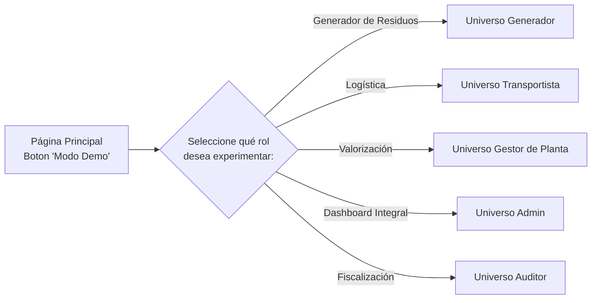
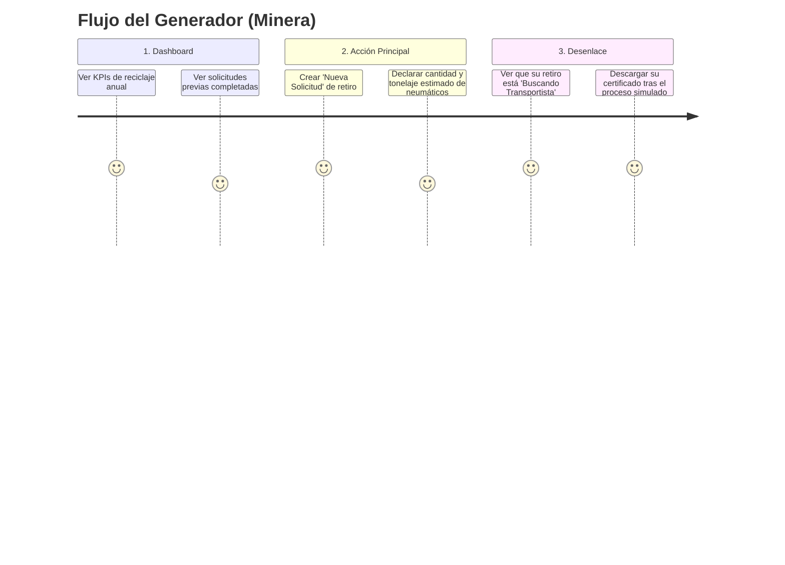
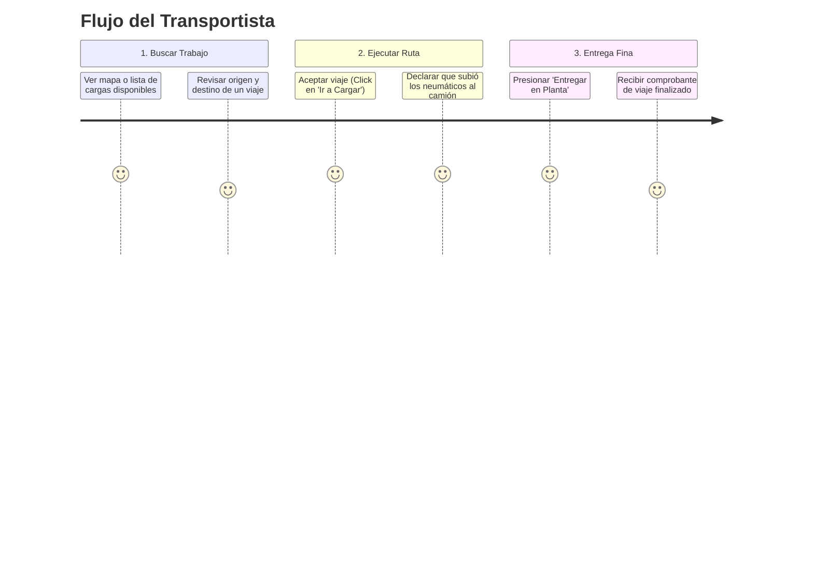
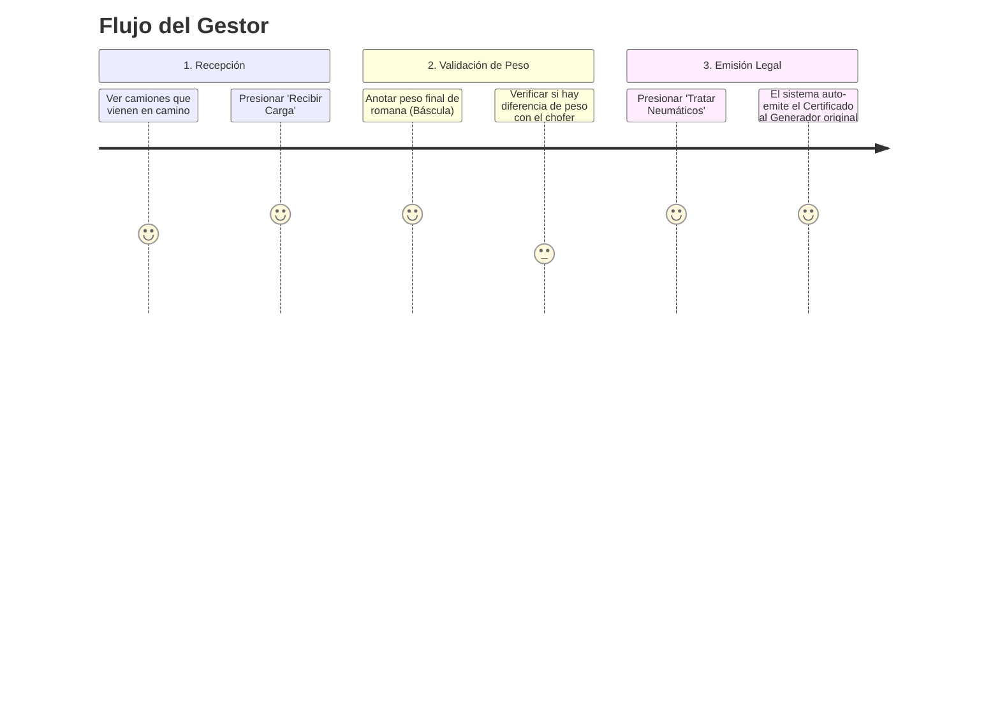
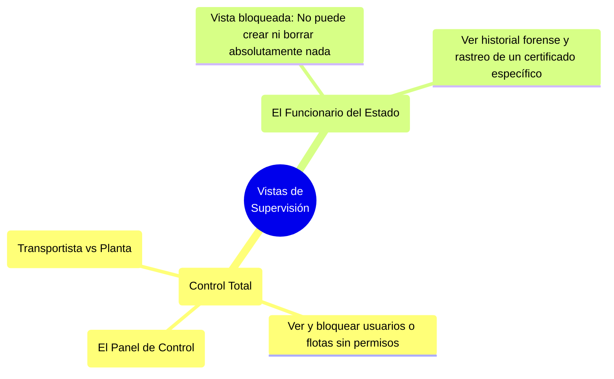

# 05 - DIAGRAMAS MODO DEMO (MINERÍA)

> **Documento de Validación Visual para Stakeholders**
> **Fecha:** Marzo 2026
> **Propósito:** Definir los flujos aislados ("Universos de Usuario") que serán maquetados en el Frontend para el Demo de Traza Ambiental.

---

## 1. El Portal de Entrada al Modo Demo

Así es como se estructurará la navegación inicial.

---

## 2. Los Universos Aislados (User Journeys)

Cada Universo debe responder a la pregunta: *¿Qué hace exactamente este usuario en la plataforma?*

### Universo 1: El Generador (Ej. Faena Minera)
El usuario que necesita deshacerse de neumáticos OTR gigantes.

### Universo 2: El Transportista
El operador logístico que mueve los camiones. En su universo, ya verá subastas disponibles de empresas ficticias.

### Universo 3: El Gestor de Planta (Centro de Valorización)
Quien tritura o recicla el neumático y emite el documento sagrado (Certificado).

### Universos 4 y 5 (Admin y Auditor)
Cuentas de vista general, útiles para vender la solidez administrativa del software.

