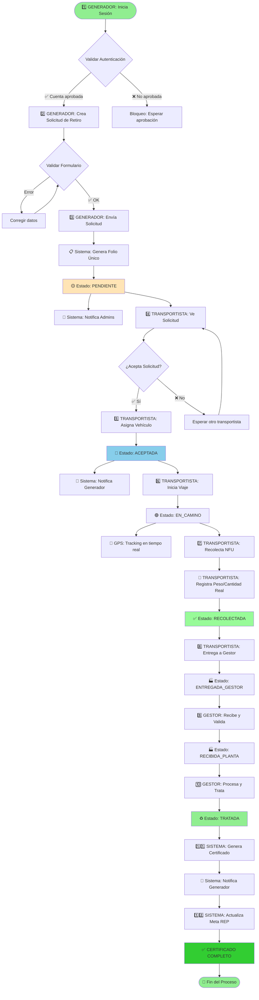

# 🔍 Guía de Validación del Proceso REP - Desde el Generador

> **Objetivo**: Documentar el flujo completo de validación del proceso REP, iniciando desde el rol Generador hasta la obtención del certificado de valorización.

---

## 📋 Índice

1. [Flujo General del Proceso](#1-flujo-general-del-proceso)
2. [Checklist de Validación por Etapa](#2-checklist-de-validación-por-etapa)
3. [Validación Técnica Detallada](#3-validación-técnica-detallada)
4. [Puntos Críticos de Verificación](#4-puntos-críticos-de-verificación)
5. [Herramientas de Validación](#5-herramientas-de-validación)

---

## 1. Flujo General del Proceso

### 🎯 Diagrama de Flujo Completo



---

## 2. Checklist de Validación por Etapa

### ✅ **ETAPA 1: Creación de Solicitud (Generador)**

#### Validaciones en Frontend

- [ ] **Formulario Multi-Paso Renderiza Correctamente**
  - Paso 1: Información de Retiro visible
  - Paso 2: Detalles NFU visible
  - Paso 3: Contacto e Instrucciones visible
  - Navegación entre pasos funciona

- [ ] **Validaciones de Datos en Cliente**
  - Dirección: Mínimo 10 caracteres, máximo 200
  - Región: Selector muestra las 16 regiones de Chile
  - Comuna: Se actualiza dinámicamente según región seleccionada
  - Fecha preferida: No permite fechas pasadas
  - Fecha preferida: No permite fechas > 30 días
  - Horario: Solo permite "MANANA" o "TARDE"
  - Categoría A: Cantidad >= 0, Peso > 0 si cantidad > 0
  - Categoría B: Cantidad >= 0, Peso > 0 si cantidad > 0
  - Al menos una categoría tiene cantidad > 0
  - Teléfono: Formato chileno válido (+56 9 XXXX XXXX)
  - Fotos: Máximo 5 archivos, cada uno < 5MB, formatos válidos (JPG/PNG/WEBP)

- [ ] **Cálculos Automáticos**
  - Peso total = categoriaA_pesoEst + categoriaB_pesoEst
  - Cantidad total = categoriaA_cantidad + categoriaB_cantidad
  - Valores se actualizan en tiempo real

#### Validaciones en Backend

- [ ] **API `/api/solicitudes` (POST)**
  - Autenticación requerida (401 si no autenticado)
  - Verificación de rol "Generador" (403 si no tiene rol)
  - Verificación de cuenta aprobada (403 si cuenta no aprobada)
  - Validación de schema Zod pasa
  - Folio único generado (formato: `SOL-YYYYMMDD-XXXX`)
  - Solicitud guardada en base de datos con estado `PENDIENTE`
  - Registro `CambioEstado` creado
  - Fotos subidas a storage (si existen)
  - Email de confirmación enviado al generador
  - Notificación a administradores creada

- [ ] **Verificar en Base de Datos**

  ```sql
  -- Consultar última solicitud creada
  SELECT
    id, folio, estado, generadorId,
    pesoTotalEstimado, cantidadTotal,
    createdAt
  FROM solicitudes_retiro
  WHERE generadorId = '<userId>'
  ORDER BY createdAt DESC
  LIMIT 1;

  -- Verificar cambio de estado
  SELECT * FROM cambios_estado
  WHERE solicitudId = '<solicitudId>'
  ORDER BY fecha DESC;
  ```

#### Verificación Post-Creación

- [ ] **En Dashboard del Generador**
  - Solicitud aparece en lista "Mis Solicitudes"
  - Estado muestra "PENDIENTE"
  - Folio es visible y clickeable
  - Link a detalle funciona

- [ ] **Email de Confirmación**
  - Email recibido en inbox del generador
  - Folio incluido en el email
  - Link de acceso al detalle funciona
  - Información de la solicitud es correcta

---

### ✅ **ETAPA 2: Asignación de Transportista**

#### Validaciones como Transportista

- [ ] **Visibilidad de Solicitud**
  - Solicitud aparece en `/dashboard/transportista/solicitudes`
  - Estado visible como "PENDIENTE"
  - Información completa visible (dirección, peso, cantidad)
  - Mapa muestra ubicación correcta

- [ ] **Proceso de Aceptación**
  - Botón "Aceptar Solicitud" funciona
  - Modal de aceptación muestra formulario:
    - Selector de vehículo (debe tener al menos 1)
    - Input de fecha estimada de recolección
  - Validaciones:
    - Vehículo seleccionado es válido
    - Fecha estimada >= hoy

#### Validaciones en Backend

- [ ] **API `/api/transportista/solicitudes/[id]/aceptar` (POST)**
  - Autenticación requerida
  - Verificación de rol "Transportista"
  - Verificación de cuenta aprobada y verificada
  - Verificación de estado de solicitud = 'PENDIENTE'
  - Verificación de que transportista tiene vehículos
  - Solicitud actualizada:
    - `transportistaId` = usuario.id
    - `vehiculoId` = vehículo seleccionado
    - `estado` = 'ACEPTADA'
    - `fechaAceptacion` = now()
  - Registro `CambioEstado` creado
  - Email de notificación enviado al generador

#### Verificación Post-Aceptación

- [ ] **En Dashboard del Generador**
  - Estado cambia a "ACEPTADA"
  - Información del transportista visible
  - Patente del vehículo visible
  - Fecha estimada de recolección visible
  - Botón de contacto al transportista funciona

- [ ] **En Dashboard del Transportista**
  - Solicitud aparece en "Mis Solicitudes Aceptadas"
  - Estado muestra "ACEPTADA"
  - Acciones disponibles: "Iniciar Viaje", "Cancelar"

- [ ] **Email de Notificación**
  - Generador recibe email de aceptación
  - Información del transportista incluida

---

### ✅ **ETAPA 3: Recolección (Transportista)**

#### Validaciones de Inicio de Viaje

- [ ] **Cambio de Estado a EN_CAMINO**
  - API `/api/transportista/solicitudes/[id]/estado` (PATCH)
  - Estado cambia a 'EN_CAMINO'
  - GPS tracking inicia (si está habilitado)
  - Notificación enviada al generador

#### Validaciones de Recolección

- [ ] **Registro de Recolección**
  - Formulario muestra:
    - Peso real (input numérico)
    - Cantidad real (input entero)
    - Opcional: Fotos de evidencia
  - Validaciones:
    - Peso real > 0
    - Cantidad real > 0
    - Discrepancia con estimado alertada si > 20%

- [ ] **API `/api/transportista/solicitudes/[id]/recoleccion` (POST)**
  - Verificación de ownership (transportistaId = usuario.id)
  - Estado actual = 'EN_CAMINO'
  - Actualización de datos:
    - `pesoReal` = peso ingresado
    - `cantidadReal` = cantidad ingresada
    - `estado` = 'RECOLECTADA'
    - `fechaRecoleccion` = now()
  - Fotos de evidencia subidas (si existen)
  - Registro `CambioEstado` creado
  - Notificación enviada al generador

#### Verificación Post-Recolección

- [ ] **En Dashboard del Generador**
  - Estado cambia a "RECOLECTADA"
  - Peso y cantidad reales visibles
  - Fotos de evidencia visibles
  - Comparación con estimado visible (con alerta si discrepancia)

---

### ✅ **ETAPA 4: Entrega a Gestor (Transportista)**

#### Validaciones de Entrega

- [ ] **Selección de Gestor**
  - Lista de gestores disponibles visible
  - Información del gestor mostrada
  - Botón "Confirmar Entrega" funciona

- [ ] **API `/api/transportista/solicitudes/[id]/entrega-gestor` (POST)**
  - Verificación de ownership
  - Verificación de estado = 'RECOLECTADA'
  - Verificación de gestor válido y aprobado
  - Actualización:
    - `gestorId` = gestor seleccionado
    - `estado` = 'ENTREGADA_GESTOR'
    - `fechaEntregaGestor` = now()
  - Notificación enviada al gestor

#### Verificación Post-Entrega

- [ ] **En Dashboard del Generador**
  - Estado cambia a "ENTREGADA_GESTOR"
  - Información del gestor visible
  - Fecha de entrega visible

- [ ] **En Dashboard del Gestor**
  - Solicitud aparece en "Nuevas Entregas"
  - Estado muestra "ENTREGADA_GESTOR"
  - Información completa visible

---

### ✅ **ETAPA 5: Recepción en Planta (Gestor)**

#### Validaciones de Recepción

- [ ] **Formulario de Recepción**
  - Peso recibido (input numérico)
  - Cantidad recibida (input entero)
  - Campo de discrepancias (si aplica)
  - Botón "Confirmar Recepción" funciona

- [ ] **API `/api/gestor/solicitudes/[id]/recepcion` (POST)**
  - Verificación de ownership (gestorId = usuario.id)
  - Verificación de estado = 'ENTREGADA_GESTOR'
  - Cálculo de discrepancias:
    - Si > 5% diferencia, requiere justificación
  - Actualización:
    - `pesoRecibidoGestor` = peso recibido
    - `cantidadRecibidaGestor` = cantidad recibida
    - `estado` = 'RECIBIDA_PLANTA'
    - `fechaRecepcionPlanta` = now()
  - Si hay discrepancia: Registro `Discrepancia` creado
  - Notificación a transportista y admin (si discrepancia)

---

### ✅ **ETAPA 6: Procesamiento y Valorización (Gestor)**

#### Validaciones de Tratamiento

- [ ] **Asignación de Tratamiento**
  - Lista de tratamientos disponibles
  - Tipo de tratamiento seleccionado
  - Peso tratado (por tratamiento)
  - Botón "Registrar Tratamiento" funciona

- [ ] **API `/api/gestor/tratamientos` (POST)**
  - Verificación de ownership
  - Verificación de estado = 'RECIBIDA_PLANTA'
  - Validación de tipo de tratamiento válido
  - Registro de tratamiento creado
  - Si todos los tratamientos completados: `estado` = 'TRATADA'

---

### ✅ **ETAPA 7: Generación de Certificado (Sistema Automático)**

#### Validaciones Automáticas

- [ ] **Trigger de Generación**
  - Sistema detecta cambio de estado a 'TRATADA'
  - Validación de que todos los tratamientos están completos
  - Validación de peso total tratado > 0

- [ ] **Generación de Certificado**
  - Código único generado (formato: `CERT-YYYY-XXXX`)
  - Certificado creado en base de datos
  - PDF generado con Puppeteer
  - Código QR incluido
  - URL de PDF guardada

- [ ] **Actualización de Meta REP**
  - Meta del generador actualizada automáticamente
  - `avanceToneladas` incrementado
  - `porcentajeAvance` recalculado
  - Si alcanza 90% o 100%, notificación enviada

- [ ] **Notificaciones**
  - Email con certificado enviado al generador
  - PDF adjunto en email
  - Notificación in-app creada

#### Verificación Post-Certificado

- [ ] **En Dashboard del Generador**
  - Certificado aparece en "Mis Certificados"
  - Estado del certificado: "VÁLIDO"
  - Link para descargar PDF funciona
  - QR code visible
  - Meta REP actualizada (avance incrementado)

- [ ] **Verificación Pública del Certificado**
  - URL pública: `/verificar-certificado?codigo=CERT-XXXX-XXXX`
  - Certificado visible sin autenticación
  - Información correcta mostrada
  - QR code escaneable

---

## 3. Validación Técnica Detallada

### 🔍 **Validación de Base de Datos**

#### Consultas SQL para Verificar Integridad

```sql
-- 1. Verificar solicitud completa
SELECT
    sr.id,
    sr.folio,
    sr.estado,
    u_gen.name AS generador,
    u_trans.name AS transportista,
    u_gest.name AS gestor,
    sr.pesoTotalEstimado,
    sr.pesoReal,
    sr.cantidadTotal,
    sr.cantidadReal,
    sr.createdAt,
    sr.fechaRecoleccion,
    sr.fechaEntregaGestor,
    sr.fechaRecepcionPlanta
FROM solicitudes_retiro sr
LEFT JOIN users u_gen ON sr.generadorId = u_gen.id
LEFT JOIN users u_trans ON sr.transportistaId = u_trans.id
LEFT JOIN users u_gest ON sr.gestorId = u_gest.id
WHERE sr.folio = 'SOL-YYYYMMDD-XXXX'
ORDER BY sr.createdAt DESC;

-- 2. Verificar historial de estados
SELECT
    ce.estadoAnterior,
    ce.estadoNuevo,
    ce.fecha,
    u.name AS realizadoPor,
    ce.notas
FROM cambios_estado ce
JOIN users u ON ce.realizadoPor = u.id
WHERE ce.solicitudId = '<solicitudId>'
ORDER BY ce.fecha ASC;

-- 3. Verificar certificado generado
SELECT
    c.id,
    c.codigo,
    c.solicitudId,
    c.pesoTotalValorizado,
    c.fechaEmision,
    c.urlPDF,
    c.codigoQR
FROM certificados c
WHERE c.solicitudId = '<solicitudId>';

-- 4. Verificar actualización de meta
SELECT
    m.id,
    m.anio,
    m.tipo,
    m.metaToneladas,
    m.avanceToneladas,
    m.porcentajeAvance,
    m.cumplida
FROM metas m
WHERE m.productorId = '<generadorId>'
  AND m.anio = EXTRACT(YEAR FROM CURRENT_DATE)
ORDER BY m.tipo;
```

### 🧪 **Validación de APIs**

#### Script de Pruebas (Postman/Thunder Client)

```typescript
// 1. Crear Solicitud (Generador autenticado)
POST /api/solicitudes
Headers: { Authorization: "Bearer <token>" }
Body: {
  direccionRetiro: "Av. Ejemplo 123",
  region: "13",
  comuna: "Santiago",
  fechaPreferida: "2025-12-01",
  horarioPreferido: "MANANA",
  categoriaA_cantidad: 10,
  categoriaA_pesoEst: 100,
  categoriaB_cantidad: 5,
  categoriaB_pesoEst: 250,
  nombreContacto: "Juan Pérez",
  telefonoContacto: "+56 9 1234 5678"
}

// Esperado: 200 OK, { solicitud: { folio: "SOL-...", estado: "PENDIENTE" } }

// 2. Aceptar Solicitud (Transportista autenticado)
POST /api/transportista/solicitudes/{id}/aceptar
Headers: { Authorization: "Bearer <token>" }
Body: {
  vehiculoId: "<vehiculoId>",
  fechaEstimadaRecoleccion: "2025-12-01"
}

// Esperado: 200 OK, { solicitud: { estado: "ACEPTADA" } }

// 3. Registrar Recolección (Transportista)
POST /api/transportista/solicitudes/{id}/recoleccion
Headers: { Authorization: "Bearer <token>" }
Body: {
  pesoReal: 380,
  cantidadReal: 15
}

// Esperado: 200 OK, { solicitud: { estado: "RECOLECTADA" } }

// 4. Confirmar Entrega (Transportista)
POST /api/transportista/solicitudes/{id}/entrega-gestor
Headers: { Authorization: "Bearer <token>" }
Body: {
  gestorId: "<gestorId>"
}

// Esperado: 200 OK, { solicitud: { estado: "ENTREGADA_GESTOR" } }

// 5. Validar Recepción (Gestor)
POST /api/gestor/solicitudes/{id}/recepcion
Headers: { Authorization: "Bearer <token>" }
Body: {
  pesoRecibido: 375,
  cantidadRecibida: 15
}

// Esperado: 200 OK, { solicitud: { estado: "RECIBIDA_PLANTA" } }

// 6. Registrar Tratamiento (Gestor)
POST /api/gestor/tratamientos
Headers: { Authorization: "Bearer <token>" }
Body: {
  solicitudId: "<solicitudId>",
  tipo: "RECICLAJE_MATERIAL",
  pesoTratado: 375
}

// Esperado: 200 OK, { tratamiento: {...}, solicitud: { estado: "TRATADA" } }

// 7. Verificar Certificado Generado
GET /api/certificados?solitudId={id}
Headers: { Authorization: "Bearer <token>" }

// Esperado: 200 OK, { certificado: { codigo: "CERT-...", urlPDF: "..." } }
```

---

## 4. Puntos Críticos de Verificación

### ⚠️ **Checkpoints Obligatorios**

#### Punto 1: Integridad de Datos

- [ ] Folio único generado correctamente
- [ ] No hay duplicados de folio
- [ ] Relaciones en BD son consistentes (foreign keys válidas)
- [ ] Timestamps son coherentes (createdAt < updatedAt)

#### Punto 2: Trazabilidad Completa

- [ ] Todos los cambios de estado están registrados
- [ ] Historial completo desde PENDIENTE hasta TRATADA
- [ ] Usuario que realizó cada cambio está registrado
- [ ] Fechas de transición son lógicas

#### Punto 3: Cálculos Correctos

- [ ] Peso total = suma de categorías
- [ ] Discrepancias calculadas correctamente
- [ ] Meta REP actualizada con precisión
- [ ] Porcentajes de avance son correctos

#### Punto 4: Notificaciones Enviadas

- [ ] Email de confirmación al generador
- [ ] Notificación de aceptación al generador
- [ ] Notificación de recolección al generador
- [ ] Notificación de entrega al gestor
- [ ] Notificación de certificado al generador

#### Punto 5: Documentos Generados

- [ ] Certificado PDF se genera correctamente
- [ ] QR code es escaneable y válido
- [ ] Información del certificado coincide con solicitud
- [ ] URL pública de verificación funciona

---

## 5. Herramientas de Validación

### 📊 **Dashboard de Validación**

Acceso: `/dashboard/admin/validacion-proceso`

**Métricas a Monitorear:**

- Solicitudes creadas vs completadas
- Tiempo promedio por etapa
- Tasa de error por etapa
- Discrepancias detectadas
- Certificados generados vs esperados

### 🔍 **Logs y Auditoría**

**Verificar Logs del Sistema:**

```bash
# Logs de aplicación
tail -f logs/app.log | grep "solicitud"

# Logs de base de datos
tail -f logs/db.log | grep "INSERT\|UPDATE"

# Logs de emails
tail -f logs/email.log | grep "certificado\|solicitud"
```

**Consultar Tabla de Auditoría:**

```sql
SELECT
    action,
    entityType,
    entityId,
    description,
    createdAt
FROM audit_logs
WHERE entityType = 'SolicitudRetiro'
  AND createdAt >= CURRENT_DATE - INTERVAL '7 days'
ORDER BY createdAt DESC;
```

---

## 📝 Reporte de Validación

### Plantilla de Validación

Al completar una validación completa del proceso, generar un reporte con:

```markdown
# Reporte de Validación - Proceso REP

**Fecha**: [Fecha]
**Validado por**: [Nombre]
**Solicitud de Prueba**: SOL-YYYYMMDD-XXXX

## Resumen Ejecutivo

- ✅ Proceso completado exitosamente
- ⏱️ Tiempo total: [X] horas
- ⚠️ Incidencias: [N] (detallar abajo)

## Etapas Validadas

- [ ] ETAPA 1: Creación de Solicitud
- [ ] ETAPA 2: Asignación de Transportista
- [ ] ETAPA 3: Recolección
- [ ] ETAPA 4: Entrega a Gestor
- [ ] ETAPA 5: Recepción en Planta
- [ ] ETAPA 6: Procesamiento
- [ ] ETAPA 7: Generación de Certificado

## Incidencias Encontradas

1. [Descripción del problema]
   - Impacto: [Alto/Medio/Bajo]
   - Estado: [Abierto/Resuelto]

## Recomendaciones

- [Recomendación 1]
- [Recomendación 2]
```

---

**📅 Última actualización**: 24 de noviembre de 2025  
**🏷️ Versión**: 1.0.2  
**📍 Estado**: ✅ Documentación completa para validación end-to-end
