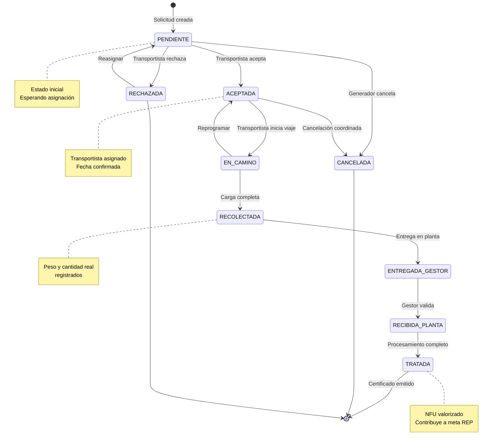
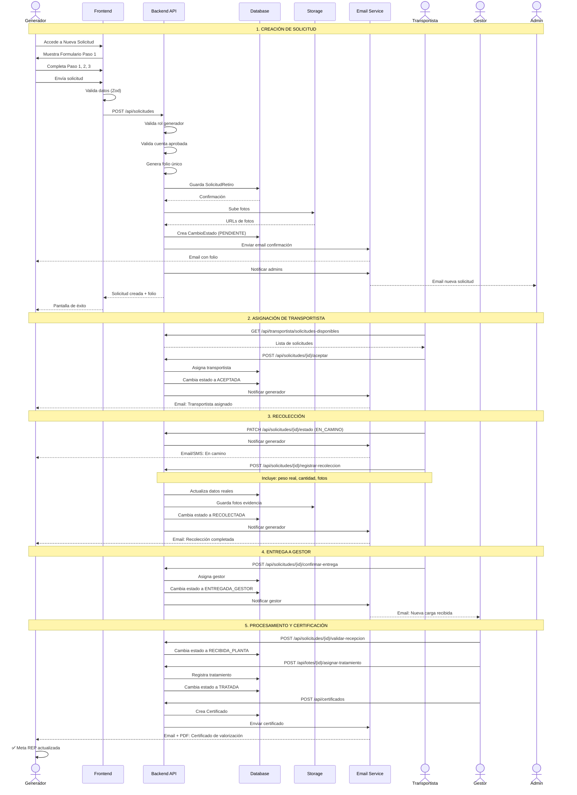
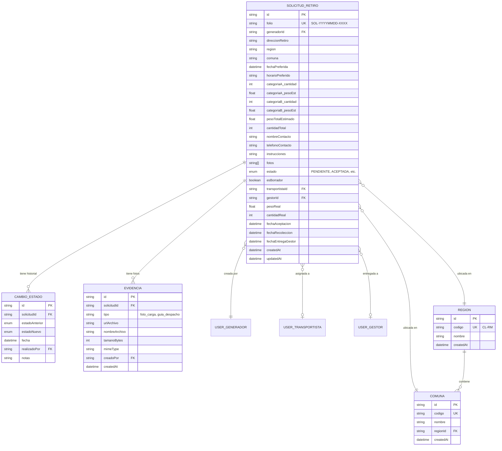

# Diagramas - Flujo de Solicitud de Retiro

## 📊 Diagrama de Flujo Principal (Mermaid)

```mermaid
flowchart TD
    Start([Generador inicia sesión]) --> CheckCuenta{¿Cuenta aprobada?}

    CheckCuenta -->|No| Bloqueado[❌ Mensaje: Cuenta pendiente de aprobación]
    CheckCuenta -->|Sí| Dashboard[Dashboard Generador]

    Dashboard --> NuevaSolicitud[➕ Presiona: Nueva Solicitud]

    NuevaSolicitud --> Paso1[📍 Paso 1: Información del Retiro]

    Paso1 --> InputDireccion[Ingresa dirección, región, comuna]
    InputDireccion --> InputFecha[Selecciona fecha y horario preferido]
    InputFecha --> ValidarPaso1{¿Datos válidos?}

    ValidarPaso1 -->|No| ErrorPaso1[❌ Mostrar errores]
    ErrorPaso1 --> Paso1
    ValidarPaso1 -->|Sí| Paso2[🚗 Paso 2: Detalles NFU]

    Paso2 --> InputCategorias[Ingresa cantidades y pesos por categoría]
    InputCategorias --> CalcularTotales[Sistema calcula totales]
    CalcularTotales --> ValidarPaso2{¿Al menos una categoría?}

    ValidarPaso2 -->|No| ErrorPaso2[❌ Error: Ingrese al menos una categoría]
    ErrorPaso2 --> Paso2
    ValidarPaso2 -->|Sí| Paso3[📞 Paso 3: Contacto e Instrucciones]

    Paso3 --> InputContacto[Ingresa nombre y teléfono contacto]
    InputContacto --> InputInstrucciones[Instrucciones adicionales opcional]
    InputInstrucciones --> OpcionFotos{¿Agregar fotos?}

    OpcionFotos -->|Sí| SubirFotos[📷 Sube hasta 5 fotos]
    SubirFotos --> ValidarFotos{¿Fotos válidas?}
    ValidarFotos -->|No| ErrorFotos[❌ Error: Tamaño/formato]
    ErrorFotos --> OpcionFotos
    ValidarFotos -->|Sí| ValidarPaso3

    OpcionFotos -->|No| ValidarPaso3{¿Datos válidos?}

    ValidarPaso3 -->|No| ErrorPaso3[❌ Mostrar errores]
    ErrorPaso3 --> Paso3
    ValidarPaso3 -->|Sí| OpcionGuardar{Usuario elige acción}

    OpcionGuardar -->|Guardar Borrador| GuardarBorrador[💾 Guardar como borrador]
    GuardarBorrador --> MensajeBorrador[✅ Borrador guardado]
    MensajeBorrador --> Dashboard

    OpcionGuardar -->|Enviar| ModalConfirmacion[📋 Modal de confirmación]

    ModalConfirmacion --> UsuarioConfirma{¿Confirma?}
    UsuarioConfirma -->|No| Paso3
    UsuarioConfirma -->|Sí| ProcesarSolicitud[🔄 Procesar solicitud]

    ProcesarSolicitud --> GenerarFolio[Generar folio único SOL-YYYYMMDD-XXXX]
    GenerarFolio --> GuardarDB[(💾 Guardar en Base de Datos)]
    GuardarDB --> SubirFotosStorage[☁️ Subir fotos a storage]
    SubirFotosStorage --> CrearCambioEstado[📝 Crear registro CambioEstado]
    CrearCambioEstado --> EnviarEmails[📧 Enviar emails]

    EnviarEmails --> EmailGenerador[✉️ Email confirmación al Generador]
    EnviarEmails --> EmailAdmins[✉️ Notificación a Administradores]

    EmailAdmins --> MostrarExito[✅ Pantalla de éxito con folio]

    MostrarExito --> AccionesPost{Usuario elige}
    AccionesPost -->|Ver Solicitud| VerDetalle[Ver detalle de solicitud]
    AccionesPost -->|Nueva Solicitud| NuevaSolicitud
    AccionesPost -->|Dashboard| Dashboard

    VerDetalle --> SeguimientoEstado[👁️ Seguimiento de estados]

    SeguimientoEstado --> EstadoPendiente[🟡 PENDIENTE: Esperando transportista]
    EstadoPendiente --> TransportistaAcepta{¿Transportista acepta?}

    TransportistaAcepta -->|No 48h| NotificarAdmin[⚠️ Notificar admin - sin asignación]
    TransportistaAcepta -->|Sí| EstadoAceptada[🔵 ACEPTADA: Transportista asignado]

    EstadoAceptada --> EstadoEnCamino[🟢 EN CAMINO: Transportista en ruta]
    EstadoEnCamino --> EstadoRecolectada[✅ RECOLECTADA: NFU recogidos]
    EstadoRecolectada --> EstadoEntregada[🏭 ENTREGADA A GESTOR: En planta]
    EstadoEntregada --> EstadoTratada[♻️ TRATADA: Procesada]
    EstadoTratada --> GenerarCertificado[📜 Generar Certificado de Valorización]

    GenerarCertificado --> Fin([Fin del flujo])

    style Start fill:#90EE90
    style Fin fill:#90EE90
    style Bloqueado fill:#FFB6C1
    style ErrorPaso1 fill:#FFB6C1
    style ErrorPaso2 fill:#FFB6C1
    style ErrorPaso3 fill:#FFB6C1
    style ErrorFotos fill:#FFB6C1
    style MostrarExito fill:#90EE90
    style GenerarCertificado fill:#90EE90
```



---

## 🔄 Diagrama de Estados de Solicitud



---

## 👥 Diagrama de Actores e Interacciones



---

## 🗂️ Diagrama de Estructura de Datos



---

## 📱 Diagrama de Componentes Frontend

```mermaid
graph TB
    subgraph "Dashboard Generador"
        Dashboard[DashboardView]
        Dashboard --> NuevaSolicitudBtn[Botón: Nueva Solicitud]
    end

    subgraph "Crear Solicitud - Container"
        NuevaSolicitudView[NuevaSolicitudView.tsx]
        NuevaSolicitudView --> StepIndicator[StepIndicator]
        NuevaSolicitudView --> FormPaso1[Paso1InformacionRetiro]
        NuevaSolicitudView --> FormPaso2[Paso2DetallesNFU]
        NuevaSolicitudView --> FormPaso3[Paso3ContactoInstrucciones]
        NuevaSolicitudView --> Resumen[ResumenSolicitud]
        NuevaSolicitudView --> Confirmacion[MensajeConfirmacion]
    end

    subgraph "Componentes Paso 1"
        FormPaso1 --> CheckboxDireccion[Checkbox: Usar dirección registrada]
        FormPaso1 --> SelectRegion[Select: Región]
        FormPaso1 --> SelectComuna[Select: Comuna]
        FormPaso1 --> DatePicker[DatePicker: Fecha]
        FormPaso1 --> RadioHorario[RadioGroup: Horario]
    end

    subgraph "Componentes Paso 2"
        FormPaso2 --> InputCatA[CategoriaNFUInput: Cat. A]
        FormPaso2 --> InputCatB[CategoriaNFUInput: Cat. B]
        FormPaso2 --> DisplayTotales[Display: Totales calculados]
    end

    subgraph "Componentes Paso 3"
        FormPaso3 --> InputContacto[Input: Nombre contacto]
        FormPaso3 --> InputTelefono[Input: Teléfono validado]
        FormPaso3 --> TextareaInstrucciones[Textarea: Instrucciones]
        FormPaso3 --> CargadorFotos[CargadorFotos.tsx]
    end

    subgraph "Hooks Personalizados"
        useSolicitudMultiStep[useSolicitudMultiStep]
        useValidarPaso[useValidarPaso]
        useSubirFotos[useSubirFotos]
    end

    NuevaSolicitudView -.usa.-> useSolicitudMultiStep
    FormPaso1 -.usa.-> useValidarPaso
    FormPaso2 -.usa.-> useValidarPaso
    FormPaso3 -.usa.-> useValidarPaso
    CargadorFotos -.usa.-> useSubirFotos

    subgraph "API Calls"
        API_Regiones[GET /api/regiones]
        API_Comunas[GET /api/regiones/{id}/comunas]
        API_Crear[POST /api/solicitudes]
        API_Borrador[POST /api/solicitudes/borrador]
    end

    SelectRegion -->|fetch| API_Regiones
    SelectComuna -->|fetch| API_Comunas
    NuevaSolicitudView -->|enviar| API_Crear
    NuevaSolicitudView -->|guardar| API_Borrador

    style NuevaSolicitudView fill:#4A90E2
    style useSolicitudMultiStep fill:#F5A623
    style API_Crear fill:#7ED321
```

---

## 🎯 Puntos de Decisión Clave

### 1. Validación de Cuenta

```
┌─────────────────────┐
│  Usuario accede     │
└──────────┬──────────┘
           │
           ▼
    ┌──────────────┐
    │ ¿Rol =       │
    │ Generador?   │
    └──────┬───────┘
           │
      No ──┴── Sí
       │        │
       ▼        ▼
   ❌ 403   ┌──────────────┐
            │ ¿Cuenta      │
            │ aprobada?    │
            └──────┬───────┘
                   │
              No ──┴── Sí
               │        │
               ▼        ▼
           ❌ Mensaje  ✅ Continuar
           "Pendiente"
```

### 2. Generación de Folio

```
┌──────────────────────┐
│ Usuario envía        │
│ solicitud            │
└──────────┬───────────┘
           │
           ▼
    ┌──────────────────┐
    │ Obtener fecha    │
    │ actual           │
    │ YYYYMMDD         │
    └──────────┬───────┘
               │
               ▼
    ┌──────────────────┐
    │ Buscar última    │
    │ solicitud del día│
    └──────────┬───────┘
               │
        ¿Existe?
               │
        No ─────┴──── Sí
         │            │
         │            ▼
         │     ┌──────────────┐
         │     │ Incrementar  │
         │     │ secuencia    │
         │     └──────┬───────┘
         │            │
         └────────────┤
                      │
                      ▼
           ┌──────────────────┐
           │ Generar folio    │
           │ SOL-YYYYMMDD-XXX │
           └──────────────────┘
```

---

**Generado:** 29/10/2025  
**Versión:** 1.0  
**Herramienta:** Mermaid.js
