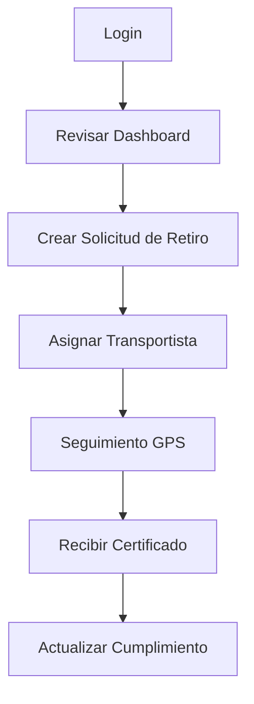

# 📋 Guía Completa del Generador - Sistema TrazAmbiental REP

[](.)
[](.)
[](.)

## 🏭 Rol del Generador en el Sistema REP

### ¿Quién es un Generador?

Como **Generador** (Productor según la Ley REP), su empresa es responsable de la gestión integral de los Neumáticos Fuera de Uso (NFU) que introduce al mercado chileno.

**Empresas generadoras incluyen:**

- 🏭 **Fabricantes** de neumáticos
- 🚚 **Importadores** de neumáticos
- 🛒 **Distribuidores** mayoristas
- 🏪 **Retailers** con ventas significativas

### 📊 Su Responsabilidad Legal

#### Marco Regulatorio

| Norma                       | Descripción                             | Obligación     |
| --------------------------- | --------------------------------------- | -------------- |
| **Ley 20.920**              | Responsabilidad Extendida del Productor | ✅ Obligatoria |
| **Decreto 8/2023 MMA**      | Metas específicas por año               | ✅ Obligatoria |
| **Decreto 148/2003 MINSAL** | Transporte residuos peligrosos          | ✅ Obligatoria |

#### Metas Anuales REP 2025

| Categoría        | Meta 2025 | Unidad                    |
| ---------------- | --------- | ------------------------- |
| **Recolección**  | 60%       | Del total introducido     |
| **Valorización** | 50%       | Del total introducido     |
| **Categoría A**  | 25%       | De neumáticos valorizados |
| **Categoría B**  | 25%       | De neumáticos valorizados |

### 🎯 Su Misión en el Sistema REP

1. **📝 Declarar** anualmente sus introducciones al mercado
2. **🚛 Gestionar** la recolección de NFU generados
3. **💰 Financiar** el proceso de valorización
4. **📊 Cumplir** las metas ambientales establecidas
5. **📄 Certificar** la correcta disposición final
6. **📈 Reportar** cumplimiento al MMA

### ⚠️ Consecuencias del Incumplimiento

- **Multas** de hasta 10.000 UTM por incumplimiento
- **Suspensión** de actividades comerciales
- **Responsabilidad penal** por contaminación ambiental
- **Pérdida de reputación** corporativa

---

---

## 🚀 Primeros Pasos en el Sistema

### 1. Registro Inicial

Si es la primera vez que accede:

1. **📧 Solicitar acceso** a soporte@trazambiental.cl
2. **📋 Preparar documentos** requeridos
3. **⏱️ Esperar aprobación** (24-48 horas)
4. **🔑 Recibir credenciales** por email

### 2. Configuración Inicial

Después del primer login:

1. **👤 Completar perfil** de empresa
2. **📊 Declarar** introducciones del año actual
3. **🎯 Configurar metas** y gestores autorizados
4. **🚛 Establecer** puntos de recolección

### 3. Operaciones Diarias

Flujo de trabajo típico:



---

## 📊 Dashboard Ejecutivo - Centro de Control

### 🎯 KPIs Principales en Tiempo Real

| Indicador            | Descripción           | Meta Ideal   | Unidad     |
| -------------------- | --------------------- | ------------ | ---------- |
| **Cumplimiento REP** | Progreso meta anual   | >80%         | Porcentaje |
| **Introducciones**   | Neumáticos al mercado | Declarado    | Toneladas  |
| **Valorizados**      | NFU procesados        | >50% meta    | Toneladas  |
| **Pendientes**       | Solicitudes activas   | <50          | Cantidad   |
| **Costo/Ton**        | Eficiencia financiera | <100.000 CLP | $/ton      |

### 📈 Widgets Interactivos

#### 📊 Gráfico de Progreso Mensual

- **Barras azules**: Introducciones al mercado
- **Barras verdes**: Valorizaciones completadas
- **Línea roja**: Meta acumulada mensual
- **Interactividad**: Click para detalles mensuales

#### 🎯 Velocímetro de Cumplimiento

- **Zona verde**: >80% cumplimiento
- **Zona amarilla**: 60-80% cumplimiento
- **Zona roja**: <60% cumplimiento
- **Proyección**: Cálculo automático fin de año

#### 📜 Certificados Recientes

- **Últimos 10 certificados** emitidos
- **Estado**: Activo, Revocado, Expirado
- **Enlaces directos** a PDFs
- **Búsqueda** por folio o fecha

#### ⚠️ Alertas Críticas

- **Meta mensual** próxima a vencer
- **Solicitudes** sin transportista asignado
- **Certificados** próximos a expirar
- **Incidencias** reportadas por transportistas

### 2. Registrar Neumáticos

#### Paso a Paso

1. **Acceder al módulo**
   - Menú: `Neumáticos > Registrar Introducción`

2. **Completar formulario**

   ```
   - Fecha de introducción al mercado
   - Tipo de neumático (Auto, Camión, Moto, Industrial, etc.)
   - Marca y modelo
   - Cantidad (unidades)
   - Peso promedio por unidad (kg)
   - Código de producto interno
   - País de origen (si es importación)
   - Documento aduanero (si aplica)
   ```

3. **Adjuntar documentación**
   - Factura de importación/producción
   - Declaración de aduana (si aplica)
   - Certificados de conformidad

4. **Validar y enviar**
   - Sistema valida datos
   - Genera código único de trazabilidad
   - Registra en blockchain (opcional)

#### Importación Masiva

Para grandes volúmenes:

- Descargar plantilla Excel: `Neumáticos > Importar > Descargar Plantilla`
- Completar datos según formato
- Subir archivo: `Neumáticos > Importar > Cargar Archivo`
- Revisar validaciones
- Confirmar importación

### 3. Declaraciones Anuales

#### Período de Declaración

- **Fecha límite:** 31 de marzo de cada año
- **Período declarado:** Año anterior completo

#### Proceso

1. **Iniciar declaración**
   - Menú: `Declaraciones > Nueva Declaración Anual`

2. **Revisión automática**
   - Sistema consolida todos los registros del año
   - Muestra totales por categoría de neumático
   - Calcula meta de valorización aplicable

3. **Validación**
   - Verificar datos consolidados
   - Realizar ajustes si es necesario
   - Adjuntar documentación de respaldo

4. **Firma digital**
   - Representante legal firma la declaración
   - Sistema genera acuse de recibo
   - Envía copia al MMA (integración)

5. **Establecimiento de meta**
   - Sistema calcula meta anual según normativa
   - Se activa seguimiento de cumplimiento

### 4. Solicitar Recolección

#### ¿Cuándo solicitar?

Cuando tiene NFU acumulados que necesitan ser retirados.

#### Proceso Paso a Paso

##### 4.1. Crear Nueva Solicitud

1. **Acceder al formulario**
   - Menú: `Recolección > Nueva Solicitud`
   - O desde el dashboard: botón `➕ Nueva Solicitud de Retiro`

##### 4.2. Paso 1 - Información del Retiro

**Dónde están los neumáticos:**

- ☑️ **Usar dirección registrada:** Si están en su dirección empresarial
- ☐ **Ingresar dirección diferente:** Si están en otra ubicación

**Completar:**

- **Dirección de retiro** (obligatorio)
- **Región** (selector, obligatorio)
- **Comuna** (selector dinámico según región, obligatorio)

**Cuándo prefiere el retiro:**

- **Fecha preferida** (hoy o posterior, máximo 30 días)
- **Horario preferido:**
  - ☐ Mañana (8:00 - 12:00)
  - ☐ Tarde (14:00 - 18:00)

💡 **Tip:** La fecha es preferencial, el transportista confirmará disponibilidad.

**Botón:** `[Siguiente →]`

##### 4.3. Paso 2 - Detalles de los NFU

**Categoría A - Neumáticos de Vehículos Livianos**

- Autos, camionetas, SUVs
- **Cantidad (unidades):** [número]
- **Peso estimado total (kg):** [número con decimales]

**Categoría B - Neumáticos de Vehículos Pesados**

- Camiones, buses, maquinaria
- **Cantidad (unidades):** [número]
- **Peso estimado total (kg):** [número con decimales]

📊 **Totales calculados automáticamente:**

- Cantidad total: X unidades
- Peso total estimado: X kg

⚠️ **Validación:** Debe ingresar al menos una categoría (A o B)

💡 **Tip:** Si no conoce el peso exacto, puede estimarlo:

- Categoría A: ~8-15 kg por unidad
- Categoría B: ~50-150 kg por unidad

**Botones:** `[← Anterior] [Siguiente →]`

##### 4.4. Paso 3 - Contacto e Instrucciones

**¿Quién recibirá al transportista?**

- **Nombre del contacto en sitio** (obligatorio)
- **Teléfono de contacto** (formato: +56 9 XXXX XXXX, obligatorio)

**Instrucciones adicionales** (opcional, máximo 500 caracteres)

- Ejemplo: "Tocar timbre del segundo piso"
- Ejemplo: "No disponible entre 13:00-14:00"
- Ejemplo: "Neumáticos están en bodega del fondo"

**Fotos de los Neumáticos** (opcional)

- Arrastra fotos aquí o haz clic para seleccionar
- Máximo 5 fotos
- Tamaño máximo por foto: 5MB
- Formatos aceptados: JPG, PNG, WEBP

💡 **Tip:** Las fotos ayudan al transportista a prepararse mejor.

**Botones:** `[💾 Guardar Borrador] [← Anterior] [📤 Enviar Solicitud]`

##### 4.5. Confirmación y Envío

**Antes de enviar, revise:**

- ✅ Dirección correcta
- ✅ Fecha y horario preferido
- ✅ Cantidades y pesos estimados
- ✅ Datos de contacto

**Modal de confirmación:**

```
¿Confirmar envío de solicitud?

• Dirección: [dirección completa]
• Fecha: [fecha] - [horario]
• Total: [cantidad] unidades (~[peso] kg)
• Contacto: [nombre] - [teléfono]

[Cancelar] [✅ Confirmar]
```

##### 4.6. Solicitud Creada

**Mensaje de éxito:**

```
✅ ¡Solicitud Creada Exitosamente!

Tu solicitud ha sido registrada con el ID:
SOL-20251029-0042

Recibirás una notificación cuando un transportista
acepte tu solicitud.

📧 Confirmación enviada a: contacto@empresa.cl

[Ver Mi Solicitud] [Crear Nueva] [Ir al Inicio]
```

**Qué sucede ahora:**

1. ✅ Solicitud registrada en el sistema
2. ✅ Email de confirmación enviado
3. ⏳ Transportistas disponibles ven tu solicitud
4. 🔔 Recibirás notificación cuando alguien la acepte
5. 📱 Podrás hacer seguimiento en tiempo real

#### 4.7. Guardar como Borrador

**Si necesita pausar:**

- Puede presionar `💾 Guardar Borrador` en cualquier paso
- Sus datos se guardan automáticamente
- Puede continuar después desde `Mis Solicitudes > Borradores`

#### 4.8. Ver Mis Solicitudes

**Acceso:** `Menú > Mis Solicitudes`

**Verá una tabla con:**

- **ID:** SOL-YYYYMMDD-XXXX
- **Fecha de creación**
- **Dirección:** Primera línea de la dirección
- **Estado:**
  - 🟡 **Pendiente:** Esperando asignación
  - 🔵 **Aceptada:** Transportista asignado
  - 🟢 **En Camino:** Transportista en ruta
  - ✅ **Recolectada:** NFU recolectados
  - 🏭 **Entregada a Gestor:** En planta
  - ❌ **Rechazada:** No se pudo atender

**Acciones disponibles:**

- 👁️ **Ver Detalle:** Información completa
- 📞 **Contactar Transportista:** Si está asignado
- 🗺️ **Ver en Mapa:** Ubicación de la solicitud
- 📋 **Descargar Comprobante:** PDF de la solicitud

#### 4.9. Seguimiento de Recolección

Una vez aceptada su solicitud:

1. **Notificación de Aceptación**
   - Nombre y contacto del transportista
   - Patente del vehículo
   - Fecha confirmada de recolección

2. **24 horas antes**
   - Recordatorio por email/SMS
   - Confirmación de horario

3. **El día de la recolección**
   - Estado cambia a "En Camino"
   - Puede ver ubicación en tiempo real (si disponible)

4. **Durante la recolección**
   - Transportista registra peso y cantidad real
   - Toma fotos de evidencia
   - Genera acta digital de recolección

5. **Después de la recolección**
   - Estado cambia a "Recolectada"
   - Recibe comprobante con datos reales
   - Puede ver fotos de evidencia

6. **Entrega a Gestor**
   - Estado cambia a "Entregada a Gestor"
   - NFU en planta de valorización
   - Esperando proceso y certificado

7. **Certificado de Valorización**
   - Cuando el gestor procesa los NFU
   - Recibirá certificado digital
   - Contribuye a su meta REP

#### 4.10. Preguntas Frecuentes - Solicitudes

**¿Puedo modificar una solicitud después de enviarla?**

- No, una vez enviada no se puede modificar
- Puede cancelarla y crear una nueva (si aún está pendiente)
- Si está aceptada, debe coordinar con el transportista

**¿Cuánto tiempo toma que acepten mi solicitud?**

- Generalmente entre 2 horas y 2 días
- Depende de la disponibilidad de transportistas en su zona
- Recibirá notificación inmediata cuando sea aceptada

**¿Puedo tener varias solicitudes activas?**

- Sí, puede crear múltiples solicitudes
- Cada una con su propio seguimiento
- Sin límite de solicitudes

**¿Qué pasa si nadie acepta mi solicitud?**

- El sistema notifica a administradores después de 48 horas
- Se buscarán alternativas de recolección
- Recibirá contacto directo del equipo de soporte

**¿Cuánto cuesta la recolección?**

- El costo depende de su contrato con el sistema de gestión
- Puede ser gratuito o con tarifa según volumen
- Consulte con su ejecutivo de cuenta

**¿Qué debo hacer si el transportista no llega?**

- Contacte al transportista directamente (datos en la solicitud)
- Reporte el incidente en: `Solicitud > Reportar Problema`
- El equipo de soporte intervendrá

**¿Puedo solicitar recolección urgente?**

- Actualmente no hay opción de urgencia
- Puede indicarlo en "Instrucciones adicionales"
- O contactar directamente al soporte: soporte@trazambiental.com

### 5. Seguimiento de Solicitudes de Retiro

#### Acceso al Módulo

Puede acceder al seguimiento de sus solicitudes de dos formas:

1. **Desde el Dashboard**: Haga clic en el card "Seguimiento" (fondo morado)
2. **Desde el Menú**: Navegue a `Recolección > Mis Solicitudes`
3. **URL directa**: `/dashboard/generador/solicitudes`

#### Vista de Lista de Solicitudes

Al entrar al módulo, verá una lista de todas sus solicitudes con:

**Barra de búsqueda:**

- Busque por folio (ej: `SOL-20251030-0001`)
- Busque por dirección

**Filtro por estado:**

- Todos los estados
- Pendientes
- Aceptadas
- En Camino
- Recolectadas
- Rechazadas
- Canceladas

**Lista de tarjetas:**
Cada solicitud se muestra como una tarjeta con:

- **Folio de la solicitud**
- **Badge de estado** con color indicativo:
  - 🟡 Pendiente (amarillo): Esperando asignación
  - 🔵 Aceptada (azul): Transportista asignado
  - 🔵 En Camino (índigo): Transportista en ruta
  - 🟢 Recolectada (verde): NFU recolectados exitosamente
  - 🟣 Entregada a Gestor (morado): En planta de valorización
  - 🔵 Recibida en Planta (azul claro): Gestor recibió los NFU
  - 🟢 Tratada (verde lima): Procesamiento completado
  - 🔴 Rechazada (rojo): No pudo ser atendida
  - ⚫ Cancelada (gris): Solicitud cancelada
- **Fecha preferida y horario**
- **Dirección de retiro**
- **Total de NFU** (cantidad y peso)

#### Detalle de Solicitud

**Para ver detalles completos:**

1. Haga clic en cualquier tarjeta de solicitud
2. Se abrirá un modal con información completa

**Información mostrada en el modal:**

📍 **Información del Retiro:**

- Dirección completa
- Región y comuna
- Fecha preferida (formato: lunes, 30 de octubre, 2025)
- Horario (Mañana o Tarde con rango horario)

📦 **Detalles de NFU:**

- Desglose por categoría A (Vehículos Livianos):
  - Cantidad en unidades
  - Peso estimado en kg
- Desglose por categoría B (Vehículos Pesados):
  - Cantidad en unidades
  - Peso estimado en kg
- **Total general** resaltado:
  - Cantidad total en unidades
  - Peso total estimado en kg

👤 **Contacto en Sitio:**

- Nombre del contacto
- Teléfono de contacto
- Instrucciones adicionales (si fueron proporcionadas)

📷 **Fotos** (si fueron subidas):

- Galería de hasta 5 fotos
- Vista previa en cuadrícula
- Cada foto muestra la evidencia de los NFU

🕐 **Historial de Cambios de Estado:**

- Sección expandible/colapsable
- Cada cambio muestra:
  - Estados de transición (anterior → nuevo)
  - Fecha y hora exacta
  - Usuario que realizó el cambio
  - Notas adicionales (si existen)

#### Funcionalidades de Filtrado y Búsqueda

**Búsqueda por texto:**

1. Ingrese texto en el campo "Buscar por folio"
2. La búsqueda se aplica automáticamente mientras escribe
3. Los resultados se filtran en tiempo real

**Filtro por estado:**

1. Seleccione un estado del dropdown
2. La lista se actualiza mostrando solo las solicitudes con ese estado
3. Use "Limpiar filtros" para restaurar la vista completa

**Combinar filtros:**

- Puede combinar búsqueda de texto + filtro de estado
- Los filtros son acumulativos
- Todos los filtros activos pueden limpiarse con un solo botón

#### Actualización en Tiempo Real

El módulo se actualiza automáticamente cada 30 segundos:

- ✅ No necesita recargar la página manualmente
- ✅ Los cambios de estado se reflejan automáticamente
- ✅ Las notificaciones se muestran en tiempo real

#### Paginación

Si tiene más de 10 solicitudes:

- La página muestra controles de paginación en la parte inferior
- Contador: "Mostrando 1 a 10 de 25 solicitudes"
- Botones "Anterior" y "Siguiente" para navegar
- Indicador: "Página X de Y"

#### Estado Vacío

Si no tiene solicitudes creadas:

- Verá un mensaje amigable: "No tienes solicitudes aún"
- Botón directo: "Crear Primera Solicitud"
- Este botón lo llevará al formulario de creación

#### Navegación desde el Módulo

Desde la página de seguimiento puede:

- **Crear nueva solicitud**: Botón "Nueva Solicitud" en la parte superior derecha
- **Volver al dashboard**: Usar el menú de navegación
- **Ver detalle completo**: Hacer clic en cualquier tarjeta

#### Preguntas Frecuentes - Seguimiento

**¿Por qué no veo mis solicitudes?**

- Verifique que esté logeado con la cuenta correcta
- Verifique que la solicitud no haya sido eliminada
- Verifique los filtros aplicados (puede tener un filtro activo)

**¿Cómo sé cuándo cambió el estado de mi solicitud?**

- El historial muestra la fecha y hora exacta de cada cambio
- Puede expandir el historial en el modal de detalle
- También recibirá notificaciones por email

**¿Puedo ver el histórico de solicitudes antiguas?**

- Sí, todas sus solicitudes (activas y completadas) están disponibles
- Use los filtros para encontrar solicitudes específicas
- La lista muestra todas las solicitudes sin importar el estado

**¿Qué significa cada estado?**

- Consulte la sección "Seguimiento de Recolección" (punto 4.9) para el flujo completo

**¿Cómo contacto al transportista de mi solicitud?**

- Los datos de contacto aparecen en el modal de detalle
- Si el estado es "Aceptada" o superior, el transportista ya está asignado
- Puede ver el nombre y email del transportista en el detalle

### 6. Certificados de Valorización

#### ¿Qué son?

Documentos digitales que certifican que sus NFU fueron valorizados correctamente, contribuyendo a su meta REP.

#### Visualizar certificados

1. **Acceder a listado**
   - Menú: `Certificados > Ver Certificados`

2. **Información mostrada**
   - Fecha de emisión
   - Gestor que valoró
   - Toneladas certificadas
   - Método de valorización
   - Estado (Válido/Observado)
   - Contribución a meta (%)

3. **Acciones disponibles**
   - 👁️ Ver detalle completo
   - 📥 Descargar PDF
   - ✉️ Enviar por email
   - 🔗 Compartir link seguro
   - ⚠️ Reportar inconsistencia

#### Validación de certificados

Los certificados son generados automáticamente por el sistema cuando un Gestor registra la valorización. Incluyen:

- Código único QR
- Firma digital del gestor
- Hash de blockchain (si aplica)
- Metadatos no modificables

### 7. Reportes y Análisis

#### Reportes Disponibles

##### A. Reporte de Cumplimiento Mensual

- **Contenido:**
  - Toneladas introducidas en el mes
  - Toneladas valorizadas en el mes
  - Progreso acumulado
  - Proyección de cumplimiento
- **Formato:** PDF, Excel
- **Frecuencia:** Mensual automático

##### B. Reporte de Trazabilidad

- **Contenido:**
  - Seguimiento completo de lote de neumáticos
  - Desde introducción hasta valorización
  - Todos los actores involucrados
  - Tiempos de proceso

##### C. Reporte Financiero

- **Contenido:**
  - Costos de gestión por tonelada
  - Comparativa con períodos anteriores
  - Proyección de costos
  - Análisis por tipo de neumático

##### D. Reporte para MMA

- **Contenido:**
  - Formato oficial según normativa
  - Datos consolidados anuales
  - Evidencia de cumplimiento
  - Listo para presentación oficial

#### Generar Reporte

1. `Reportes > Generar Nuevo`
2. Seleccionar tipo de reporte
3. Definir período
4. Aplicar filtros (opcional):
   - Por tipo de neumático
   - Por gestor
   - Por región
5. Elegir formato (PDF/Excel/CSV)
6. Generar y descargar

### 8. Dashboard de Cumplimiento

#### Vista Global

Acceda a una vista integral de su cumplimiento REP:

1. **Menú:** `Cumplimiento > Dashboard`

2. **Secciones:**

   **A. Indicadores Principales**
   - Meta anual (toneladas)
   - Avance actual (%)
   - Brecha por cerrar
   - Días restantes en el año
   - Tasa diaria requerida

   **B. Gráficos**
   - Evolución mensual (línea de tiempo)
   - Comparativa año anterior
   - Distribución por método de valorización
   - Comparativa por región

   **C. Alertas**
   - 🔴 Críticas: Riesgo de incumplimiento
   - 🟡 Advertencias: Desviación de proyección
   - 🟢 Informativas: Hitos alcanzados

   **D. Acciones Recomendadas**
   - Sistema sugiere acciones para mejorar cumplimiento
   - Ej: "Solicitar recolección en Región X"
   - Ej: "Meta alcanzable con 15 ton/mes adicionales"

#### Filtros Disponibles

- Por período (mes, trimestre, año)
- Por región geográfica
- Por tipo de neumático
- Por gestor/transportista

### 9. Configuración de Cuenta

#### Información de Empresa

`Perfil > Información de Empresa`

- Razón social
- RUT
- Dirección
- Representante legal
- Contactos
- Certificaciones

#### Usuarios y Accesos

Como Generador, puede crear sub-usuarios:

1. `Administración > Usuarios > Crear Usuario`
2. Definir:
   - Nombre y email
   - Rol secundario (Ej: "Generador - Solo Lectura")
   - Permisos específicos
3. Enviar invitación
4. Usuario recibe email con acceso

#### Notificaciones

`Perfil > Notificaciones`

Configure cómo desea recibir alertas:

- ✉️ Email
- 📱 SMS
- 🔔 Push notifications
- 📊 Slack/Teams (integraciones)

**Tipos de notificaciones:**

- Nueva recolección programada
- Certificado emitido
- Meta mensual alcanzada
- Alertas de cumplimiento
- Reportes automáticos

---

## ✅ Checklist Mensual

Como Generador, le recomendamos esta rutina mensual:

### Primera semana del mes

- [ ] Revisar dashboard de cumplimiento
- [ ] Verificar nuevos certificados recibidos
- [ ] Validar que certificados estén correctamente aplicados a meta

### Segunda semana

- [ ] Registrar neumáticos introducidos en el mes anterior (si no se hizo en tiempo real)
- [ ] Revisar inventario de NFU acumulados
- [ ] Programar recolecciones si es necesario

### Tercera semana

- [ ] Generar reporte mensual de cumplimiento
- [ ] Analizar tendencias y proyecciones
- [ ] Ajustar estrategia si hay desviaciones

### Cuarta semana

- [ ] Revisar presupuesto y costos
- [ ] Planificar mes siguiente
- [ ] Coordinar con transportistas y gestores si hay compromisos especiales

---

## 💡 Mejores Prácticas para Generadores REP

### 📊 Gestión Eficiente del Cumplimiento

#### 1. Registro Oportuno

- ✅ **Registrar introducciones** inmediatamente después de ventas
- ✅ **Usar importación masiva** para registros históricos
- ✅ **Verificar datos** antes de guardar (previene correcciones)

#### 2. Planificación Estratégica

- 🎯 **Diversificar gestores** para evitar cuellos de botella
- 📅 **Programar recolecciones** con antelación (30-45 días)
- 💰 **Negociar contratos** anuales con transportistas
- 📊 **Monitorear KPIs** semanalmente, no mensualmente

#### 3. Optimización de Costos

- 🏭 **Concentrar retiros** en puntos estratégicos
- 🚛 **Rutas optimizadas** reducen costos de transporte
- 📦 **Agrupa solicitudes** para economías de escala
- 🎯 **Metas realistas** evitan costos de última hora

### 🔧 Troubleshooting - Solución de Problemas

#### 🚨 Problemas Comunes y Soluciones

##### **Solicitud sin transportista asignado**

```
Problema: Solicitud creada pero sin movimiento por días
```

**Solución:**

1. Verificar cobertura geográfica del transportista
2. Contactar transportistas alternativos
3. Escalar a Especialista de Sistema si persiste

##### **Certificado rechazado por gestor**

```
Problema: Gestor rechaza recepción por discrepancias
```

**Solución:**

1. Revisar cantidades y tipos declarados
2. Verificar estado físico de los neumáticos
3. Corregir solicitud y reenviar
4. Documentar evidencia fotográfica

##### **Meta mensual en riesgo**

```
Problema: Cumplimiento < 80% en mes avanzado
```

**Solución:**

1. Activar "modo urgencia" con transportistas
2. Solicitar capacidad extra a gestores
3. Considerar "préstamo" de certificados futuros
4. Reportar plan de recuperación

##### **Error de conexión al sistema**

```
Problema: No puedo acceder al dashboard
```

**Solución:**

1. Verificar conexión a internet
2. Limpiar cache del navegador
3. Probar con navegador alternativo
4. Contactar soporte si persiste

#### 📞 Escalation Matrix

| Nivel | Problema                | Tiempo Respuesta | Contacto                      |
| ----- | ----------------------- | ---------------- | ----------------------------- |
| **1** | Error técnico menor     | < 4 horas        | soporte@trazambiental.cl      |
| **2** | Solicitud sin asignar   | < 24 horas       | coordinador@trazambiental.cl  |
| **3** | Riesgo meta mensual     | < 12 horas       | especialista@trazambiental.cl |
| **4** | Emergencia cumplimiento | < 2 horas        | director@trazambiental.cl     |

### 📈 Indicadores de Performance

#### KPIs a Monitorear Diariamente

- **Solicitudes activas**: Máximo 20 por generador
- **Tiempo asignación**: < 48 horas promedio
- **Certificados semanales**: Mínimo según meta
- **Incidencias**: < 5% del total de solicitudes

#### Alertas Automáticas Configurables

- 📧 **Meta mensual**: Alerta cuando < 80%
- 📧 **Sin asignación**: 24h sin transportista
- 📧 **Certificado pendiente**: 48h sin emisión
- 📧 **Cumplimiento semanal**: Reporte automático

### 🎯 Estrategias de Optimización

#### Optimización de Procesos

1. **Automatizar** reportes semanales
2. **Capacitar** equipo en uso del sistema
3. **Establecer** rutinas de verificación
4. **Negociar** mejores condiciones con proveedores

#### Gestión de Riesgos

1. **Diversificar** proveedores de servicios
2. **Mantener** reserva de capacidad (10-15%)
3. **Documentar** procesos críticos
4. **Realizar** simulacros de contingencia

---

## 🆘 Preguntas Frecuentes

### ¿Qué hago si no alcanzo la meta anual?

1. **Solicitar anticipadamente más recolecciones**
2. **Contactar al Especialista de Sistema** para análisis
3. **Diversificar gestores** para aumentar capacidad
4. **Considerar ajustar calendarios** de introducción al mercado

### ¿Cómo verifico la autenticidad de un certificado?

1. Ir a `Certificados > Validar Certificado`
2. Escanear código QR o ingresar código manualmente
3. Sistema muestra información completa y estado

### ¿Puedo gestionar múltiples plantas/sucursales?

Sí, puede:

- Crear sub-usuarios por ubicación
- Asignar cada registro a una sucursal
- Filtrar reportes por sucursal

### ¿Los datos son confidenciales?

Sí, su información es privada. Solo tienen acceso:

- Su empresa (usuarios autorizados)
- Especialista de Sistema (solo para seguimiento de metas agregadas)
- Administradores (para soporte técnico)
- Auditores (solo lectura)

### ¿Qué pasa si hay un error en un registro?

- Registros recientes (< 7 días) pueden editarse
- Registros antiguos requieren solicitud de corrección
- Todo cambio queda registrado en auditoría

---

## 📞 Soporte

### Soporte Técnico

- **Email:** soporte@trazambiental.com
- **Teléfono:** +56 2 XXXX XXXX
- **Horario:** Lunes a Viernes, 9:00 - 18:00

### Soporte Legal/Normativo

- **Email:** legal@trazambiental.com
- Consultas sobre interpretación de normativa REP

### Capacitación

- Solicite capacitación para su equipo
- Webinars mensuales gratuitos
- Documentación y videos tutoriales

---

## 📚 Recursos Adicionales

- [Video Tutorial: Primeros Pasos como Generador](link)
- [Guía de Mejores Prácticas REP](link)
- [FAQ Extendido](link)
- [Normativa REP Completa](link)

---

**Última actualización:** Octubre 2025  
**Versión:** 1.0.0
