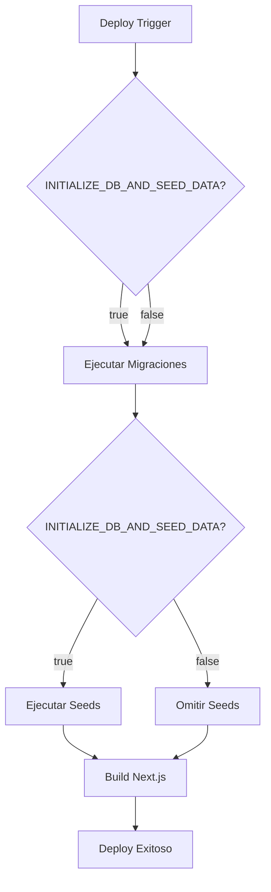

# 🎛️ Estrategia de Inicialización de Base de Datos

**Fecha:** 29 de enero de 2026  
**Versión:** 1.0

---

## 📖 Resumen

Esta guía explica la estrategia de inicialización de base de datos mediante la flag `INITIALIZE_DB_AND_SEED_DATA`, que controla si los seeds se ejecutan durante el deploy.

---

## 🎯 Objetivo

Proporcionar un mecanismo seguro para:

1. **Inicializar** la base de datos en el primer deploy (con roles y admin)
2. **Preservar** datos existentes en deploys subsecuentes
3. **Evitar** sobrescribir información de usuarios en producción

---

## 🔧 Cómo Funciona

### Flag: `INITIALIZE_DB_AND_SEED_DATA`

| Valor   | Comportamiento                                         |
| ------- | ------------------------------------------------------ |
| `true`  | Ejecuta migraciones + seeds (roles, admin, estructura) |
| `false` | Solo ejecuta migraciones (preserva datos)              |

### Flujo de Deploy



---

## 📋 Casos de Uso

### 1. Primer Deploy en Producción

**Escenario:** Base de datos vacía, necesitas crear estructura inicial.

**Configuración:**

```bash
INITIALIZE_DB_AND_SEED_DATA=true
ADMIN_EMAIL=admin@tudominio.com
ADMIN_PASSWORD=TuPasswordSegura!123
```

**Resultado:**

- ✅ Se crean roles del sistema
- ✅ Se crea usuario admin
- ✅ Base de datos lista para usar

**Acción Posterior:**
🔒 **Cambiar a `false` inmediatamente después del primer deploy exitoso**

---

### 2. Deploys Subsecuentes en Producción

**Escenario:** Aplicación en funcionamiento, necesitas aplicar cambios sin perder datos.

**Configuración:**

```bash
INITIALIZE_DB_AND_SEED_DATA=false
```

**Resultado:**

- ✅ Solo se aplican migraciones pendientes
- ✅ Datos existentes se preservan
- ✅ No se ejecutan seeds
- ✅ Usuarios, guías, tratamientos intactos

---

### 3. Desarrollo Local

**Escenario:** Desarrollo y testing, necesitas resetear frecuentemente.

**Configuración:**

```bash
INITIALIZE_DB_AND_SEED_DATA=true
NODE_ENV=development
```

**Resultado:**

- ✅ Seeds se ejecutan
- ✅ Crea roles y usuarios de prueba
- ✅ Datos demo disponibles
- ✅ Fácil reseteo con `npm run db:reset`

---

### 4. Reinicialización Completa (⚠️ PELIGROSO)

**Escenario:** Necesitas reiniciar producción desde cero.

**⚠️ ADVERTENCIA:** Esto borrará TODOS los datos existentes.

**Pasos:**

1. Hacer backup de la base de datos
2. Cambiar `INITIALIZE_DB_AND_SEED_DATA=true` en Vercel
3. Ejecutar deploy
4. Cambiar de vuelta a `false`

---

## 🔄 Comportamiento de Seeds

### Cuando `INITIALIZE_DB_AND_SEED_DATA=true`:

#### Seeder de Roles (002-...)

- Crea/actualiza roles del sistema (Administrador, Gestor, etc.)
- Crea admin si NO existe (preserva contraseña si existe)
- En desarrollo: crea usuarios de prueba

#### Seeder de Sistema de Gestión (003-...)

- Solo en desarrollo: crea datos demo de metas
- En producción: se omite

### Cuando `INITIALIZE_DB_AND_SEED_DATA=false`:

- ❌ NO se ejecutan seeds
- ✅ Solo migraciones
- ✅ Datos preservados

---

## 🛡️ Protección de Datos

### Seeders Seguros (Usan Upsert)

Los seeders están diseñados para NO sobrescribir datos críticos:

```typescript
// Ejemplo: Creación de admin
const existingAdmin = await prisma.user.findUnique({
  where: { email: adminUser.email }
});

if (existingAdmin) {
  // Solo actualiza campos no sensibles
  await prisma.user.update({
    data: {
      active: true,
      cuentaAprobada: true
      // NO actualiza password
    }
  });
} else {
  // Crea nuevo admin con password
  await prisma.user.create({ ... });
}
```

### Migraciones Seguras

`prisma migrate deploy`:

- ✅ Solo aplica migraciones pendientes
- ✅ NO borra datos
- ✅ NO ejecuta `prisma db push`
- ✅ Seguro para producción

---

## 📊 Comparación con Sistema Anterior

| Aspecto       | Sistema Anterior                    | Sistema Actual                |
| ------------- | ----------------------------------- | ----------------------------- |
| Flags         | `SEED_TEST_USERS`, `SEED_DEMO_DATA` | `INITIALIZE_DB_AND_SEED_DATA` |
| Control       | Dos flags separadas                 | Una flag maestra              |
| Claridad      | Confuso qué hacer                   | Claro: true/false             |
| Primer deploy | No documentado                      | Proceso de 2 fases            |
| Preservación  | Admin se reseteaba                  | Admin se preserva             |

---

## ✅ Checklist de Seguridad

Antes de cualquier deploy en producción:

- [ ] Verificar valor de `INITIALIZE_DB_AND_SEED_DATA`
- [ ] Si es primer deploy: `true`
- [ ] Si es deploy subsecuente: `false`
- [ ] Backup de BD antes de cambios mayores
- [ ] Verificar que `NODE_ENV=production`

---

## 🆘 Troubleshooting

### Problema: "Seeds no se ejecutaron en primer deploy"

**Causa:** `INITIALIZE_DB_AND_SEED_DATA` en `false` o no configurado.

**Solución:**

```bash
# En Vercel
INITIALIZE_DB_AND_SEED_DATA=true
# Redeploy
```

---

### Problema: "Admin se resetea en cada deploy"

**Causa:** `INITIALIZE_DB_AND_SEED_DATA` sigue en `true`.

**Solución:**

```bash
# En Vercel, cambiar a:
INITIALIZE_DB_AND_SEED_DATA=false
```

---

### Problema: "Necesito actualizar roles del sistema"

**Solución:**
Los roles se actualizan mediante migraciones, no seeds. Crea una migración:

```bash
# Local
npx prisma migrate dev --name update-roles

# En producción, la migración se aplica automáticamente
```

---

## 📚 Referencias

- [Guía de Deploy en Vercel](./DEPLOYMENT-VERCEL.md)
- [Pasos de Despliegue](../../PASOS-DESPLIEGUE.md)
- [Reset de Base de Datos](./RESET-DB-PRODUCCION.md)

---

## 📝 Notas Adicionales

### Entornos

La flag funciona en conjunto con `NODE_ENV`:

```bash
# Desarrollo
NODE_ENV=development
INITIALIZE_DB_AND_SEED_DATA=true
→ Seeds con datos de prueba

# Producción - Primer deploy
NODE_ENV=production
INITIALIZE_DB_AND_SEED_DATA=true
→ Seeds solo con admin, sin datos demo

# Producción - Subsecuente
NODE_ENV=production
INITIALIZE_DB_AND_SEED_DATA=false
→ Solo migraciones
```

### Recomendaciones

1. **Siempre** hacer backup antes de cambiar la flag a `true` en producción
2. **Nunca** dejar la flag en `true` permanentemente en producción
3. **Documentar** en el log de deploy cuándo y por qué se cambió la flag
4. **Comunicar** al equipo antes de ejecutar seeds en producción

---

**Última actualización:** 29 de enero de 2026
