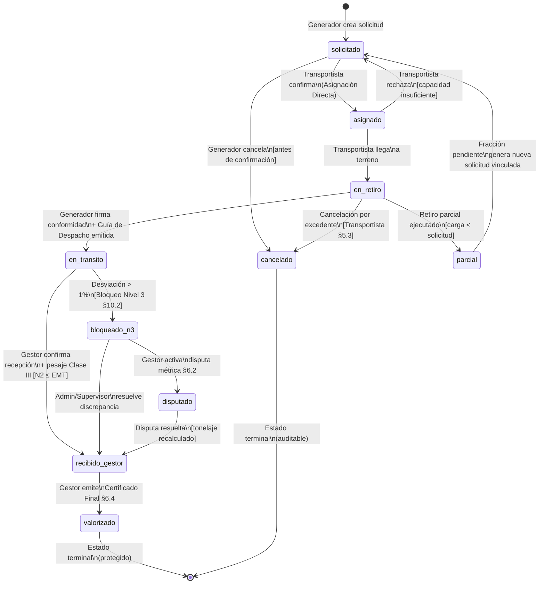
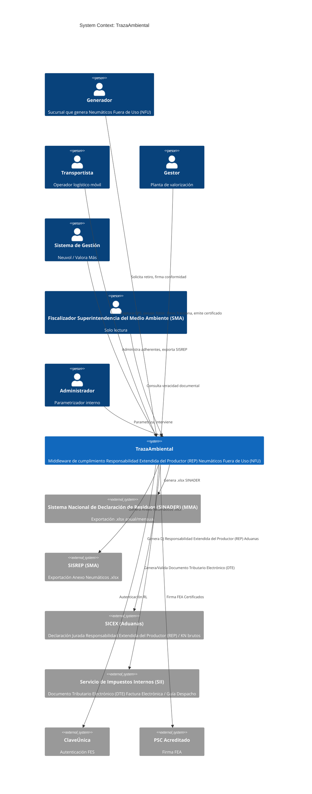
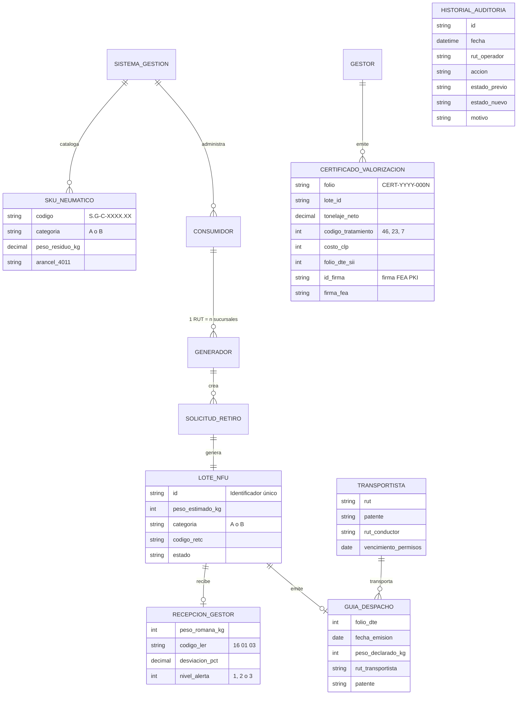
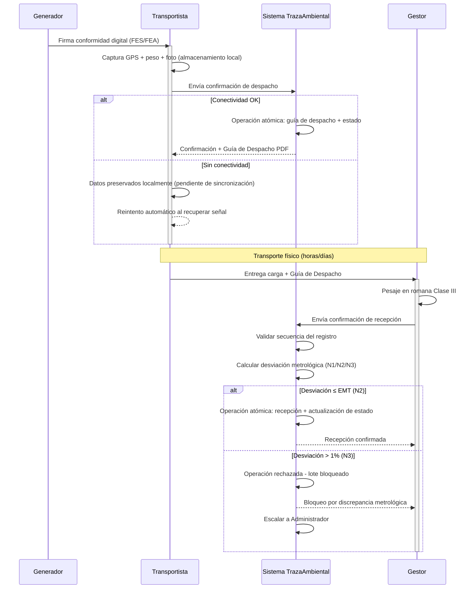
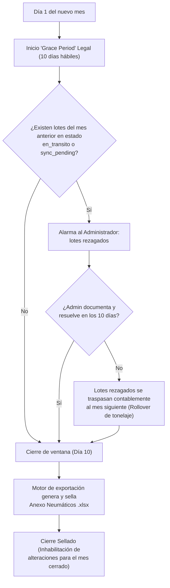

<!-- MACRO 1 | SUB-BLOQUE: Parte 0 (Metadatos) | INICIO -->

# PRD - TrazaAmbiental: Plataforma de Trazabilidad Ambiental para Productos Prioritarios

---

## PARTE 0: METADATOS Y CONTROL DE VERSIONES

### §0.1 Ficha Técnica del Documento

| Campo | Valor |
|---|---|
| **Nombre del producto** | TrazaAmbiental |
| **Versión del documento** | 2.0.0 (Tech-Agnostic) |
| **Fecha de emisión** | 2026-04-12 |
| **Estado** | Borrador definitivo. Pendiente de aprobación ejecutiva. Purgado de referencias a implementación técnica (ADR-013). |
| **Módulo inicial** | Neumáticos Fuera de Uso (NFU) - Categoría A y Categoría B |
| **Jurisdicción normativa** | República de Chile |
| **Marco legal primario** | Ley 20.920, D.S. 8, Ley 21.719, Ley 19.799 |
| **Fuentes de investigación** | 9 informes de investigación primaria + Reporte de Brecha Conceptual + Correcciones de Auditabilidad (docs/research/) |
| **Índice de fuentes verificadas** | [INDEX-FUENTES.md](../research/INDEX-FUENTES.md) |
| **Diccionario terminológico** | [diccionario-terminologico.md](diccionario-terminologico.md) |

> [!IMPORTANT]
> Este documento es autocontenido. No referencia iteraciones previas de código, brechas históricas ni documentos de trabajo intermedios. Toda afirmación legal se respalda con referencia a su fuente primaria.

---

### §0.2 Glosario de Acrónimos

| Sigla | Significado completo |
|---|---|
| APDP | Agencia de Protección de Datos Personales (creada por Ley 21.719) |
| ARCOP | Derechos de Acceso, Rectificación, Cancelación, Oposición y Portabilidad |
| DJA | Declaración Jurada Anual |
| DTE | Documento Tributario Electrónico |
| FEA | Firma Electrónica Avanzada (Ley 19.799) |
| FES | Firma Electrónica Simple (Ley 19.799) |
| LER | Listado Europeo de Residuos |
| MMA | Ministerio del Medio Ambiente |
| MTT | Ministerio de Transportes y Telecomunicaciones |
| NFU | Neumático Fuera de Uso |
| OIML | Organización Internacional de Metrología Legal |
| OTR | Off-The-Road (neumáticos fuera de carretera, minería) |
| PKI | Infraestructura de Clave Pública |
| PSC | Prestador de Servicios de Certificación |
| RAT | Registro de Actividades de Tratamiento (Ley 21.719) |
| RCA | Resolución de Calificación Ambiental |
| REP | Responsabilidad Extendida del Productor |
| RETC | Registro de Emisiones y Transferencias de Contaminantes |
| RL | Representante Legal |
| RUT | Rol Único Tributario |
| SEREMI | Secretaría Regional Ministerial |
| SG | Sistema de Gestión (Colectivo) |
| SICEX | Sistema Integrado de Comercio Exterior |
| SII | Servicio de Impuestos Internos |
| SINADER | Sistema Nacional de Declaración de Residuos |
| SISREP | Sistema de Reporte de la Responsabilidad Extendida del Productor |
| SKU | Stock Keeping Unit |
| SMA | Superintendencia del Medio Ambiente |
| SNA | Servicio Nacional de Aduanas |
| SNIFA | Sistema Nacional de Información de Fiscalización Ambiental |
| UTA | Unidad Tributaria Anual |
| UTM | Unidad Tributaria Mensual |
| UUID | Identificador Único Universal (versión 4) |

<!-- MACRO 1 | SUB-BLOQUE: Parte 0 (Metadatos) | FIN | CHECKS: Ninguno (infraestructura documental) -->

<!-- MACRO 1 | SUB-BLOQUE: §1.1-§1.3 (Propósito, Mercado, Aislamiento) | INICIO -->

---

## PARTE I: VISIÓN ESTRATÉGICA

### §1.1 Declaración de Propósito

TrazaAmbiental es una plataforma de trazabilidad ambiental que funciona como middleware de cumplimiento normativo entre los actores regulados por la Ley 20.920 y las plataformas digitales del Estado chileno (Registro de Emisiones y Transferencias de Contaminantes (RETC)/Sistema Nacional de Declaración de Residuos (SINADER), SISREP, SICEX).

El sistema no es una aplicación logística con interfaz estética. Es un motor de equivalencia metrológica y un generador de evidencia auditable que reconcilia tres diccionarios de datos divergentes:

| Sistema Estatal | Unidad de medida | Taxonomía | Foco |
|---|---|---|---|
| Aduanas / SICEX | KN | Arancel 4011.xxxx | Ingreso a frontera |
| MMA / SINADER | Toneladas métricas (coma decimal) | Código LER Cap. 16 (ej. `16 01 03`) | Movimiento físico de residuos |
| SMA / SISREP | Unidades (SKU) × peso estimado | Categoría A/B por pulgadas de aro | Cumplimiento de metas REP |

**Alcance Modular (Scope):** TrazaAmbiental está diseñada arquitectónicamente para abordar y soportar **todos** los perfiles de residuos exigidos por la Ley REP (Envases y Embalajes, Aceites Lubricantes, Baterías, Pilas, RAEE). Sin embargo, el **módulo inicial y primario de desarrollo es Neumáticos Fuera de Uso (NFU)** (Categorías A y B). A nivel de base de datos y backend, se construirá el esqueleto mínimo y las tablas paramétricas para todos los otros tipos de residuos, pero en la interfaz de usuario, todos los módulos excepto NFU estarán **deshabilitados visualmente** hasta futuras fases.

**Éxito:** TrazaAmbiental cumple su propósito cuando cada tonelada que ingresa al sistema sale con un Certificado de valorización sellada, una factura Documento Tributario Electrónico (DTE) del Servicio de Impuestos Internos (SII) asociada, y un archivo `.xlsx` listo para carga manual en las pantallas estatales correspondientes. Toda métrica de desempeño exigida se vincula a una obligación legal con plazos duros - no a promesas de rendimiento abstractas.

**Precisión metrológica:** Las magnitudes de peso se registran en el sistema con resolución decimal (coma para separador, conforme al estándar es-CL que Sistema Nacional de Declaración de Residuos (SINADER) exige). La consistencia entre KN (Aduanas), Toneladas métricas (SINADER) y SKU×peso (SISREP) se garantiza por conversión algorítmica protegido, no por intervención manual.

**Jurisdicción temporal:** El sistema se diseña para cumplir las obligaciones legales vigentes a partir de 2026, incluyendo la Ley 21.719 que entra en vigor pleno el 1 de diciembre de 2026.

---

### §1.2 Problema de Mercado

Chile genera 6,6 millones de neumáticos fuera de uso al año, equivalentes a ~140.000 toneladas de residuo efectivo post-desgaste. Antes de la Ley Responsabilidad Extendida del Productor (REP), el 17% de estos Neumáticos Fuera de Uso (NFU) entraba a canales de gestión racional. El 83% restante terminaba en vertederos ilegales, quemas al aire libre o sitios eriazos con riesgo vectorial (mosquito Aedes aegypti).

**Clasificación legal de NFU:** Los Neumáticos Fuera de Uso son residuo sólido industrial **no peligroso**. No están sujetos al D.S. 148 de residuos peligrosos. Esta clasificación fue refrendada por el Servicio de Evaluación Ambiental en el caso de la planta de Mostazal, Región de O'Higgins. La excepción aplica solo ante contaminación cruzada accidental (solventes, PCB, residuos hospitalarios). El depósito de NFU en rellenos sanitarios está terminantemente prohibido.

**Metas progresivas del D.S. 8:**

**Categoría A** (aro < 57 pulgadas, excepto 45, 49, 51):

| Año | Recolección | Valorización |
|---|---|---|
| 1 | 50% | 25% |
| 2 | - | 30% |
| 3 | - | 35% |
| 4 | 80% | 60% |
| 6 | - | 80% |
| 8 | 90% | 90% |

Restricción cualitativa: el 60% mínimo de la valorización de Categoría A debe corresponder a reciclaje material o recauchaje. La valorización energética (coprocesamiento en cementeras) sola no satisface la meta.

**Categoría B** (aros = 45, 49, 51, o ≥ 57 pulgadas):

| Año | Recolección | Valorización |
|---|---|---|
| 2023 (Año 1) | 25% | 25% |
| 2024 | 30% | 30% |
| 2025 | 35% | 35% |
| 2026 | 60% | 60% |
| 2027 | 60% | 60% |
| 2028 | 80% | 80% |
| 2029 | 90% | 90% |
| 2030+ | 100% | 100% |

**Regla de equivalencia Cat. B:** La meta de recolección es matemáticamente idéntica a la de valorización. El NFU minero se acopia en faena y sale bajo contrato cerrado de logística inversa. Al registrar un Certificado de Valorización Final, el sistema inyecta automáticamente un registro espejo en la tabla de recolección por el mismo tonelaje.

**trazabilidad estricta de transacciones de borde:** Todo proceso de valorización es protegido tras la generación del DTE del SII y el Certificado de Valorización. No se admite recálculo retrospectivo ajeno al registro de auditoría.

#### §1.2.1 Realidad Operativa de Categoría B (Gran Minería)

La Categoría B no es "Categoría A con neumáticos más grandes". La operativa minera difiere estructuralmente y el sistema debe absorber estas diferencias:

| Factor | Categoría A (automoción) | Categoría B (minería/OTR) | Fuente |
|---|---|---|---|
| **Peso unitario** | ~8 kg (motocicleta) a ~12 kg (automóvil) | Hasta ~5.000 kg por unidad | Ref: reporte-brecha-conceptual.md L41, L165 |
| **Diámetro exterior** | Estándar automotriz | Hasta 4 metros | Ref: reporte-brecha-conceptual.md L41 |
| **Puntos de generación** | Miles (talleres, vulcanizaciones) | Decenas (faenas mineras concentradas) | Ref: reporte-brecha-conceptual.md L91 |
| **Logística de retiro** | Camión convencional, ruta urbana | Transporte especializado, ruta extrema (desierto, altitud >3.000 msnm) | Ref: reporte-brecha-conceptual.md L294 |
| **Conectividad** | 4G/5G urbano | Nula o marginal (zonas sin cobertura SUBTEL) | Ref: reporte-brecha-conceptual.md L294 |
| **Gestores especializados** | Polambiente, Resur (reciclaje mecánico) | Arrigoni Ambiental NFU (pirólisis), cementeras (coprocesamiento) | Ref: reporte-brecha-conceptual.md L91; 05-operativa-y-mercado.md L186 |

**Precedente de cumplimiento anticipado:** Codelco El Teniente superó su meta 2024 de Categoría B anticipadamente. Este dato confirma que la gran minería tiene incentivos y capacidad para cumplir, pero necesita herramientas de trazabilidad que soporten sus ciclos operativos (contratos cerrados, logística inversa a escala, pesaje de tonelaje masivo).

**Ventaja comercial:** TrazaAmbiental tiene contactos directos en el sector minero. El segmento Cat B presenta menor atomización (decenas de clientes vs. miles), mayor ticket promedio y mayor disposición a pagar por cumplimiento regulatorio. Es el segmento natural de entrada al mercado.

#### §1.2.2 Dimensionamiento del Mercado NFU en Chile

| Magnitud | Valor | Fuente |
|---|---|---|
| Consumo anual de neumáticos | 6,6 millones de unidades | Reporte MMA / D.S. 8 |
| Generación anual de NFU | ~140.000 toneladas | Estimación MMA |
| Gestión pre-REP | 17% en canales racionales | Línea base D.S. 8 |
| Destino del 83% restante | Vertederos ilegales, quema, acopio en sitios eriazos | Diagnóstico MMA |
| Sistemas de Gestión operativos (NFU) | 2: Neuvol y Valora Más | datosretc.mma.gob.cl |
| Eco-Tasa Neuvol | $249,5–$262,5 + IVA por kg | Investigación de mercado |
| Gestores verificados Cat. A | Polambiente, Resur (reciclaje mecánico, Código SINADER 46) | Registro RETC |
| Gestores verificados Cat. B | Arrigoni Ambiental NFU (pirólisis), cementeras (coprocesamiento, Código 23) | Registro RETC |

**Clientes directos de TrazaAmbiental:** Los 2 Sistemas de Gestión (Neuvol, Valora Más) y, en segunda instancia, los Consumidores Industriales del sector minero que operan bajo rutas CIB1 o CIB2. El mercado total es acotado pero cautivo: la adherencia a un SG es obligatoria para operar legalmente.

#### §1.2.3 Contexto Competitivo y Propuesta de Valor

**Estado actual del mercado:** A la fecha (abril 2026), no se ha identificado un software de trazabilidad ambiental especializado para NFU en el mercado chileno. Los Sistemas de Gestión y gestores operan con combinaciones de:
- Planillas Excel manuales para consolidar datos de SINADER y SISREP
- Correo electrónico para coordinar retiros y confirmar recepciones
- Archivos .xlsx armados a mano para carga masiva en portales estatales
- ERPs contables genéricos (Defontana, Nubox) para facturación, sin vínculo con datos ambientales

**Riesgos del status quo (Excel):**
1. **Error de formato:** Un solo decimal con punto en vez de coma invalida la carga masiva completa en SINADER
2. **Duplicación de tonelaje:** Sin control de integridad, un mismo lote puede contarse dos veces entre actores
3. **Dificultad de fiscalización:** Sin un registro histórico de cambios, la SMA no puede rastrear alteraciones al documento.
4. **Desconexión DTE↔tonelaje:** Sin vínculo folio tributario↔operación ambiental, la triangulación SMA↔SII queda expuesta
5. **Riesgo sancionatorio:** Multas de hasta 10.000 UTA (~$8.400 millones CLP, valor UTA abril 2026: $838.668, fuente SII) por infracciones gravísimas (Ley 20.920, Art. 39)

**Propuesta de valor diferenciable de TrazaAmbiental:**

| Capacidad | Excel | TrazaAmbiental |
|---|---|---|
| Trazabilidad de custodia continuada | ✗ | ✓ - Registro atómico de cada estado y transferencia (§12.1) |
| Exportación .xlsx con formato estatal exacto | Manual, propenso a error | Automático, validado contra reglas SINADER/SISREP (§10.4) |
| Vínculo folio DTE↔tonelaje ambiental | Inexistente | Trazado por operación (§12.9) |
| Operación offline en zonas sin red | ✗ | ✓ - Almacenamiento local con sincronización posterior (§3.4, §5.2) |
| Detección de anomalías metrológicas (N1/N2/N3) | ✗ | ✓ - Validación automática con umbrales OIML R76-1 (§6.3) |
| Control de acceso granular por actor | ✗ | ✓ - Cada actor opera solo en su dominio (§8.5) |
| Evidencia rastreable para Tribunales Ambientales | Cuestionable | ✓ - Historial registral exportable (§8.5, §12.1) |
| Escalabilidad a otros productos prioritarios | Rehacer desde cero | El mismo núcleo absorbe Envases, Aceites, RAEE sin reescritura (§1.1) |

---

### §1.3 Interoperabilidad con el Estado: Realidad Presente

Las plataformas del Estado chileno no ofrecen APIs transaccionales públicas para escritura de datos. No existen endpoints REST, SOAP, portales para desarrolladores ni especificaciones Swagger. Las integraciones inter-institucionales (Superintendencia del Medio Ambiente (SMA)↔Servicio de Impuestos Internos (SII)↔Aduanas) operan en redes privadas EDI cerradas a las que TrazaAmbiental no tiene acceso.

El mecanismo de interoperabilidad **real y presente** es la generación de archivos que un operador humano carga manualmente en las pantallas del Estado:

| Sistema estatal | Archivo generado por TrazaAmbiental | Formato | Quién lo carga | Cadencia |
|---|---|---|---|---|
| Sistema Nacional de Declaración de Residuos (SINADER) (Ministerio del Medio Ambiente (MMA)) | Plantilla de declaración de residuos | `.xlsx` (6 o 9 columnas, coma decimal, LER con espacios, RUT sin puntos) | Operador con ClaveÚnica en Ventanilla Única | Mensual (mes vencido) + Anual |
| SISREP (Superintendencia del Medio Ambiente (SMA)) | Anexo Neumáticos Consolidado | `.xlsx` (3 pestañas: SKU, Introducción al Mercado, Operaciones de Manejo) | Representante Legal del Sistema de Gestión (SG) en "Mi SMA" | Mensual (10 días hábiles) |
| SISREP (SMA) | Planilla Consumidores Industriales | `.xlsx` (hojas CIA0/CIB1/CIB2) | Consumidor Industrial en "Mi Superintendencia del Medio Ambiente (SMA)" | Según calendario Res. Ex. 2.279 |
| Sistema Integrado de Comercio Exterior (SICEX) (Aduanas) | Declaración Jurada REP Neumáticos | `.pdf` (formulario offline) | Agente de aduanas al momento de importación | Por operación de importación |

> [!NOTE]
> En un escenario ideal, el Estado habilitaría APIs transaccionales que permitieran a plataformas como TrazaAmbiental enviar declaraciones directamente. Esa capacidad no existe a la fecha de redacción de este documento y no figura en la planificación pública de ninguna de las agencias involucradas. TrazaAmbiental se diseña para la realidad presente: exportación de archivos. Si el Estado desarrolla APIs en el futuro, la arquitectura modular del motor de exportación permitiría adaptarse, pero este PRD no diseña abstracciones ni contratos de interfaz especulativos en torno a esa aspiración.

<!-- MACRO 1 | SUB-BLOQUE: §1.1-§1.3 (Propósito, Mercado, Aislamiento) | FIN | CHECKS: PROP-EXT-001,002,003,005,006,007,009,010 -->

<!-- MACRO 1 | SUB-BLOQUE: §1.4-§1.6 (Taxonomía, Anti-Scope, Lagunas) | INICIO -->

---

### §1.4 Taxonomía de Actores

TrazaAmbiental opera con un catálogo cerrado de 15 actores, definidos taxativamente en el Apéndice A (Diccionario Terminológico). Este catálogo es la única referencia válida para nombrar actores en el sistema. El término coloquial "GRANSIC" no designa ningún registro, plataforma o agencia estatal; es un acrónimo de mercado para "Gran Sistema Colectivo" y su uso en la arquitectura del sistema está proscrito.

| ID | Actor | Rol en TrazaAmbiental | Referencia legal |
|---|---|---|---|
| ACT-01 | Generador | Genera NFU por desgaste operacional. Requiere despeje. | Art. 3 num. 6, Ley 20.920 |
| ACT-02 | Transportista | Traslada NFU desde Generador hasta Gestor. No requiere autorización de peligrosos. | Reglamentación MTT, DFL 725 |
| ACT-03 | Gestor / Valorizador | Ejecuta operaciones de manejo o tratamiento. Emite Certificado de Valorización. | Art. 3 num. 10, Ley 20.920 |
| ACT-04 | Sistema de Gestión (SG) | Corporación sin fines de lucro. Intermediación financiera y operativa. Reporta a Superintendencia del Medio Ambiente (SMA). | Art. 3 num. 27, Ley 20.920 |
| ACT-05 | Consumidor Industrial (CI) | Sub-tipo del Generador. Rutas de reporte únicas (CIA0/CIB1/CIB2) frente a SISREP. | Res. Ex. 2.279, D.S. 22/2024 |
| ACT-06 | Importador / Comercializador Mayorista | Productor inicial. Obligado por Sistema Integrado de Comercio Exterior (SICEX)/Aduanas. Financia Sistema de Gestión (SG) vía Eco-Tasa. | Declaración Jurada Responsabilidad Extendida del Productor (REP), D.S. 8 |
| ACT-07 | Consumidor Final | Persona natural sin RUT corporativo. Entrega NFU en puntos de recolección. Modelado anónimo. | Ley 21.719 |
| ACT-08 | Municipalidad | Convenios con SG para recolección domiciliaria. Acopio primario provisorio. | Art. 25, Ley 20.920 |
| ACT-09 | Comercializador de Última Milla | Tiendas/talleres que reciben NFU al vender neumático nuevo. Primera interfaz de acopio Cat. A. | Art. 18, D.S. 8 |
| ACT-10 | RL | Persona natural con representación jurídica. Datos protegidos bajo licitud legal (Art. 13b). | Ley 21.719, Código Civil |
| ACT-11 | Delegado | Operador designado por el RL con permisos fraccionados (Sub-RBAC) vía FES/FEA. | Ley 19.799 |
| ACT-12 | Administrador del Sistema | Entidad técnica de TrazaAmbiental. Sin capacidad de alteración retrospectiva. Parametriza constantes normativas. | Internal |
| ACT-13 | Fiscalizador (Superintendencia del Medio Ambiente (SMA)/MMA) | Super-auditor de solo lectura. Cruza operaciones con DTE y SISREP. | Art. 34, Ley 20.920 |
| ACT-14 | Auditor Externo | Dictamina veracidad del Informe Final de los SG (mayo). Requiere exportaciones financieras. | Res. Ex. 2.084, SMA |
| ACT-15 | Entidad Certificadora (PSC) | Prestador acreditado de FEA/FES. Solo los 11 vigentes. | Ley 19.799 |

---

### §1.5 Fronteras Arquitectónicas (Axiomas de Limitación)

Siguiendo la Ley de Conway -donde el diseño de los sistemas copia las estructuras de comunicación y líneas de negocio- las restricciones de TrazaAmbiental se definen delineando las **fronteras naturales entre verticales de negocio**. El **Motor Normativo** (el software diseñado en este PRD) no asumirá responsabilidades de otras Verticales:

1. **Frontera con la Vertical Logística (El Marketplace):** El Motor Normativo no es un ruteador dinámico ni asignador de flotas. No actúa como "Uber Freight" (ofertas en tiempo real, pool competitivo). El software se limita a registrar asertivamente Asignaciones Directas pre-acordadas fuera de banda por los actores.
2. **Frontera con la Vertical Financiera (El SaaS Tributario):** El Motor Normativo no recauda Eco-Tasas, no emite facturas masivas ni liquida cauciones a gestores. Esa vertical le pertenece al ERP de turno del cliente. La única labor del Motor es atar la tonelada física a un folio de Guía de Despacho manual emitido fuera del sistema.
3. **Frontera con el Estado (SaaS Público vs. Privado):** TrazaAmbiental es un software B2B privado. La exposición de transacciones en portales ciudadanos de Datos Abiertos (formato CKAN) pertenece a la vertical estatal del MMA. Asimismo, las clausuras físicas de recintos con candado le incumben a la SEREMI, no a un *kill-switch* en nuestro panel. No interviene en tiempo real con SINADER ni SISREP, sino a través de cargas estructuradas de archivos (`.xlsx`). **La única excepción mandatada de integración de arquitectura es hacia el Servicio de Impuestos Internos (SII)**, donde se proyecta la inserción de consultas API para validar algorítmicamente la unicidad de folios de los Documentos Tributarios Electrónicos (DTE) y extirpar vectores de fraude en terreno (Ver §10.5).
4. **Frontera de Protección Operacional:** Se reserva la Firma Electrónica Avanzada (FEA) estrictamente para actos corporativos inquebrantables, impidiendo que el peso del sistema recaiga en la capacidad técnica de operarios base en terreno. Para estos operarios de patio o choferes, **las credenciales RBAC serán estrictamente nominales e intransferibles** (atadas a su RUT/DNI), y el sistema rechazará activamente las sesiones concurrentes para preservar la trazabilidad del individuo físico y mitigar suplantación. Se prohíbe capturar biometría como validación compensatoria, evitando someterse a regulaciones de datos sensibles (Ley 21.719).
---

### §1.6 Lagunas Declaradas y Cajas Negras

Las siguientes áreas no se resuelven en este documento por diseño. Están preparadas como secciones estructuradas para poblar a posteriori.

#### §1.6.1 [TBD - CAJA NEGRA] Modelo de Negocio / Billing / Monetización

La lógica de monetización de TrazaAmbiental como plataforma (planes de suscripción, comisiones por transacción) se define en la Parte VI (§15) de este PRD, pendiente de investigación comercial del CEO. La vinculación tonelaje↔folio DTE se almacena separada de los datos operativos ambientales. Ningún dato operativo ambiental referencia o depende de los datos financieros de referencia. La recaudación de Eco-Tasas y compensaciones a gestores es competencia del ERP externo del SG, no de TrazaAmbiental.

#### §1.6.2 [TBD - PENDIENTE CEO] Umbrales de Merma Configurables

El campo `MERMA_AUTORIZADA` del módulo de discrepancia de peso se declara como parámetro configurable por el Administrador (ACT-12). El PRD documenta el rango metrológico de referencia OIML R76-1 (±0,2% para balanzas Clase III) pero no toma la decisión de negocio sobre qué porcentaje adicional de tolerancia operativa aplicar. Requiere firma del CEO.

**Pregunta pendiente:** Los umbrales de discrepancia de peso de 5% (Nivel 1) y 20% (Nivel 2) del código legacy - ¿son reglas de negocio internas que se desean preservar como constantes configurables, o se eliminan?

#### §1.6.3 [TBD - CAJA NEGRA] Diseño UI/UX Detallado

El PRD establece 3 principios no funcionales para la interfaz:
1. **Offline-First** para la interfaz móvil (choferes, operadores en terreno) derivado de datos SUBTEL sobre brecha digital rural (ver §12.4).
2. **Hiperminimalismo para terreno** - pantallas operables con guantes, polvo y sol directo.
3. **Accesibilidad** conforme a WCAG 2.1 nivel AA.

No se especifican wireframes, paletas de color ni componentes de interfaz.

#### §1.6.4 Preguntas Pendientes para el CEO

Las preguntas consolidadas se encuentran en el Apéndice C. Los temas abiertos incluyen:
- Umbrales de discrepancia de peso (ver §1.6.2)
- Proveedor FEA inicial (E-Sign, Certinet, IDOK u otro del catálogo de 11 vigentes)
- Prioridad del módulo de licitación de rutas (Pool Competitivo de Transportistas): ¿MVP o roadmap?
- Portal diferenciado para el Fiscalizador Superintendencia del Medio Ambiente (SMA): ¿desde el MVP o fase posterior?

<!-- MACRO 1 | SUB-BLOQUE: §1.4-§1.6 (Taxonomía, Anti-Scope, Lagunas) | FIN | CHECKS: PROP-EXT-004,008 -->

<!-- MACRO 1 | SUB-BLOQUE: §2.1-§2.3 (Ley 20.920, D.S. 8, Ecosistema Institucional) | INICIO -->

---

## PARTE II: MARCO LEGAL OPERATIVO

### §2.1 Ley 20.920: Las 4 Obligaciones del Artículo 9

La Ley N° 20.920, "Establece Marco Para La Gestión De Residuos, La Responsabilidad Extendida Del Productor Y Fomento Al Reciclaje", publicada el 1 de junio de 2016 por el Ministerio del Medio Ambiente, impone a los productores de productos prioritarios 4 obligaciones taxativas:

| Obligación | Contenido | Implicancia para TrazaAmbiental |
|---|---|---|
| **a)** Inscripción | Inscribirse en el registro del Art. 37 (Registro de Emisiones y Transferencias de Contaminantes (RETC)). | El sistema debe verificar que todo actor regulado tenga ID de establecimiento Registro de Emisiones y Transferencias de Contaminantes (RETC) válido antes de operar. |
| **b)** Organización | Organizar y financiar la recolección, almacenamiento, transporte y tratamiento de residuos **a través de Sistemas de Gestión** (ACT-04). La ley prohíbe tácitamente la acción individual informal. | El flujo operativo del sistema canaliza toda operación a través de un Sistema de Gestión (SG) autorizado. No se admiten operaciones fuera de este marco. |
| **c)** Metas | Cumplir con las metas cuantitativas del D.S. sectorial (D.S. 8 para NFU) en plazos y proporciones establecidos. | El motor de cálculo del sistema cruza las metas del D.S. 8 contra los Certificados de Valorización emitidos. |
| **d)** Gestores autorizados | Asegurar que la gestión se realice por gestores autorizados y registrados. La responsabilidad se extiende hasta la disposición final. | El sistema bloquea la emisión de Certificados de Valorización si el Gestor (ACT-03) no tiene RCA vigente registrada. |

**Definición legal de "Productor" (Art. 3, N° 21, Ley 20.920):** La ley define "Productor" mediante **3 condiciones alternativas** (no acumulativas). Cualquiera de ellas activa la obligación:

| Condición | Texto legal | Ejemplo en NFU |
|---|---|---|
| **(a)** Primer enajenador en territorio nacional | "persona que, independientemente de la técnica de venta utilizada [...] realice la primera venta o primera enajenación en el país" | Fábrica nacional que vende neumáticos a distribuidores |
| **(b)** Marca propia | "introduzca en el mercado nacional un producto prioritario bajo marca propia" | Empresa que importa neumáticos y les pone su marca |
| **(c)** Importador para uso propio | "importe un producto prioritario para uso o consumo propio" | Minera que importa directamente neumáticos OTR para su flota |

La condición (c) es particularmente relevante para Categoría B: las grandes mineras que importan OTR directamente desde fabricantes internacionales (Bridgestone, Michelin, Goodyear) son "productores" bajo la ley, aunque no enajenan a terceros. Esto las somete al cumplimiento de metas de recolección y valorización como si fueran importadores comerciales.

---

### §2.2 D.S. 8: Bifurcación Geométrica y Metas Progresivas

El Decreto Supremo N° 8 del Ministerio del Medio Ambiente (MMA), promulgado el 28 de mayo de 2019 y publicado el 20 de enero de 2021, establece las metas de recolección y valorización para NFU.

**Regla de clasificación:** La diferenciación Categoría A / Categoría B se basa exclusivamente en el diámetro del aro interior en pulgadas, no en peso:

```
SI aro < 57 pulgadas Y aro ∉ {45, 49, 51} → Categoría A
SI aro ∈ {45, 49, 51} O aro ≥ 57 pulgadas → Categoría B
```

> [!WARNING]
> Los umbrales de peso (100 kg, 150 kg) del código legacy **no tienen fundamento en el D.S. 8**. La clasificación por peso fue una simplificación operativa que el sistema debe eliminar. La única clasificación válida es la geométrica por pulgadas de aro.

**Sub-umbral cualitativo (Categoría A):** Del total de valorización acreditada, el 60% mínimo debe corresponder a reciclaje material o recauchaje. La valorización energética (coprocesamiento en cementeras, código SINADER 23) sola no satisface la meta. El sistema debe distinguir entre códigos Sistema Nacional de Declaración de Residuos (SINADER) de materialidad (46, 7) y de coprocesamiento (23) al calcular cumplimiento.

**Exclusiones del decreto:** Los neumáticos de bicicleta y los neumáticos de sillas de ruedas están explícitamente excluidos del ámbito del D.S. 8 (Art. 2, D.S. 8/2019, MMA). El módulo NFU de TrazaAmbiental no los considera.

Las tablas de metas interanualizadas están reproducidas verbatim en §1.2.

---

### §2.3 Ecosistema Institucional: 6 Agencias con Jurisdicción

El cumplimiento de la Ley Responsabilidad Extendida del Productor (REP) involucra 6 agencias estatales con competencias concurrentes sobre los NFU. TrazaAmbiental debe generar outputs compatibles con los formatos de cada una.

#### 1. Ministerio del Medio Ambiente (MMA)

- Creado por: Ley N° 20.417, 12 de enero de 2010
- Rol Responsabilidad Extendida del Productor (REP): Rectoría. Dicta los D.S. de metas. Aprueba/rechaza Planes de Gestión de los Sistema de Gestión (SG) a través de la Ventanilla Única del Registro de Emisiones y Transferencias de Contaminantes (RETC).
- Opera Registro de Emisiones y Transferencias de Contaminantes (RETC) y Sistema Nacional de Declaración de Residuos (SINADER) (Ventanilla Única: portalvu.mma.gob.cl, autenticación con ClaveÚnica).
- **Hallazgo crítico - Pre-fiscalización:** El Art. 38, inciso 2° de la Ley 20.920 otorga al Ministerio del Medio Ambiente (MMA) un rol de monitor activo. Si detecta antecedentes que permitan presumir una infracción, **debe** remitir información a la Superintendencia del Medio Ambiente (SMA) y solicitar procedimiento sancionatorio. **Requisito funcional derivado:** El sistema debe producir exportaciones consolidadas (consolidado por SG, por gestor, por región) que permitan al MMA detectar anomalías estadísticas (ej. un SG que reporta cero toneladas en un trimestre, un gestor con ratio valorizado/recibido anómalo). Esta capacidad se materializa a través del portal del Fiscalizador (§9) y las exportaciones del Administrador (§8.5).

#### 2. Superintendencia del Medio Ambiente (SMA)

- Nombre oficial: "Superintendencia **del** Medio Ambiente"
- Competencia Responsabilidad Extendida del Productor (REP): **Monopolio fiscalizador y sancionador** sobre Ley 20.920, consagrado en Art. 34 de la Ley REP.
- **Fiscalización dual:**
  1. Física: toneladas recolectadas y valorizadas in situ.
  2. Algorítmica/digital: a través de SISREP (Res. Ex. N° 2.084, publicada D.O. 27/12/2023, activación plena 01/01/2025). Centralizada en plataforma "Mi Superintendencia del Medio Ambiente (SMA)".
- Los Arts. 35 y 36 de la Ley 20.920 establecen catálogo cerrado de infracciones: gravísimas, graves, leves.
- La Superintendencia del Medio Ambiente (SMA) cruza datos de SISREP con facturas electrónicas del Servicio de Impuestos Internos (SII) (giro 900090) y con datos aduaneros del Servicio Nacional de Aduanas (SNA) para detectar doble contabilidad o reciclajes simulados.
- Administra el **Registro Público de Sistemas de Gestión habilitados** (dentro de SISREP).

#### 3. Secretaría Regional Ministerial de Salud (SEREMI de Salud)

- Competencia: Código Sanitario (DFL N° 725), Libro X.
- **D.S. 148 no aplica a Neumáticos Fuera de Uso (NFU) por regla general.** Los NFU son caucho vulcanizado estabilizado, residuo sólido no peligroso. Excepción: contaminación cruzada accidental.
- **Competencia concurrente sobre acopio:** La SEREMI tiene jurisdicción sobre riesgo vectorial (Aedes aegypti: dengue, zika, chikungunya). Puede emitir resoluciones de prohibición de traslado interprovincial (Res. Ex. CP N° 14.141/2023, Valparaíso) y clausurar instalaciones.
- **D.S. 189/2005:** Prohíbe el depósito de Neumáticos Fuera de Uso (NFU) en rellenos sanitarios.

#### 4. Servicio Nacional de Aduanas (SNA)

- Competencia Responsabilidad Extendida del Productor (REP) activada por: Res. Ex. N° 134 (11/01/2023) - modifica Compendio de Normas Aduaneras, Anexo 18.
- Exige que al importar neumáticos, el agente de aduanas acredite que el importador pertenece a un Sistema de Gestión (SG) autorizado. Sin acreditación, la importación es administrativamente irregular.
- Opera como barrera preventiva contra el importador oportunista ("free-rider").
- Partidas arancelarias NFU: 4011.1000, 4011.2000, 4011.3000, 4011.4000, 4011.7000, 4011.8011, 4011.8019.

#### 5. Servicio de Impuestos Internos (SII)

- Competencia Responsabilidad Extendida del Productor (REP): Oficio Ordinario N° 606 (23/03/2017), Subdirección Normativa.
- La actividad del gestor de residuos es proceso industrial, sujeta a IVA (Art. 20 N° 3 Ley de Renta + Art. 2 N° 2 Ley del IVA).
- Código de Actividad Económica: **900090** ("Otras actividades de manejo de desperdicios").
- La Res. Ex. 2.084/SMA obliga a reportar el N° de Documento Tributario Electrónico (DTE) que respalda cada operación de gestión. Esto permite cruce Superintendencia del Medio Ambiente (SMA)↔Servicio de Impuestos Internos (SII).

#### 6. Ministerio de Transportes y Telecomunicaciones (MTT) / Carabineros

- MTT: Certifica condiciones técnicas de la flota de camiones de transporte de Neumáticos Fuera de Uso (NFU).
- Carabineros: Intervención solo por contingencia (desperfecto mecánico, riesgo de vertido ilegal). No se requiere escolta policial rutinaria (NFU no es residuo peligroso bajo D.S. 148).

<!-- MACRO 1 | SUB-BLOQUE: §2.1-§2.3 (Ley 20.920, D.S. 8, Ecosistema Institucional) | FIN | CHECKS: parcial PROP + OIML-EXT-001,002,003 -->

<!-- MACRO 1 | SUB-BLOQUE: §2.4-§2.7 (Sistemas Externos, Ley 21.719, Firma, Sanciones) | INICIO -->

---

### §2.4 Sistemas Externos: Interoperabilidad Real

Las plataformas medioambientales del Estado operan como sistemas cerrados (sin APIs públicas). TrazaAmbiental interactúa con SINADER/SISREP/SICEX generando archivos estructurados (.xlsx) para carga manual. La única excepción y arquitectura objetivo a corto plazo es la integración M2M vía API con el **Servicio de Impuestos Internos (SII)**, para auditar y prevenir fraude tributario inter-sistemas sobre folios DTEs (Ver §10.5).

| Plataforma | Entidad receptora | Mecanismo de ingreso | Autenticación | Cadencia |
|---|---|---|---|---|
| **RETC / SINADER** (Ventanilla Única: portalvu.mma.gob.cl) | MMA | Carga masiva de planillas `.xlsx` (ver §10.4.1). CSV prohibido. | ClaveÚnica | Mensual (mes vencido) + Anual |
| **SISREP** (plataforma "Mi Superintendencia del Medio Ambiente (SMA)") | SMA | Carga de "Anexo Neumáticos" `.xlsx` (3 pestañas, ver §10.4.2) + "Planilla CI" (hojas CIA0/CIB1/CIB2, ver §10.4.3) | ClaveÚnica | Mensual (10 días hábiles) |
| **SICEX** (sicexchile.cl) | Servicio Nacional de Aduanas (SNA) / Aduanas | Declaración Jurada REP | Firma del agente de aduanas | Por operación de importación |
| **Servicio de Impuestos Internos (SII)** (sii.cl) | Servicio de Impuestos Internos (SII) | Documento Tributario Electrónico (DTE) (factura electrónica). TrazaAmbiental no emite DTEs - los referencia para trazabilidad. | Certificado digital | Por operación de gestión |
| **Datos Abiertos RETC** (datosretc.mma.gob.cl) | MMA | API CKAN pública (solo lectura, consultas históricas) | Ninguna | N/A - solo consumo |

Sistema Nacional de Declaración de Residuos (SINADER) no es un sistema independiente del Registro de Emisiones y Transferencias de Contaminantes (RETC). Es un módulo sectorial incrustado dentro del Registro de Emisiones y Transferencias de Contaminantes (RETC), accesible a través de Ventanilla Única. El acceso requiere activación de perfil (Generador Industrial, Generador Municipal, Destinatario Final), sujeta a aprobación burocrática del Ministerio del Medio Ambiente (MMA).

Sistema Nacional de Declaración de Residuos (SINADER) utiliza la nomenclatura del LER versión 2025. Los códigos clave para Neumáticos Fuera de Uso (NFU) son: `16 01 03` (neumáticos fuera de uso, formato con espacios obligatorios), con códigos de tratamiento 46 (reciclaje NFU) y 75 (reciclaje general/coprocesamiento).

---

### §2.5 Ley 21.719: Protección de Datos Personales y Conflicto Normativo

La Ley N° 21.719, "Regula la Protección y el Tratamiento de los Datos Personales y crea la Agencia de Protección de Datos Personales", fue publicada el 13 de diciembre de 2024. Su vigencia plena inicia el **1 de diciembre de 2026**.

La ley protege exclusivamente datos de **personas naturales**. Los datos de personas jurídicas (RUT corporativo, razón social, domicilio fiscal, giro) no están cubiertos. En TrazaAmbiental, solo los datos del Representante Legal (ACT-10) están regulados: nombre completo, RUT personal, correo electrónico y firma electrónica PKI.

**Base de licitud - Hallazgo crítico:**
TrazaAmbiental **no debe solicitar consentimiento** a los representantes legales para el tratamiento de sus datos personales. La base de licitud correcta es el **Art. 13 letra b)** de la Ley 21.719: "cumplimiento de una obligación legal", derivada de la Ley 20.920.

El consentimiento no solo es innecesario - es jurídicamente defectuoso:
- Vulnera el Principio de Transparencia (Art. 14 ter): pedir permiso cuando la ley obliga es ficción engañosa.
- El consentimiento es revocable (Art. 12): si el RL revoca, el sistema enfrenta una imposibilidad - o elimina el dato (rompe la cadena de custodia Responsabilidad Extendida del Productor (REP)) o lo retiene (viola la revocación).
- Solución TrazaAmbiental: Aviso de Privacidad que declare tratamiento mandatorio basado en Art. 13 b), sin checkbox de aceptación.

**Conflicto normativo Ley 20.920 vs Ley 21.719:**
El derecho de supresión ARCOP (Art. 16) no es absoluto. Cuando la retención obedece a "cumplimiento de obligación legal" (Ley Responsabilidad Extendida del Productor (REP) + SMA con retención de 6 años), la eliminación destruiría la trazabilidad probatoria. La solución es el **Bloqueo Lógico**: el dato se vuelve indisponible para tratamiento general pero se preserva para autoridades competentes (Superintendencia del Medio Ambiente (SMA), tribunales ambientales, Agencia PDP). La operacionalización completa se detalla en §11.

**Régimen de multas APDP:**
- Infracciones leves: hasta 5.000 UTM
- Infracciones graves: hasta 10.000 UTM
- Infracciones gravísimas (ej. biometría no autorizada, omisión de brecha): hasta **20.000 UTM**

---

### §2.6 Ley 19.799: Firma Electrónica y Prestadores Acreditados

La Ley 19.799 reconoce dos tipos de firma electrónica con fuerza legal diferenciada:

| Tipo | Valor probatorio | Requisito del prestador | Uso en TrazaAmbiental |
|---|---|---|---|
| **FES** (Firma Electrónica Simple) | Identifica al firmante. No garantiza integridad. | No requiere acreditación estatal. | Operaciones cotidianas: delegación de operarios (ACT-11), consignaciones internas. |
| **FEA** (Firma Electrónica Avanzada) | Equivalente a firma manuscrita. Irrepudiable. | Prestador acreditado ante Subsecretaría de Economía. | Documentos formales: Certificado de Valorización, mandatos de representación, Informes Finales a Superintendencia del Medio Ambiente (SMA). |

**Prestadores vigentes** a abril 2026 (11 acreditados): E-CertChile, Acepta.com, E-Sign, Certinet, BPO Advisors (IDOK), Thomas Signe, AbAnCert, DOX PSC (Firmadox), E-Digital PKI (Firmaki), Microsystem, Certificadora del Sur.

**Prestadores revocados:**
- **TOC S.A.** - Cancelación definitiva (01/06/2021): emitió 73.884 FEA con biometría facial remota pese a la orden de cese de la Subsecretaría. Emitió 44.813 certificados adicionales tras la prohibición. Cancelación inapelable.
- **E-Partners** - Cese voluntario (09/03/2022).

**Prestadores internacionales** (ej. CertiSign): no acreditados en Chile. Sin validez legal tributaria y ambiental según el marco chileno.

**Regla operativa para TrazaAmbiental:** Solo se integra con prestadores del catálogo vigente. La selección del proveedor FEA inicial (E-Sign, Certinet, IDOK u otro) es decisión del CEO (ver Apéndice C). La autenticación de acceso cotidiano utiliza ClaveÚnica (equivalente a FES) a través de la infraestructura del Registro Civil.

---

### §2.7 Régimen Sancionatorio (Ley 20.920, Arts. 34-36 / Ley 20.417, Art. 39)

La Superintendencia del Medio Ambiente (SMA) ejerce el monopolio sancionador sobre incumplimientos Responsabilidad Extendida del Productor (REP).

**Clasificación de infracciones (Arts. 35 y 36, Ley 20.920):**

| Clase | Multa máxima | Ejemplo |
|---|---|---|
| Gravísima | Hasta **10.000 UTA** + clausura temporal/definitiva + revocación RCA | Operar sin SG autorizado (Huawei, D-140-2025) |
| Grave | Escala intermedia | Omisión de reporte de toneladas introducidas (Insacomex, F-013-2025) |
| Leve | Escala menor | Retrasos formales en declaraciones mensuales |

**Precedentes sancionatorios (2025):**
- **Insacomex (F-013-2025):** Cargo por omisión de reporte de toneladas introducidas al mercado (2022) y operaciones (2023). Infracción calificada como GRAVE.
- **Huawei (D-140-2025):** Cargo gravísimo por operar sin Sistema de Gestión autorizado en la categoría Envases y Embalajes (2022-2024).

A la fecha de redacción, no existen multas efectivamente cobradas de forma definitiva. Los procedimientos están en curso. La Superintendencia del Medio Ambiente (SMA) declara que cruza datos aduaneros masivamente para identificar infractores.

**Garantías de cumplimiento (Sistemas de Gestión):**
Los Sistema de Gestión (SG) deben constituir cauciones financieras (boleta de garantía o póliza de seguro). El cálculo se basa en: costo promedio × toneladas meta × factor de riesgo de incumplimiento (mínimo 15%)).

<!-- MACRO 1 | SUB-BLOQUE: §2.4-§2.7 (Sistemas Externos, Ley 21.719, Firma, Sanciones) | FIN | CHECKS: parciales APDP-EXT-001,004,005,010 -->

<!-- MACRO 2 | SUB-BLOQUE: §3 Generador | INICIO -->

---

## PARTE III: ESPECIFICACIÓN FUNCIONAL POR ACTOR

### §3 Actor 1: Generador (ACT-01)

**Definición legal:** "Consumidor" se define en el Art. 3, N° 6 de la Ley 20.920 como "todo generador de un residuo de producto prioritario". El término "Generador" no tiene definición aislada en la ley - se construye circularmente a través de "Consumidor".

**Regla de modelado:** 1 Consumidor (RUT corporativo) = n Generadores (sucursales físicas, faenas, puntos de venta). Cada sucursal tiene un código de establecimiento único otorgado por la Ventanilla Única del Ministerio del Medio Ambiente (MMA). El Consumidor es la entidad jurídica; el Generador es su expresión geográfica.

---

#### §3.1 Onboarding y Validación de Identidad

**Documentos requeridos para operar:**

| Documento | Fuente legal | Validación del sistema |
|---|---|---|
| Inscripción Registro de Emisiones y Transferencias de Contaminantes (RETC) (obligatoria si > 12 ton/año) | Ley 20.920, Art. 37 | ID de establecimiento en Ventanilla Única |
| Adhesión a Sistema de Gestión | Ley 20.920, Art. 9 b) | Contrato vigente con Sistema de Gestión (SG) (Neuvol/Valora Más) |
| Representación legal vigente | Código Civil | Validación vía ClaveÚnica del RL (ACT-10) |

**Onboarding progresivo:** El sistema no bloquea la primera solicitud de retiro de emergencia por validaciones de compliance pendientes. Si un Generador solicita una recolección de emergencia (basural vectorial, riesgo sanitario), el sistema permite la solicitud y marca la cuenta como `compliance_pendiente`. El compliance completo se exige antes de la segunda solicitud. La validación de campo ID (código Registro de Emisiones y Transferencias de Contaminantes (RETC) + autenticidad del RL) es requisito para el despacho: el sistema bloquea la emisión de la Guía de Despacho si la sucursal emisora carece de representación legal autenticada.

---

#### §3.2 Solicitud de Retiro

El Generador crea solicitudes de retiro de Neumáticos Fuera de Uso (NFU) desde su panel. Cada solicitud hereda automáticamente el código Registro de Emisiones y Transferencias de Contaminantes (RETC) del establecimiento emisor - no puede ser ingresado manualmente ni modificado por el usuario.

**Modalidad de asignación logística:**

TrazaAmbiental opera normativamente bajo una figura exclusiva de **Asignación Directa**. El Generador selecciona a un Transportista específico autorizado con el cual existe un acuerdo previo o contrato formal para ejecutar el movimiento. No se implementan funcionalidades de logística dinámica, subastas tipo "Uber Freight" ni "Pool Competitivo" (estas funciones quedan vetadas formalmente, ya que el sistema no es un motor logístico, conforme a los Axiomas de Limitación).

**Escalabilidad volumétrica:** La interfaz soporta tanto la solicitud de 4 neumáticos Cat. A (taller local) como un lote de 200 neumáticos Off-The-Road (OTR) Cat. B de 3,5 toneladas cada uno (~700 ton), mediante un mecanismo de "batch release" que agrupa unidades por categoría y peso estimado.

**Retiro parcial:** Si el Transportista no puede cargar la solicitud completa (capacidad vehicular, condiciones de terreno), el sistema permite generar un registro de retiro parcial que cierra la fracción cargada y mantiene abierta la fracción pendiente como nueva solicitud vinculada.

---

#### §3.3 Transferencia de Custodia y Firma

Al momento exacto de la carga física, el Generador proporciona conformidad digital de transferencia al Transportista. Esta conformidad se firma con FES (ClaveÚnica) o FEA según la naturaleza del lote:
- Lotes ≤ 5 toneladas: FES suficiente.
- Lotes > 5 toneladas o Cat. B (minería): FEA recomendada.

La firma desencadena la generación inmediata de la Guía de Despacho (Documento Tributario Electrónico (DTE) conforme a Art. 55, DFL 825, Servicio de Impuestos Internos (SII)). La Guía se genera en el momento del despacho - queda prohibida la generación posterior para regularización.

---

#### §3.4 Registro Offline-First y Ambientes Extremos

La interfaz del Generador opera bajo paradigma Offline-First obligatorio. Los formularios de solicitud, pesaje estimado, geolocalización y firma persisten en almacenamiento local ante pérdida de conectividad. La sincronización ocurre automáticamente al recuperar señal 4G/5G.

El diseño contempla operaciones de retiro en ambientes extremos: mineras del norte de Chile (Atacama, Antofagasta) con cobertura de red nula o marginal. Las pantallas deben ser operables con guantes, bajo sol directo y con polvo.

---

#### §3.5 Máquina de Estados del Generador

El Generador ve una lista consolidada de estados MECE de sus solicitudes:

| Estado | Significado | Acción disponible |
|---|---|---|
| `solicitado` | Solicitud creada, asignada directamente al Transportista | Cancelar, Modificar |
| `asignado` | Transportista confirmó su disponibilidad operativa para la Asignación Directa | Ver detalle |
| `en_retiro` | Carga en curso (Transportista en terreno) | Firmar conformidad |
| `en_transito` | Carga firmada, Guía de Despacho emitida | Solo lectura |
| `recibido_gestor` | Gestor confirmó recepción y pesaje | Solo lectura |
| `valorizado` | Certificado de Valorización emitido | Descargar certificado |
| `parcial` | Retiro parcial ejecutado, fracción pendiente | Ver solicitud vinculada |

No se admiten estados ambiguos, campos en blanco ni métricas sin datos.

---

#### §3.5.1 Grafo Formal de Transiciones de Estado (Lote Neumáticos Fuera de Uso (NFU))

Las transiciones válidas del ciclo de vida de un Lote NFU son las siguientes. Toda transición no listada está **prohibida** - el sistema la rechaza.



**Tabla de transiciones:**

| # | Desde | Hacia | Actor | Guarda |
|---|---|---|---|---|
| T1 | `[inicio]` | `solicitado` | Generador | Código RETC + RL autenticado |
| T2 | `solicitado` | `asignado` | Transportista | Permisos vigentes (§5.1) |
| T3 | `solicitado` | `cancelado` | Generador | Solo antes de asignación |
| T4 | `asignado` | `en_retiro` | Transportista | GPS capturado |
| T5 | `asignado` | `solicitado` | Transportista | Rechazo documentado con foto |
| T6 | `en_retiro` | `en_transito` | Generador | Firma FES/FEA + Guía emitida |
| T7 | `en_retiro` | `parcial` | Transportista | Carga < solicitud, foto |
| T8 | `en_retiro` | `cancelado` | Transportista | Excedente físico (§5.3) |
| T9 | `parcial` | `solicitado` | Sistema | Auto: genera solicitud vinculada |
| T10 | `en_transito` | `recibido_gestor` | Gestor | Pesaje OK (N2 ≤ EMT) |
| T11 | `en_transito` | `bloqueado_n3` | Sistema | Desviación > 1% bruto |
| T12 | `bloqueado_n3` | `recibido_gestor` | Admin/Supervisor | Resolución manual |
| T13 | `bloqueado_n3` | `disputado` | Gestor | Carga adulterada (§6.2) |
| T14 | `disputado` | `recibido_gestor` | Gestor + Admin | Tonelaje neto recalculado |
| T15 | `recibido_gestor` | `valorizado` | Gestor | Certificado emitido (§6.4) |

**Estados terminales:** `valorizado` (certificado emitido) y `cancelado` (anulado con trazabilidad histórica).

**Estado de timeout:** Si un lote permanece en `en_transito` más allá del tiempo máximo configurable (§5.4), el sistema lo escala al Administrador como transacción sospechosa, pero no cambia el estado automáticamente - requiere intervención humana.

---

#### §3.6 Exportación y Reportes

**Declaración Jurada Anual (DJA):** El sistema pre-puebla un módulo con los datos acumulados del Generador para el cierre anual al **31 de marzo** de cada año. El Generador revisa y autoriza el envío.

**Exportación Sistema Nacional de Declaración de Residuos (SINADER):** El sistema genera el archivo `.xlsx` en formato estricto de Ventanilla Única (6 o 9 columnas) con las reglas de validación documentadas en §10.4.1. El Generador puede descargar su histórico total de tonelaje emitido a lo largo del año calendario como vista inexpugnable.

**Regla de equivalencia Cat. B (exportación):** Para NFU de Categoría B, el sistema replica automáticamente la regla de equivalencia del D.S. 8: al generar la exportación de recolección, inyecta un registro espejo del tonelaje valorizado.

<!-- MACRO 2 | SUB-BLOQUE: §3 Generador | FIN | CHECKS: AGEN-EXT-001 a 015 -->

<!-- MACRO 2 | SUB-BLOQUE: §4 Consumidor Industrial | INICIO -->

---

### §4 Actor 2: Consumidor Industrial (ACT-05)

**Definición legal:** "Todo establecimiento industrial, de acuerdo a la Ordenanza General de Urbanismo y Construcciones, que genere residuos de un producto prioritario".

**Diferenciación ontológica:** Un Consumidor Industrial (CI) no es un Generador común. El CI gasta producto comercial internamente (ej. empresa minera que desgasta 200 neumáticos OTR al año) y tiene rutas de reporte únicas frente a SISREP, disociadas del flujo de productores retail. La diferencia con una vulcanización transaccional es que la vulcanización vende servicios al público - el Consumidor Industrial (CI) consume producto para su operación propia.

---

#### §4.1 Tres Rutas de Acreditación Ambiental

El CI reporta a SISREP mediante una planilla que se bifurca en 3 rutas independientes:

| Ruta | Descripción | Crédito regulatorio | Flujo en TrazaAmbiental |
|---|---|---|---|
| **CIA0** | CI entrega Neumáticos Fuera de Uso (NFU) físicamente a un Sistema de Gestión (SG) formal. | Crédito va al SG receptor. | El sistema registra la entrega, genera acta de recepción y atribuye el tonelaje al Sistema de Gestión (SG) indicado. |
| **CIB1** | CI valoriza por cuenta propia con plantas autorizadas. | Crédito se distribuye **a prorrata** entre TODOS los Sistema de Gestión (SG) del mercado. | El sistema registra la operación con DTE del gestor autorizado y marca la distribución proporcional. |
| **CIB2** | Sistema de Gestión (SG) informa en nombre del CI mediante convenio legal vigente. | Crédito va exclusivamente al Sistema de Gestión (SG) con convenio. | El SG carga los datos del CI; el CI no opera directamente en SISREP. |

Cada ruta opera como un flujo algorítmico independiente que arrastra la integridad documental (Documento Tributario Electrónico (DTE) + pesaje + código LER) hasta la exportación final.

---

#### §4.2 Exportación SISREP para Consumidores Industriales

El sistema genera la "Planilla Consumidores Industriales" (`.xlsx`, hojas CIA0/CIB1/CIB2) conforme al formato oficial de la Superintendencia del Medio Ambiente (SMA). El canal alterno confirmado activo es Google Forms cifrado. El catastro obligatorio de CI inició en junio 2025 (Fase 3, Res. Ex. 2.279).

<!-- MACRO 2 | SUB-BLOQUE: §4 Consumidor Industrial | FIN | CHECKS: ACCI-EXT-001 a 005 -->

<!-- MACRO 2 | SUB-BLOQUE: §5 Transportista | INICIO -->

---

### §5 Actor 3: Transportista (ACT-02)

**Definición legal:** Sin definición propia aislada en la normativa Responsabilidad Extendida del Productor (REP). Se subordina a normas MTT y Código Sanitario (DFL 725). No requiere autorización sanitaria de transporte de residuos peligrosos (D.S. 148), porque los Neumáticos Fuera de Uso (NFU) son residuos sólidos no peligrosos.

---

#### §5.1 Requisitos de Habilitación

| Documento | Fuente legal | Validación del sistema | Cadencia |
|---|---|---|---|
| Inscripción Registro de Emisiones y Transferencias de Contaminantes (RETC) | Ley 20.920, Art. 37 | ID de establecimiento en Ventanilla Única | Única |
| Resolución Sanitaria SEREMI | Código Sanitario, DFL 725 | N° de resolución + vigencia | Anual |
| Inscripción SINADER | Módulo RETC | Perfil activo en Ventanilla Única | Única |
| Permiso de Circulación | MTT | Vigente año en curso | Anual |
| Revisión Técnica | MTT | Al día | Semestral/Anual |

**Bloqueo automático documental:** El sistema verifica periódicamente la vigencia de los permisos documentales de cada Transportista. Al detectar un documento expirado, suspende la asignación de nuevas solicitudes hasta regularización.

**Escolta policial excluida:** No se requiere coordinación logística policial para el transporte de NFU. Carabineros interviene solo por contingencia (desperfecto mecánico, accidente con riesgo de vertido ilegal).

---

#### §5.2 Operación en Terreno (Interfaz Offline-First)

El Transportista opera desde una interfaz Offline-First. Los formularios de captura, pesaje y firma persisten en almacenamiento local ante caídas de 4G. La sincronización se ejecuta en segundo plano al recuperar conectividad.

**Registro obligatorio por viaje:**

| Campo | Tipo | Momento de captura |
|---|---|---|
| Geolocalización (Lat/Lon) de carga | Automático (GPS) | Al firmar recepción de carga |
| Geolocalización de entrega | Automático (GPS) | Al entregar al Gestor |
| Fotografía de ticket de báscula | Captura fotográfica del dispositivo | En terreno, previo a partida |
| Fotografía de patente de carga | Captura fotográfica del dispositivo | En terreno |
| Peso declarado (romana de carga) | Manual / automático | En terreno |
| Registro Conductor (RUT + Patente) | Acoplamiento transaccional | Al aceptar solicitud |

**Restricción:** Cada transacción se acopla a una dupla Patente + RUT Conductor. No se admite un viaje sin identificación del conductor.

---

#### §5.3 Flota y Escalabilidad Vehicular

El sistema reconoce un rango de vehículos desde camioneta 3/4 hasta rampa flat-bed de camión minero. El límite de capacidad volumétrica se parametriza por vehículo para validar que la carga asignada no exceda la capacidad declarada.

**Cancelación por excedente físico:** Si la carga real en terreno supera la báscula de capacidad del vehículo (el Generador declaró cifras groseramente superiores), el Transportista puede rechazar la carga in situ, documentando el rechazo con fotografía y generando un registro de cancelación.

---

#### §5.4 Custodia y Responsabilidad

**Responsabilidad transitiva temporal:** La responsabilidad ambiental sobre la carga se transfiere al Transportista desde el momento de la firma de conformidad hasta la entrega confirmada al Gestor. El Generador se libera parcialmente - la responsabilidad por robo de carga en tránsito recae sobre el Transportista como custodio.

**Guía de Despacho:** Se genera obligatoriamente al momento del despacho (Art. 55, DFL 825, Servicio de Impuestos Internos (SII)). Queda prohibida la generación posterior. La Guía incluye pesos declarados y códigos LER.

**Tiempo máximo abierto:** El sistema exige cierre del viaje en un plazo configurable tras despacho validado (configurable por el Administrador, ACT-12). Superado el plazo, el sistema escala al Administrador como transacción sospechosa.

---

#### §5.5 Discrepancia de Peso (Nivel 2)

Al llegar al Gestor, la romana de recepción compara su pesaje contra el peso declarado en la Guía de Despacho. Si la desviación está dentro del EMT en servicio de ambas balanzas (±0,2% para 40 ton, equivalente a ±80 kg), el sistema registra la discrepancia como alerta Nivel 2 sin bloquear el flujo. Si la desviación supera el 1% del bruto, se activa el bloqueo Nivel 3 descrito en §10.2.

<!-- MACRO 2 | SUB-BLOQUE: §5 Transportista | FIN | CHECKS: ACTR-EXT-001 a 015 -->

<!-- MACRO 2 | SUB-BLOQUE: §6 Gestor | INICIO -->

---

### §6 Actor 4: Gestor / Valorizador (ACT-03)

**Definición legal:** Art. 3, N° 10 de la Ley 20.920 - actor que ejecuta operaciones de manejo de residuos, incluyendo almacenamiento, transporte, tratamiento y disposición final.

---

#### §6.1 Requisitos de Habilitación

| Documento | Fuente legal | Validación del sistema |
|---|---|---|
| Inscripción Registro de Emisiones y Transferencias de Contaminantes (RETC) | Ley 20.920, Art. 37 | ID de establecimiento |
| Resolución Sanitaria SEREMI | Código Sanitario, DFL 725 | N° + vigencia |
| RCA vinculada al código de tratamiento | SEIA + SINADER | Validación cruzada automática |
| Capacidad autorizada (ton/año) | Resolución de Calificación Ambiental (RCA) + Res. Sanitaria | Límite operativo parametrizado |
| Empadronamiento SISREP (Mi Superintendencia del Medio Ambiente (SMA)) | Res. Ex. 2.084, Superintendencia del Medio Ambiente (SMA) | Perfil activo como Destinatario Final |

**Cruce Resolución de Calificación Ambiental (RCA) contra operación:** El sistema verifica automáticamente que la Resolución de Calificación Ambiental del Gestor cubra el tipo de tratamiento que declara ejecutar. Si un Gestor tiene Resolución de Calificación Ambiental (RCA) para "Reutilización" (código 7), el sistema veta transacciones de "Pirólisis Térmica". El Sistema Nacional de Declaración de Residuos (SINADER) rechaza automáticamente esta incongruencia en carga masiva.

**Control de capacidad:** El sistema compara el acumulado anual del Gestor contra su capacidad autorizada (ton/año). Al aproximarse al límite, genera alerta; al alcanzarlo, bloquea la recepción de carga adicional.

---

#### §6.2 Recepción y Pesaje

Al recibir la carga del Transportista, el Gestor ejecuta un pesaje en su romana Clase III. Este pesaje se convierte en el peso de referencia para la cadena de custodia. La discrepancia contra el peso de la Guía de Despacho se procesa según los niveles metrológicos descritos en §10.2.

**Blindaje taxonómico LER:** El sistema bloquea el ingreso si el código LER declarado (`16 01 03` para Neumáticos Fuera de Uso (NFU)) no corresponde al código de establecimiento del Gestor. Los códigos LER se ingresan con espacios obligatorios conforme a la nomenclatura LER 2025.

**Proceso de disputa métrica:** Si el Gestor identifica carga adulterada (piedras, agua en Neumáticos Fuera de Uso (NFU), caucho ajeno a neumáticos), puede activar un proceso de disputa que recalcula el tonelaje neto validado, documentando la desviación con fotografías y registrando la diferencia entre peso bruto recibido y peso neto aprobado.

---

#### §6.3 Fraccionamiento y Tratamiento

**Fraccionamiento algorítmico multidestino:** El Gestor puede partir un ingreso de NFU en múltiples operaciones de tratamiento. Ejemplo: 30 ton ingresan y se fraccionan en 12 ton → Código 23 (coprocesamiento en cementera), 10 ton → Código 46 (reciclaje mecánico), 8 ton → acopio temporal (Código 47). Cada fracción arrastra la integridad documental (UUID del lote padre, Documento Tributario Electrónico (DTE), pesaje original).

**Códigos de tratamiento Sistema Nacional de Declaración de Residuos (SINADER) parametrizados:**

| Código | Operación | ¿Suma a metas REP? | Requisito RCA |
|---|---|---|---|
| 47 | Pretratamiento (acopio, clasificación, trozado) | No - estado intermedio | Sí |
| 46 | Reciclaje NFU (granulación mecánica/criogénica) | **Sí** - materialidad | Sí |
| 23 | Coprocesamiento (valorización energética en cementeras) | **Sí** - energético | Sí |
| 7 | Preparación para Reutilización (recauchaje) | **Sí** - materialidad | Sí |
| 11, 12, 14, 30 | Eliminación (relleno/vertedero) | **No** - prohibido por D.S. 189 | N/A |

> [!CAUTION]
> Si un Gestor ingresa código 11, 12, 14 o 30 (eliminación definitiva), el sistema interrumpe y previene la suma de esos montos a las metas Responsabilidad Extendida del Productor (REP). El depósito de Neumáticos Fuera de Uso (NFU) en rellenos sanitarios está prohibido (D.S. 189/2005).

**Sub-obligación del 60% D.S. 8 (Cat. A):** El sistema traza internamente que al menos el 60% de la valorización de Cat. A se consigne en códigos de materialidad (46 reciclaje, 7 reutilización). El coprocesamiento (código 23) solo puede representar hasta el 40% restante.

---

#### §6.4 Certificado de Valorización Final

Al completar una operación de tratamiento, el Gestor emite un Certificado de Valorización Final. Este certificado es el documento probatorio que cierra la cadena de custodia.

**Contenido obligatorio del Certificado:**

| Campo | Detalle |
|---|---|
| Folio | `CERT-YYYY-000N` (secuencial anual) |
| UUID del lote | v4, generado al momento de la creación del lote |
| Totalización neta | Toneladas métricas (coma decimal) |
| Código de tratamiento | Sistema Nacional de Declaración de Residuos (SINADER) (46/23/7) |
| RUT del Gestor | Código de establecimiento Registro de Emisiones y Transferencias de Contaminantes (RETC) |
| Costo operativo | CLP + IVA |
| Documento Tributario Electrónico (DTE) Servicio de Impuestos Internos (SII) | N° de folio de factura electrónica |
| Firma | FEA del Representante Legal del Gestor |

**Manejo de anulaciones:** Si un Certificado debe invalidarse dado algún error grave o mandato judicial, el sistema asienta el evento preservando el motivo de anulación de modo de ofrecer sustento frente a verificaciones cruzadas del fiscalizador.

**Notificación:** Al emitir el Certificado, el sistema envía alerta (correo/notificación push) al Representante Legal del Generador/Consumidor enlazado.

**Validación decimal/regional:** Las exportaciones del Gestor a planillas estatales usan coma como separador decimal (estándar es-CL). No se admite punto decimal en archivos de exportación.

**Exportación propia:** El Gestor puede extraer su historial completo de operaciones sin intervención del Administrador.

<!-- MACRO 2 | SUB-BLOQUE: §6 Gestor | FIN | CHECKS: ACGE-EXT-001 a 015 -->

<!-- MACRO 2 | SUB-BLOQUE: §7 Sistema de Gestión | INICIO -->

---

### §7 Actor 5: Sistema de Gestión Colectivo (ACT-04)

**Definición legal:** Art. 3, N° 27 de la Ley 20.920 - "Organización constituida como persona jurídica sin fines de lucro, que tiene por objeto cumplir en forma colectiva las obligaciones que esta ley establece para los productores".

**Rol financiero:** El SG actúa como recaudador de Eco-Tasas de sus productores adherentes y como contratante de Transportistas y Gestores. La facturación de Eco-Tasas, la compensación a gestores y la liquidación se procesan en el ERP contable externo del SG (Defontana, Nubox, SAP u otro). TrazaAmbiental **no recauda, no factura y no liquida**. Su única responsabilidad financiera es vincular cada movimiento de tonelaje a un folio DTE tributario procesado externamente, almacenando la referencia en el dominio de datos financieros (ver §12.9 y §1.6.1). TrazaAmbiental traza el *resultado ambiental* del gasto (toneladas valorizadas + DTEs), no la mecánica de cobro.

**Sistemas de Gestión operativos confirmados para NFU (abril 2026):** Neuvol y Valora Más.

**Registro bifásico:** El Sistema de Gestión (SG) pasa por dos fases de habilitación legal:
1. **Fase de aprobación:** Plan de Gestión presentado al Ministerio del Medio Ambiente (MMA) vía Registro de Emisiones y Transferencias de Contaminantes (RETC)/Ventanilla Única.
2. **Fase de empadronamiento:** Sistema habilitado se registra en SISREP/Superintendencia del Medio Ambiente (SMA) para reporte operativo continuo.

---

#### §7.1 Catálogo de SKU (Pestaña 1 SISREP)

El Sistema de Gestión (SG) mantiene una pila de SKUs en formato `S.G - C - XXXX.XX` que mapea cada producto comercial (neumático nuevo importado) a su peso estimado como residuo (Neumáticos Fuera de Uso (NFU) post-desgaste). Esta tabla alimenta la Pestaña 1 del "Anexo Neumáticos" de la Superintendencia del Medio Ambiente (SMA).

Cada SKU registra:
- Descripción del producto
- Categoría A/B (por pulgadas de aro, no peso)
- Tabla de equivalencia SKU → peso como residuo (post-desgaste)
- Código arancelario 4011.xxxx (trazabilidad aduanera)

---

#### §7.2 Introducción al Mercado (Pestaña 2 SISREP)

La Pestaña 2 registra las introducciones al mercado: unidades importadas, fecha, identificación del comprador y calificación industrial (si no es retail). El Sistema de Gestión (SG) genera e informa en masa las importaciones de sus adherentes, y el sistema provee el cruce indirecto Superintendencia del Medio Ambiente (SMA)↔SNA comparando KN brutos (Aduanas) contra unidades×peso_SKU declaradas.

---

#### §7.3 Operaciones de Manejo (Pestaña 3 SISREP)

La tabla final incluye: fecha, tipo de tratamiento (jerarquía D.S. 8), RUT del Gestor, cantidad valorizada, costo en CLP + IVA, y folio Documento Tributario Electrónico (DTE) del Servicio de Impuestos Internos (SII). Cada fila es un movimiento auditable por la Superintendencia del Medio Ambiente (SMA).

**Formato oficial:** El archivo se exporta como `REP_ConsolidadoNeumaticos.xlsx` con estructura idéntica a la plantilla de la Superintendencia del Medio Ambiente (SMA) (URL: transparencia.sma.gob.cl/doc/rep/).

---

#### §7.4 Calendario Regulatorio del SG

| Hito | Fecha | Acción del Sistema de Gestión (SG) | Acción del sistema |
|---|---|---|---|
| Reporte mensual | 10 días hábiles del mes siguiente | Remitir Anexo Neumáticos a Superintendencia del Medio Ambiente (SMA) | Alarma automática con notificación al RL si el reporte no se ha generado |
| Informe de avance | 30 de septiembre | Reportar progresión al 75% o estado legal al Ministerio del Medio Ambiente (MMA) | Notificación estructural |
| Cierre regulatorio anual | 31 de diciembre | Snapshot protegido: metas del año cerradas | El sistema inhabilita back-dating y emisión retroactiva de valorizaciones tras esta fecha |
| Informe final auditado | 31 de mayo (año subsiguiente) | Disposición contable final con auditor externo (ACT-14) | Exportación de datos financieros para auditoría |

El cierre del 31 de diciembre es un "hard-stop" regulatorio que ancla las metas del año y purga toda posibilidad de emisión retroactiva.

---

#### §7.5 Administración Multi-RUT

El SG administra multiplicidad de entidades empresariales adherentes desde un portal centralizado. Cada productor y cada consumidor industrial se asocia al Sistema de Gestión (SG) mediante contrato - el sistema identifica qué entidades son cautivas del Sistema de Gestión (SG) y cuáles operan en mercado abierto.

**Prevención Free-Rider (Aduanas):** El Sistema de Gestión (SG) puede expedir de emergencia el certificado de adhesión para que un importador cruce la barrera aduanera del Servicio Nacional de Aduanas (SNA) (Res. Ex. N° 134). Sin este certificado, la importación es administrativamente irregular.

---

#### §7.6 Dashboard de Cumplimiento de Metas

El dashboard operativo del Sistema de Gestión (SG) expone un monitor protegido de progreso respecto de las metas Responsabilidad Extendida del Productor (REP) (Cat. A y B). Este avance se calcula estrictamente desde la sumatoria algorítmica de los certificados de valorización validados versus las toneladas métricas de introducción al mercado declaradas en la Pestaña 2 del Sistema de Información de la Superintendencia del Medio Ambiente (SMA) (SISREP).

**Purga Financiera Axiomática:** El sistema *no* calcula cauciones financieras, fianzas de riesgo, ni modela "tasas competitivas" o proyecciones marginales de intermediación. El modelo de negocio se abstrae al ERP contable. En el panel de eficiencia operativa, se admiten exclusivamente métricas de materialidad (tonelaje bruto circulante y certificaciones selladas en el mes en curso).

<!-- MACRO 2 | SUB-BLOQUE: §7 Sistema de Gestión | FIN | CHECKS: ACSG-EXT-001 a 015 -->

<!-- MACRO 2 | SUB-BLOQUE: §8 Administrador | INICIO -->

---

### §8 Actor 6: Administrador del Sistema (ACT-12)

**Naturaleza:** Entidad técnica interna de TrazaAmbiental. Actúa sobre aspectos operativos y opera como parametrizador de constantes normativas y como interventor de último recurso para transacciones bloqueadas.

---

#### §8.1 Central de Parámetros

El Administrador accede a un dashboard de configuración que permite ajustar:

| Parámetro | Función | restricción |
|---|---|---|
| Metas D.S. 8 (%) por año y categoría | Ajustar porcentajes sin recodificación ni deploy | Solo valores alineados al D.S. 8 vigente |
| Plazos regulatorios (D.S. 22/2024) | Modificar fechas de bloqueos cuando la Superintendencia del Medio Ambiente (SMA) resuelva postergaciones | Requiere referencia a resolución exenta |
| Códigos LER | Actualizar base de códigos de tratamiento (tabla paramétrica) | Solo adiciones; no se eliminan códigos históricos |
| Tolerancia categórica OIML | Control de bandas paramétrico para EMT en camiones de tonelaje atípico (ej. 65 ton, faenas mineras) | Umbral mínimo: EMT Clase III (OIML R76-1) |
| Lista blanca FES/FEA | Delimitar prestadores nacionales desde panel UI | Solo los acreditados por Subsecretaría de Economía |

---

#### §8.2 Intervención Controlada (Bloqueo Lógico)

**Bloqueo Lógico de Establecimiento:** Cuando la SEREMI de Salud clausura físicamente una instalación (candados, timbres, resolución sanitaria - Art. 174 Código Sanitario), el Administrador inhabilita al establecimiento en el maestro de proveedores del sistema, bloqueando emisión o recepción de carga dirigida a dicha instalación. Esta acción es una herramienta de gestión de riesgos interna del Sistema de Gestión (SG), no un override entregado a la autoridad sanitaria. La SEREMI clausura recintos en terreno; el sistema bloquea rutas lógicas. Son actos independientes y complementarios.

**Destrabe de transacciones:** El Administrador puede forzar o destrabar transacciones bloqueadas logísticamente, pero toda modificación debiese dejar idealmente un rastro secuencial con fecha, hora y RUT del operador que ejecutó la acción.

> [!WARNING]
> **Responsabilidad ante verificaciones:** Las intervenciones por sobre la vía regular deberían apuntar a la justificación si un día la SMA audita de manera profunda la operatoria.

---

#### §8.3 Supervisión y Anomalías

**Supervisión anti-mocks logísticos:** Barridos automatizados periódicos detectan certificados que llevan > 48 horas en tránsito sin cierre. Estos se escalan como transacciones sospechosas.

**Interrupción disonante de trazabilidad:** Alerta automática ante saltos inorgánicos temporales. Ejemplo: un Gestor afirma recepcionar el 1 de abril mercadería despachada el 5 de abril. La validación secuencial de timestamps (§10.6) bloquea esta transacción.

**Notificación masiva:** Capacidad para ejecutar notificaciones "Banner" en cascada a todo actor sobre caídas del portal SISREP u otros eventos sistémicos.

---

#### §8.4 Horarios y Sincronización Temporal

Trazabilidad estricta de compensadores horarios chilenos:
- Chile continental: UTC−4 (invierno) / UTC−3 (verano, CLST)
- Magallanes: UTC−3 permanente

El sistema almacena timestamps en UTC (ISO-8601) y convierte a hora local en la capa de presentación. El Administrador verifica que una emisión del 31 de diciembre a las 23:00 hora local no se desplace al 1 de enero en UTC - este borde es el cierre regulatorio del Sistema de Gestión (SG) (§7.4).

---

#### §8.5 Control de Acceso y Sub-administradores

**Acceso restrictivo por rol:** Cada actor solo puede ver y operar las funciones que su rol le permite. Un generador no puede acceder a funciones de administración, independientemente de cómo navegue por el sistema. Los permisos se validan en cada operación, no solo en la interfaz visual.

**Sub-Administradores:** El sistema permite la creación de sub-administradores con permisos fraccionados para evitar el punto de falla único. Si el Administrador principal no está disponible, un subrogante opera con un subconjunto de permisos definido por el principal.

**Exportación para autoridades:** Capacidad de exportar historiales y logs en formatos estándar para revisiones de Tribunales Ambientales o inspectores.

<!-- MACRO 2 | SUB-BLOQUE: §8 Administrador | FIN | CHECKS: ACAD-EXT-001 a 015 -->

<!-- MACRO 2 | SUB-BLOQUE: §9 Fiscalizador | INICIO -->

---

### §9 Actor 7: Fiscalizador Superintendencia del Medio Ambiente (SMA)/MMA (ACT-13)

**Naturaleza:** Super-auditor con acceso de solo lectura. El perfil del Fiscalizador no emite, no modifica, no sanciona desde TrazaAmbiental. La plataforma funciona como depósito de evidencia auditada que la Superintendencia del Medio Ambiente (SMA) consume para sus propios procedimientos.

> [!IMPORTANT]
> TrazaAmbiental es un sistema de gestión documental de infraestructura privada en el que la Superintendencia del Medio Ambiente (SMA) no requiere *login* con permisos exploratorios (Scope-Creep preventivo). La auditoría estatal se asienta en el consumo de archivos estructurados asíncronos (`.xlsx` o `.json`), no en la injerencia funcional del aplicativo.

---

#### §9.1 Validación Pública de Certificados (Solo Lectura)

El Fiscalizador Ambiental (o auditor en terreno) accederá a un portal *no transaccional* de acceso público, donde ingresando el código de rastreo o leyendo el QR de la documentación de transporte, el sistema retorna la coincidencia de los datos emitidos, validando así si el Certificado ampara genuinamente el lote respectivo.

---

#### §9.2 Dumping Ágil y Prevención de Obstrucción

Cualquier fiscalización en profundidad por requerimiento directo de la Superintendencia se suple mediante la exportación transparente de registros requeridos en un caso. En caso de requerimiento del Acto Administrativo sancionatorio (Ley 20.417), TrazaAmbiental proporciona a la autoridad el volumen tabular que sustenta las declaraciones originales.

El sistema logra exportar el histórico documental y metrológico de la base de datos en pocos minutos en formatos interoperables y verificables (CSV, JSON, hojas de cálculo firmadas). La preempaquetación en lotes elimina cualquier riesgo penalizado por obstrucción informativa o retraso burocrático (una infracción gravísima). No existen módulos de analítica (*Business Intelligence* o *Concentración de Mercado*) nativos dirigidos al ente fiscalizador, respetando el hermetismo corporativo del Sistema de Gestión privado.

---

#### §9.4 Blindaje de Información

**Ley 20.285 (Transparencia):** TrazaAmbiental es software privado operado por un Sistema de Gestión (persona jurídica privada sin fines de lucro) y no está sujeto a las obligaciones de transparencia activa de la Ley 20.285, que recaen exclusivamente sobre órganos de la Administración del Estado (Art. 2, Ley 20.285). La consolidación y exposición de datos abiertos en formato CKAN es competencia exclusiva del Ministerio del Medio Ambiente (MMA) a través del Registro de Emisiones y Transferencias de Contaminantes (RETC)/SNIFA (datosretc.mma.gob.cl). TrazaAmbiental no provisiona portales públicos, APIs de datos abiertos ni datasets de lectura ciudadana.

**Bloque oculto del motor SG:** El Fiscalizador no percibe la vinculación tonelaje↔DTE ni los costos operativos declarados - solo las operaciones de manejo físico y los DTEs de salida. Los datos financieros de referencia son invisibles para este perfil.

**Límites de información adyacente:** La información personal de dueños de PYMEs se restringe según lo dictamine la Ley 21.719, limitando la exposición de PII del Representante Legal al mínimo necesario para la trazabilidad (nombre + RUT del RL vinculado a la operación, no datos adicionales).

**Interoperabilidad futura Sistema Nacional de Información de Fiscalización Ambiental (SNIFA):** El PRD contempla en el horizonte la interoperación con expedientes base del Sistema Nacional de Información de Fiscalización Ambiental (SNIFA) de la Superintendencia del Medio Ambiente (SMA). Esta capacidad es futura y no forma parte del MVP.

**Acoplamiento multirresiduo preparatorio:** El portal se diseña con un horizonte escalable para procesar posteriormente Envases y Embalajes, Aceites, RAEE y demás productos prioritarios en el mismo panel.

<!-- MACRO 2 | SUB-BLOQUE: §9 Fiscalizador | FIN | CHECKS: ACFI-EXT-001 a 012 -->

<!-- MACRO 2 | SUB-BLOQUE: §9.1 Actores Colaterales | INICIO -->

---

### §9.1 Actores Colaterales y de Soporte

Los siguientes actores completan la taxonomía del §1.4 pero no requieren especificación funcional extensa en el PRD. Sus requisitos se capturan como restricciones transversales:

| Actor | ID | Especificación en PRD |
|---|---|---|
| **Importador / Comercializador Mayorista** (ACT-06) | Productor inicial, obligado SICEX/Aduanas | Opera como fuente de datos para Pestaña 2 SISREP. Financia SG vía Eco-Tasa (procesada en ERP externo). Su referencia DTE se vincula en el dominio de datos financieros (§12.9). |
| **Consumidor Final** (ACT-07) | Persona natural sin RUT corporativo | Entrega Neumáticos Fuera de Uso (NFU) en puntos de recolección. Modelado anónimo - sin datos personales capturados. No interactúa con el sistema. |
| **Municipalidad** (ACT-08) | Convenios con SG (Art. 25, Ley 20.920) | Facilita la recolección domiciliaria como acopio primario provisorio. No opera como Sistema de Gestión (SG) ni como Gestor. Los municipios NO operan como "GRANSIC". |
| **Comercializador de Última Milla** (ACT-09) | Tiendas/talleres que reciben Neumáticos Fuera de Uso (NFU) al vender neumático nuevo | Primera interfaz de acopio Cat. A (Art. 18, D.S. 8). Registra la recepción en el sistema como Generador de traspaso. |
| **Representante Legal** (ACT-10) | Persona natural protegida bajo Ley 21.719 | Datos regulados: nombre, RUT personal, correo, firma PKI. Base de licitud: Art. 13 b). Sin consentimiento. Detalle en §2.5 y §11. |
| **Delegado** (ACT-11) | Operador designado por el RL | Permisos fraccionados (sub-RBAC) vía FES/FEA. Protege la identidad del firmante frente a auditorías. Una cuenta por persona - queda prohibido compartir credenciales. |
| **Auditor Externo** (ACT-14) | Dictamina veracidad del Informe Final del Sistema de Gestión (SG) | Opera en mayo del año subsiguiente. Requiere exportaciones financieras del Sistema de Gestión (SG) (§7.4). Solo lectura. |
| **Entidad Certificadora / PSC** (ACT-15) | Prestador acreditado de FEA/FES | Solo los 11 vigentes a abril 2026 (§2.6). La selección del proveedor inicial es decisión del CEO. |

<!-- MACRO 2 | SUB-BLOQUE: §9.1 Actores Colaterales | FIN -->

<!-- MACRO 3 | SUB-BLOQUE: §10 Metrología y Formatos | INICIO -->

---

## PARTE IV: ARQUITECTURA TÉCNICA

### §10 Metrología, Conversión y Formatos de Exportación

#### §10.1 Unidades Obligatorias

El sistema almacena internamente todas las magnitudes de peso en **kilogramos** (enteros o decimales con resolución de gramo). La conversión a las unidades exigidas por cada plataforma estatal se ejecuta en la capa de exportación:

| Plataforma | Unidad de salida | Separador decimal | Conversión |
|---|---|---|---|
| Sistema Nacional de Declaración de Residuos (SINADER) (Ministerio del Medio Ambiente (MMA)) | Toneladas métricas | Coma (`,`) | ÷ 1.000 |
| SISREP (SMA) | Unidades × peso SKU | Punto (`.`) para campos numéricos internos | Lookup tabla SKU |
| SICEX (Aduanas) | KN | Punto (`.`) | Sin conversión |
| Dashboard interno | Toneladas métricas | Coma (`,`) - formato es-CL | ÷ 1.000 |

> [!WARNING]
> Sistema Nacional de Declaración de Residuos (SINADER) rechaza la matriz completa si detecta punto como separador decimal. El motor de exportación debe forzar coma en toda celda numérica del archivo `.xlsx`.

---

#### §10.2 Sistema de Control de Desviaciones Multicapa (OIML R76-1)

Las romanas camioneras de plantas Neumáticos Fuera de Uso (NFU) son instrumentos Clase III (Exactitud Media) bajo OIML R76-1. La tolerancia no es un porcentaje fijo - es una función escalonada basada en el rango de carga.

**EMT para balanza de 60 ton con escalón e = 20 kg (3.000 divisiones):**

| Rango de carga | EMT verificación inicial | EMT en servicio |
|---|---|---|
| 0 a 10.000 kg | ±10 kg | ±20 kg |
| 10.020 a 40.000 kg | ±20 kg | ±40 kg |
| 40.020 a 60.000 kg | ±30 kg | ±60 kg |


**Tres niveles de control:**

| Nivel | Punto de comparación | Umbral | Acción |
|---|---|---|---|
| **N1 (Generador→Transportista)** | Peso estimado (sin balanza) vs romana de carga | 20% | Alerta informativa. El peso real de custodia lo determina el primer actor con balanza Clase III. |
| **N2 (Transportista→Gestor)** | Romana de carga vs romana de recepción | EMT en servicio de ambas balanzas (±0,2% para 40 ton = ±80 kg) | Registro técnico automático sin bloqueo. Absorbido como variación metrológica. |
| **N3 (Posible fuga)** | Desviación > 1% del peso total bruto | 1% (ej. 400 kg en 40.000 kg) | **Bloqueo duro.** Requiere autorización manual del supervisor o escalada al Administrador (ACT-12). |

**Parámetro configurable:**
```
Tolerancia_Aceptable = Máx(Suma_EMTs_Balanzas, Umbral_Merma_Climática_Configurado)
```
El `Umbral_Merma_Climática_Configurado` cubre factores como evaporación de humedad o adherencia de barro. Su valor inicial es decisión del CEO (ver §1.6.2).

> [!CAUTION]
> Los umbrales de discrepancia de 5% (N1) y 20% (N2) del código legacy **no tienen base legal ni metrológica**. Son reglas operativas configurables por el Administrador del Sistema de Gestión (SG).

---

#### §10.3 Factor de Conversión NFU (Tabla Paramétrica)

El sistema mantiene una tabla maestra de equivalencias que mapea SKU de producto nuevo (neumático comercial) a peso estimado como residuo (NFU post-desgaste con pérdida de rodadura). Esta tabla alimenta la conversión Arancel 4011.xxxx → Categoría A/B → tonelaje Sistema Nacional de Declaración de Residuos (SINADER).

La tabla es parametrizable por el Administrador y se inspira en el modelo EPU (Equivalent Passenger Unit) de la Tyre Stewardship Australia, donde todo neumático se reduce a múltiplos de 1 neumático estándar de pasajero.

> [!IMPORTANT]
> **Desdoblamiento del SKU:** La tabla de equivalencias Stock Keeping Unit (SKU)↔peso aplica **exclusivamente** al submódulo de Introducción al Mercado (Pestañas 1 y 2 del Anexo Neumáticos SISREP), operado por Productores/Importadores y consolidado por el Sistema de Gestión (SG). Las interfaces móviles de pesaje de campo (Transportista, Gestor, Reciclador) **no exponen ni requieren el campo SKU**. En terreno, la unidad operativa es la tonelada métrica consolidada por Categoría A/B, medida en báscula certificada OIML R76-1 Clase III. Forzar granularidad SKU en origen disperso (chatarras, vulcanizadoras, puntos limpios municipales) es inviable operativamente y carece de mandato legal.

---

#### §10.4 Especificación de Formatos de Exportación

##### §10.4.1 Plantilla SINADER (MMA)

**Formato Anual (Nacional) - 6 columnas obligatorias:**

| Columna | Tipo | Reglas de validación |
|---|---|---|
| ID | Entero | Correlativo secuencial (1, 2, 3...) |
| LER | String | Con espacios entre niveles: `16 01 03` (no `160103`) |
| RUT | String | Sin puntos, con guión y DV: `76237208-8` |
| TRATAMIENTO | Entero (2 dígitos) | Código oficial Sistema Nacional de Declaración de Residuos (SINADER) (46, 23, 7, 47...) |
| CANTIDAD | Decimal | Toneladas métricas, coma decimal (`,` no `.`) |
| ESTABLECIMIENTO | Entero | ID Ventanilla Única del recinto físico |

**Formato Mensual (Región Metropolitana) - 9 columnas:**
Las 6 anteriores + 3 columnas de trazabilidad logística:
- `RUT TRANSPORTISTA` (string, sin puntos)
- `PATENTE` (string, vehículo con Resolución Sanitaria)
- `FECHA MOVIMIENTO` (date, `dd/mm/yyyy` forzado como máscara personalizada en metadatos de celda Excel)

**5 Reglas de Validación Críticas:**
1. Decimales con coma obligatoria - punto rechaza la matriz completa.
2. Excel corrompe `dd/mm/yyyy` - forzar máscara personalizada en metadatos de celda.
3. RUT sin puntos, con guión y DV.
4. Validación cruzada: el ESTABLECIMIENTO debe tener Resolución de Calificación Ambiental (RCA) vigente para el código de TRATAMIENTO declarado.
5. Entidades no registradas en Ventanilla Única no pueden incluirse en carga masiva.


##### §10.4.2 Anexo Neumáticos (SMA - Sistemas de Gestión)

Archivo: `REP_ConsolidadoNeumaticos.xlsx` con 3 pestañas obligatorias:
1. **Catálogo de SKU:** producto, descripción, Categoría A/B (pulgadas), equivalencia SKU→peso como residuo
2. **Introducción al Mercado:** producto, unidades, fecha, identificación del comprador + calificación industrial
3. **Operaciones de Manejo:** fecha, tratamiento (jerarquía D.S. 8), RUT gestor, cantidad, costo CLP, folio Documento Tributario Electrónico (DTE) Servicio de Impuestos Internos (SII)

No existe diccionario de datos público. Las reglas de validación están embebidas como metadatos, macros y listas de validación dentro del propio archivo Excel.

##### §10.4.3 Planilla Consumidores Industriales (SMA)

Archivo: `REP_conind_neumaticos.xlsx` con hojas CIA0/CIB1/CIB2 + Diccionario + General.
Canal alterno: Google Forms cifrado.

---

#### §10.5 Motor Prevención Anti-Colisión DTE (Fase Transicional y Roadmap API SII)

La trazabilidad estricta y el sellado de Certificados requieren casar innegablemente el UUID de nuestro sistema con un Folio real del Servicio de Impuestos Internos (SII, giro 900090). Aceptar el ingreso libre de folios por operarios sin integración M2M es una vulnerabilidad arquitectónica inaceptable. TrazaAmbiental ejecutará esta validación en un modelo de doble fase:

**A. Etapa MVP (Motor Heurístico Transicional):** Mientras se carezca de acceso técnico directo al ecosistema del Estado, operará un motor analítico heurístico local que aplicará reglas anti-colisión intra-sistema.
1. *Unicidad Relacional:* El sistema bloqueará internamente la asignación concurrente del mismo número de Folio DTE bajo un mismo RUT Emisor para múltiples certificados, asumiendo error o fraude, excepto bajo banderas paramétricas de "Fraccionamiento de Pago".
2. *Saneamiento Algorítmico:* Reglas estrictas de validación de string bloqueando inputs malformados frágiles (ej. `000`, `12345`, vacíos, o con largos atípicos para el formato SII histórico).

**B. Roadmap (Integración Síncrona Estado-Privado):** El objetivo inamovible es el despliegue de validación síncrona vía API REST con las plataformas del SII, que interrogará programáticamente la existencia y el cruce RUT/Monto del Folio DTE reportado, antes de autorizar el sellado final de la tonelada a reportar a la SMA. No se admite recálculo retrospectivo ajeno al registro de auditoría. La regla de prevalencia final ante discrepancia: **prevalecen los datos de la factura SII**.

---

#### §10.6 Marcadores Temporales

Todos los timestamps se registran en **ISO-8601 UTC** en base de datos. La validación secuencial es obligatoria:

```
fecha_recolección ≤ fecha_transporte ≤ fecha_recepción_gestor ≤ fecha_valorización
```

Cualquier inversión temporal activa bloqueo inmediato tipo Root (§8.3). Las declaraciones mensuales a Sistema Nacional de Declaración de Residuos (SINADER) operan con un mes de desfase (declaración de febrero = datos de enero). El reporte mensual SISREP corresponde al penúltimo mes contado desde la fecha del reporte.

<!-- MACRO 3 | SUB-BLOQUE: §10 Metrología y Formatos | FIN | CHECKS: OIML-EXT-004 a 010 -->

<!-- MACRO 3 | SUB-BLOQUE: §11 Protección de Datos | INICIO -->

---

### §11 Protección de Datos Personales (Operacionalización Ley 21.719)

El marco jurídico se documenta en §2.5. Esta sección especifica la implementación técnica.

---

#### §11.1 Representante Legal como Actor Protegido

Los datos del RL (ACT-10) constituyen el único perímetro de datos personales regulados en TrazaAmbiental:

| Dato | Categoría jurídica | Tratamiento |
|---|---|---|
| Nombre completo | Dato Personal Común | Almacenado, visible para actores vinculados |
| RUT personal | Dato Personal Común | Almacenado, usado para validación de identidad |
| Correo electrónico | Dato Personal Común | Almacenado, canal de notificaciones |
| Identificación legal vía e-Firma | Dato Personal Común | Tratado meramente como artefacto conector (cuando aplica FEA firmada por la persona natural) |

Los datos de personas jurídicas (RUT corporativo, razón social, domicilio fiscal, giro) **no están cubiertos** por la Ley 21.719.

---

#### §11.2 Aviso de Privacidad (No Consentimiento)

La interfaz inicial despliega un Aviso de Privacidad informativo que declara:
- Identidad y canales de contacto del responsable (TrazaAmbiental / Sistema de Gestión (SG) operante)
- Base de licitud: Art. 13 b) de la Ley 21.719 (obligación legal derivada de Ley 20.920)
- Fines específicos de la recolección (trazabilidad ambiental REP)
- Categorías de destinatarios (Ministerio del Medio Ambiente (MMA), Superintendencia del Medio Ambiente (SMA), PSC, Tribunales Ambientales)
- Plazos de conservación (6 años mínimo, Art. 14 Res. Ex. 2.084)
- Mecanismos de ejercicio de derechos ARCOP
- Dirección del DPO (si hubiera sido designado)

> [!CAUTION]
> No existe checkbox de aceptación. No se solicita consentimiento. El tratamiento es mandatorio por ley. Un checkbox de consentimiento crearía un vector de ataque jurídico (revocación que destruye la cadena de custodia).

---

#### §11.3 Prohibición de Biometría

Queda vetada la captura de huella facial, dactilar o de trazo dinámico para login o firma. La firma biométrica elevaría el régimen regulatorio al nivel máximo:
- Dato Personal **Sensible** (Art. 16 ter, Ley 21.719)
- Consentimiento explícito obligatorio (Art. 16 bis) - la base de "obligación legal" no alcanza
- Evaluación de Impacto en la Protección de Datos (EIPD) obligatoria (Art. 15 ter, letra d)
- Infracciones clasificadas como gravísimas (multas hasta 20.000 UTM)

TrazaAmbiental usa exclusivamente certificado estandarizado conforme a Ley 19.799 (FES/FEA) y autenticación vía ClaveÚnica.

---

#### §11.4 Bloqueo Lógico (Mecanismo ARCOP)

Cuando un RL ejerce su derecho de supresión (Cancelación ARCOP) tras desvincularse de su empresa:

1. **No se ejecuta DELETE físico.** La trazabilidad probatoria Responsabilidad Extendida del Productor (REP) exige retención por 6 años mínimo.
2. **Se aplica Bloqueo Lógico:** el registro del RL se marca como `bloqueado`. Sus datos se vuelven indisponibles para tratamiento general (consultas, reportes, exportaciones nominales).
3. **Preservación pasiva:** los datos bloqueados permanecen accesibles **solo** para autoridades competentes (Superintendencia del Medio Ambiente (SMA), Tribunales Ambientales, Agencia PDP) mediante consulta con credenciales privilegiadas.
4. **Anonimización en UI:** el nombre y RUT del RL bloqueado dejan de ser inmediatamente expuestos, sustituyéndose con un alias interno, preservando la continuidad operacional.
5. **Fecha de expiración:** el bloqueo se vincula a la prescripción de responsabilidades REP (6 años desde la última operación asociada). Tras expiración → supresión definitiva mandatoria.

---

#### §11.5 Registro de Actividades de Tratamiento (RAT)

El sistema autogenera un Catálogo de Datos Tratados que documenta:
- Flujo de ingreso de datos por actor
- Justificación de licitud por campo (Art. 13 b) para todos los campos de RL)
- Ubicación geográfica de servidores
- Encargados subcontratados (si aplica)
- Calendarios de purga (6 años + supresión definitiva)

El formato definitivo del RAT está pendiente de reglamentación de la Agencia PDP. El sistema genera una versión preliminar alineada con la Guía de 16 puntos de la Secretaría de Gobierno Digital.

---

#### §11.6 Delegados y Restricción de Cuentas

**Delegación operativa:** El RL puede delegar operaciones a Delegados (ACT-11) vía FES o FEA. Cada delegación registra: RL otorgante, Delegado receptor, permisos fraccionados (sub-RBAC), fecha de vigencia.

**Restricción de cuentas compartidas:** Queda prohibido el uso compartido de credenciales. Cada persona natural opera con su propia cuenta autenticada vía ClaveÚnica. La compartición de credenciales invalida la trazabilidad del firmante y expone al RL ante auditorías.

**ClaveÚnica como puente de confianza:** ClaveÚnica (infraestructura del Registro Civil) funciona como mecanismo preventivo antifraude para el onboarding del RL. La identidad se verifica contra la base estatal al primer ingreso.

---

#### §11.7 Protocolo de Brecha de Seguridad (Art. 14 sexies)

Ante una brecha de seguridad que comprometa datos personales:
1. Notificación a la Agencia PDP en el plazo que establezca la reglamentación (primera vez en legislación chilena).
2. Si afecta significativamente derechos de titulares (o datos sensibles) → notificación directa a cada afectado.
3. Omisión deliberada de notificación = infracción gravísima.
4. El sistema registra internamente toda brecha como evento de auditoría protegido.

**Designación de DPO:** No obligatoria para empresas privadas (Art. Quinto Disposiciones Finales: obligatorio solo para organismos públicos). Recomendación estratégica: la designación voluntaria es circunstancia atenuante para graduar infracciones y multas (Arts. 33-35). Modalidad: interno o externalizado ("DPO as a Service").

<!-- MACRO 3 | SUB-BLOQUE: §11 Protección de Datos | FIN | CHECKS: APDP-EXT-001 a 011 -->

<!-- MACRO 3 | SUB-BLOQUE: §12 Seguridad e trazabilidad estricta | INICIO -->

---

### §12 Auditoría Operativa y Seguridad Sistémica

---

#### §12.1 Historial Operacional y Trazabilidad Transaccional

El ciclo de vida de los lotes y certificaciones debe privilegiar un mecanismo ordenado.

**Retención Preventiva:** Si un registro histórico debe someterse a invalidación porque contiene errores sustanciales:
1. Idealmente se mantiene el registro y se marca como anulado a nivel lógico antes que purgarlo de cuajo, siempre que no entre en conflicto con supresiones del titular normadas en la ley general de datos.
2. Se guardan las anotaciones necesarias que referencien la causa, dando resguardo de coherencia si un auditor evalúa por qué ciertas toneladas se restaron del balance final.

#### §12.3 Restricciones Operativas que Condicionan la Infraestructura

Las siguientes restricciones regulatorias y operativas deben ser consideradas por el equipo de ingeniería al seleccionar el stack tecnológico:

| Hecho regulatorio/operativo | Implicancia |
|---|---|
| Los certificados emitidos no pueden alterarse ni eliminarse (§12.1) | El almacenamiento debe garantizar trazabilidad estricta y trazabilidad de cambios |
| Retención obligatoria de 6 años (Art. 14, Res. Ex. 2.084) | La infraestructura debe soportar retención a largo plazo y eventual supresión |
| Las operaciones de terreno ocurren en zonas sin cobertura de red (§3.4, §5.2) | Es necesario un mecanismo de operación offline con sincronización posterior |
| Las transferencias entre actores no deben duplicar tonelaje ante fallos de conexión (§12.5) | Las operaciones de transferencia deben ser atómicas |
| Cada actor solo accede a las funciones de su rol (§8.5) | Control de acceso granular por operación, no solo por interfaz |
| Firma electrónica FES/FEA conforme a Ley 19.799 (§2.6) | Integración con prestadores de servicios de certificación acreditados |
| Los archivos .xlsx exportados deben cumplir reglas de validación estrictas (§10.4) | El motor de exportación debe controlar formato de celda, separadores decimales y máscaras de fecha |

---

#### §12.4 Cold Storage y Retención Legal

Retención obligatoria: **6 años** a partir de la remisión del informe final de cumplimiento al RETC (Art. 14, Res. Ex. 2.084; ajustado por Res. Ex. 2.279). Los datos incluyen documentación de respaldo, registros digitales brutos y trazabilidad tributaria.

**Política de retención por fases:**
1. Los datos operativos activos deben estar disponibles inmediatamente para consulta y exportación.
2. Al cumplir 2 años desde la última operación, los registros pueden migrar a almacenamiento de menor costo con cifrado.
3. Al cumplir 6 años + cierre formal del ciclo de reporte → supresión definitiva mandatoria de datos personales (§11.4).
4. Los datos ambientales anónimos (toneladas por región, por código LER) pueden retenerse indefinidamente para análisis estadístico.

---

#### §12.5 Atomicidad de Transferencias

Las transferencias de custodia entre actores (Generador→Transportista→Gestor) deben ser atómicas: o se completan todas las operaciones asociadas (actualización de estado, registro de pesaje, notificación) o no se completa ninguna. Esto previene la duplicación de tonelaje REP ante fallos de conexión rural.

**Comportamiento ante fallo:**
1. El Transportista envía confirmación de entrega al Gestor.
2. Si cualquier operación del proceso falla, ninguna se confirma. El lote retorna a su estado anterior.
3. El Transportista ve un estado de "pendiente de sincronización" hasta que el servidor confirma la operación completa.

**Resiliencia en conectividad degradada:** Si el Transportista pierde conectividad durante una operación, los datos se preservan localmente. La reconciliación se ejecuta automáticamente al recuperar señal, contrastando el último estado confirmado por el servidor para detectar conflictos.

---

#### §12.6 Identificador Único de Trazabilidad (UUID v4)

Todo lote de NFU que transita entre actores recibe un UUID v4 generado en el momento de creación de la solicitud de retiro. Este UUID es protegido, no secuencial y no predecible. Previene colisión de nombres: dos generadores simultáneos no pueden crear "LOTE-1" con el mismo identificador.

---

#### §12.7 Seguridad Perimetral

**Saneamiento de entradas:** Toda entrada de usuario debe ser sanitizada antes de procesarse para prevenir inyección de código o escalada de privilegios. Esto aplica a:
- Campos de texto libre (observaciones de disputa, motivos de anulación)
- Carga de archivos (certificados externos en PDF, fotografías)
- Campos RUT (validación de formato `XXXXXXXX-X` con dígito verificador)

**Frescura de datos para el Administrador:** Las consultas regulatorias del Administrador deben mostrar siempre la versión más reciente de los datos, sin artefactos de caché que falseen la vista operativa.

**Control de acceso transversal:** Toda operación del sistema requiere autenticación válida y verificación de permisos. No existen operaciones públicas. Los permisos se validan de forma granular por acción y recurso, no por rol plano. Una sesión expirada o con permisos insuficientes es rechazada.

---

#### §12.8 Cierre Definitivo de Transacción

El proceso logístico completo (solicitud → retiro → transporte → recepción → valorización) finaliza irrevocablemente con la emisión del Certificado de Valorización Final (§6.4). Tras la emisión:
1. Se purgan todos los estados efímeros (`sync_pending`, `en_retiro`, `parcial`) de la base de transición.
2. Se consolida el lote como registro histórico protegido.
3. Se actualiza el acumulado del Sistema de Gestión (SG) para el velocímetro de metas (§7.6).

---

#### §12.9 Aislamiento de Dominios de Datos

El sistema opera con dos dominios de datos lógicamente independientes:

| Dominio | Contenido | Visibilidad |
|---|---|---|
| **Datos operativos ambientales** | Lotes, pesajes, DTEs, certificados, registro histórico | Todos los actores (según permisos de rol) |
| **Datos financieros de referencia** | Folios DTE referenciados (facturación procesada en ERP externo del SG), vinculación tonelaje↔factura, costo operativo declarado por Gestor | Solo SG y Administrador |

El Fiscalizador (ACT-13) tiene acceso de solo lectura a los datos operativos ambientales. Los datos financieros de referencia son invisibles para su perfil (§9.4).

<!-- MACRO 3 | SUB-BLOQUE: §12 Seguridad e trazabilidad estricta | FIN | CHECKS: SYSA-EXT-001 a 014 -->

<!-- MACRO 3 | SUB-BLOQUE: §13 Diagramas | INICIO -->

---

### §13 Arquitectura Visual y Diagramación

Todos los diagramas incluidos en este PRD se generan como código fuente reproducible (PlantUML, Mermaid o Structurizr) renderizable vía Kroki o motor equivalente. Queda prohibida la inclusión de capturas de pantalla opacas o flujos no codificados.

---

#### §13.1 Diagrama C4 - System Context (Nivel 1)



> [!IMPORTANT]
> Todas las conexiones a sistemas externos (Sistema Nacional de Declaración de Residuos (SINADER), SISREP, Sistema Integrado de Comercio Exterior (SICEX)) son **exportaciones de archivos .xlsx** descargados por el usuario y subidos manualmente. No existen APIs (§2.4). La conexión a Servicio de Impuestos Internos (SII) para Documento Tributario Electrónico (DTE) es la única integración que podría automatizarse vía API del Servicio de Impuestos Internos (SII).

---

#### §13.2 Modelo de Datos Conceptual (Entidades de Dominio)

> [!NOTE]
> Este diagrama muestra las **entidades del dominio de negocio** y sus relaciones. No prescribe tipos de dato, claves ni tecnología de persistencia. El equipo de ingeniería diseñará el modelo físico a partir de este blueprint.



---

#### §13.3 Diagrama de Secuencia - Transferencia de Custodia



---

#### §13.4 Diagrama de Flujo - Cierre de Mes Regulado



<!-- MACRO 3 | SUB-BLOQUE: §13 Diagramas | FIN | CHECKS: DIAG-EXT-001 a 004 -->

<!-- MACRO 4 | SUB-BLOQUE: §14 Referentes Internacionales | INICIO -->

---

## PARTE V: REFERENTES INTERNACIONALES Y CAJA NEGRA COMERCIAL

### §14 Referentes Internacionales

Los siguientes sistemas de gestión de NFU operan en economías comparables y ofrecen patrones de diseño verificados. Se documentan como referencia de diseño, no como requisitos.

---

#### §14.1 Francia - Aliapur + Aliabase

**Escala:** 376.000 ton/año, 47 millones de neumáticos.

| Componente | Detalle | Relevancia para TrazaAmbiental |
|---|---|---|
| **Aliabase** | Extranet cloud integrando 40.000 talleres + 29 transportistas en tiempo real | Validación del modelo: orquestación logística masiva con trazabilidad digital es viable a escala |
| **eAZyBox** | Contenedores IoT con telemetría - disparan recolección automática al alcanzar ~1 ton | Horizonte futuro (IoT). No MVP. |
| **DPP + RFID** | Digital Product Passport + RFID embebido en neumáticos (horizonte 2027-2029) | Relevancia para §10.3: la tabla paramétrica de conversión SKU→peso es el precursor local del DPP |

---

#### §14.2 España - SIGNUS Ecovalor

**Escala:** 200.000+ ton/año, 25.820 talleres.

| Componente | Detalle | Relevancia |
|---|---|---|
| **Ecomodulación** (Real Decreto 712/2025) | Tarifas variables según reciclabilidad del compuesto - no planas por peso | El ERP externo del SG debe soportar tarificación paramétrica; TrazaAmbiental solo vincula tonelaje↔DTE en el dominio de datos financieros (§12.9) |
| **Densidad de red** | 25.820 puntos de recolección interconectados | Confirma la viabilidad del modelo Cat. A atomizado en Chile (~miles de talleres) |

---

#### §14.3 Brasil - Reciclanip + SINIR

**Escala:** 379.000 ton/año, 1.100+ puntos de acopio.

| Componente | Detalle | Relevancia |
|---|---|---|
| **Certificado de Destinación Final** (port. *Certificado de Destinação Final*, CDF) | Sin CDF rubricado por planta + autoridad, ninguna tonelada cuenta como valorizada | Equivalente chileno: Documento Tributario Electrónico (DTE) del Servicio de Impuestos Internos (SII) atado al pesaje validado (§6.4). Confirma el patrón de "Bóveda Documental" |
| **SINIR** | Sistema Nacional de Informaciones sobre Residuos | Modelo para el portal Fiscalizador (§9) como Data Lake analítico |

---

#### §14.4 Australia - Tyre Stewardship Australia (TSA)

**Escala:** Pre-intervención: 17% reciclado (idéntico a Chile pre-REP).

| Componente | Detalle | Relevancia |
|---|---|---|
| **EPU (Equivalent Passenger Unit)** | Unidad universal: todo neumático = múltiplos de 1 neumático estándar de pasajero. OTR mineros: tope fijo de 400 EPU | Inspiración directa para §10.3 (tabla paramétrica de conversión). Elimina debates metrológicos |
| **Auditoría Stock Level** | Plantas reportan mensualmente material en tránsito/espera (= Código 47 chileno) | Confirma la necesidad de trazar el inventario intermedio (acopio) como paso distinto del tratamiento |

<!-- MACRO 4 | SUB-BLOQUE: §14 Referentes Internacionales | FIN -->

<!-- MACRO 4 | SUB-BLOQUE: §15 Caja Negra Comercial | INICIO -->

---

### §15 Caja Negra Comercial

Las siguientes secciones contienen decisiones de diseño que requieren validación ejecutiva (CEO/fundador). Se aíslan del cuerpo técnico para permitir iteración independiente sin afectar la integridad del blueprint ambiental.

---

#### §15.1 Modelo de Negocio y Monetización

**Dominio operativo:** Los datos financieros de referencia (aislados de los datos operativos ambientales, §12.9) vinculan tonelaje↔folio DTE externo.
**Expansión futura (Caja Negra):** Monetización de TrazaAmbiental como plataforma.

**Contenido pendiente de definición:**
- Modelo de facturación de TrazaAmbiental como plataforma (SaaS, transaccional, licencia)
- Vertical logística tipo "Uber Freight" (Mandato Comercial del CEO - ver USER-DECISIONS.md)
- Interoperabilidad con ERPs financieros del Sistema de Gestión (SG) (SAP, Oracle, Defontana)

> [!IMPORTANT]
> TrazaAmbiental **no es un ERP contable**. La recaudación de Eco-Tasas, la compensación a gestores y la liquidación de márgenes operativos son procesos internos del Sistema de Gestión (SG), ejecutados en su ERP propio. TrazaAmbiental solo referencia folios DTE para vincular la factura tributaria al movimiento ambiental de tonelaje. El modelo de negocio de TrazaAmbiental como empresa (¿cómo cobra a los Sistema de Gestión (SG)?) es ortogonal al modelo regulatorio y no requiere replicar la mecánica financiera interna del Sistema de Gestión (SG).

---

#### §15.2 Umbrales Operativos Pendientes

| Parámetro | Estado | Propuesta técnica | Decisión requerida |
|---|---|---|---|
| Umbral N3 (merma/fuga) | Propuesta 1% | Basado en OIML R76-1 + margen climático | CEO confirma o ajusta |
| Umbral N1 (estimación Generador) | Propuesta 20% | Talleres sin balanza: desfase histórico razonable | CEO confirma |
| Umbral Merma Climática | Sin propuesta | Depende de clima (desierto vs. zona central) | CEO define por región |
| Tiempo máximo open de viaje | Sin propuesta | Depende de distancia media de rutas | CEO define (ej. 72h, 120h) |

---

#### §15.3 Principios de UI/UX (Sin Wireframes)

Los principios de diseño de interfaz se derivan de las restricciones operativas documentadas en el PRD:

1. **Offline-First obligatorio** (§3.4, §5.2): toda vista crítica funciona sin conectividad.
2. **Hiperminimalismo industrial:** pantallas operables con guantes, bajo sol directo, en polvo (§3.4).
3. **Coma decimal chilena** en todas las vistas de exportación (§10.1, §6.4).
4. **Accesibilidad:** contraste legible, anillos de enfoque visibles (`:focus-visible`), jerarquía semántica HTML.
5. **Idioma:** castellano chileno formal. Anglicismos solo en nomenclatura regulatoria estandarizada (UUID, FES, FEA, NFU).
6. **Sin biometría:** autenticación vía ClaveÚnica, no reconocimiento facial (§11.3).

Los wireframes y prototipos de alta fidelidad se producen en una fase posterior, fuera del scope de este PRD.

---

#### §15.4 Prioridad de Módulos (Roadmap)

| Módulo | Prioridad | Estado |
|---|---|---|
| Neumáticos Fuera de Uso (NFU) Categoría A (automoción) | **1 - MVP** | Especificado completamente en este PRD |
| Neumáticos Fuera de Uso (NFU) Categoría B (minería/OTR) | **1 - MVP** | Especificado completamente en este PRD |
| Envases y Embalajes | 2 - Roadmap | Esqueleto de datos. Deshabilitado visualmente. |
| Aceites Lubricantes | 3 - Roadmap | Esqueleto de datos. Deshabilitado visualmente. |
| RAEE | 4 - Roadmap | Esqueleto de datos. Deshabilitado visualmente. |
| Pilas y Baterías | 5 - Roadmap | Esqueleto de datos. Deshabilitado visualmente. |


<!-- MACRO 4 | SUB-BLOQUE: §15 Caja Negra Comercial | FIN -->

<!-- MACRO 4 | SUB-BLOQUE: Apéndices A-B | INICIO -->

---

## PARTE VI: APÉNDICES

### Apéndice A - Glosario Técnico Abreviado

| Término | Definición operativa |
|---|---|
| NFU | Neumático Fuera de Uso - residuo sólido no peligroso (excepción: contaminación cruzada D.S. 148) |
| Cat. A | Neumáticos con diámetro de aro < 57 pulgadas (excepción: 45, 49, 51" → Cat. B) |
| Cat. B | Neumáticos con diámetro de aro ≥ 57 pulgadas + las excepciones de 45, 49, 51" |
| DTE | Documento Tributario Electrónico (Servicio de Impuestos Internos (SII)) - incluye factura y guía de despacho |
| FES | Firma Electrónica Simple (ClaveÚnica) |
| FEA | Firma Electrónica Avanzada (PSC acreditado) |
| LER | Lista Europea de Residuos - código `16 01 03` para NFU |
| RETC | Registro de Emisiones y Transferencias de Contaminantes |
| Sistema Nacional de Declaración de Residuos (SINADER) | Sistema Nacional de Declaración de Residuos (Ministerio del Medio Ambiente (MMA)) |
| SISREP | Sistema de Información de la Superintendencia del Medio Ambiente (SMA) para Ley Responsabilidad Extendida del Productor (REP) |
| SICEX | Sistema Integrado de Comercio Exterior (Aduanas) |
| OIML R76-1 | Recomendación Internacional para Instrumentos de Pesaje No Automáticos |
| EMT | Error Máximo Tolerado (metrología legal) |
| ARCOP | Acceso, Rectificación, Cancelación, Oposición, Portabilidad (derechos Ley 21.719) |
| RAT | Registro de Actividades de Tratamiento |
| DPO | Data Protection Officer |
| Sistema de Gestión (SG) | Sistema de Gestión Colectivo |
| RCA | Resolución de Calificación Ambiental (SEIA) |
| Sistema Nacional de Información de Fiscalización Ambiental (SNIFA) | Sistema Nacional de Información de Fiscalización Ambiental |
| EPU | Equivalent Passenger Unit (modelo australiano TSA) |

Taxonomía completa de 15 actores: ver `docs/prd/diccionario-terminologico.md`.

---

### Apéndice B - Índice de Fuentes Primarias

| Fuente | Referencia | URL / Ubicación |
|---|---|---|
| Ley 20.920 (Ley REP) | Marco para la gestión de residuos, la Responsabilidad Extendida del Productor (REP) y el fomento al reciclaje | bcn.cl/leychile |
| D.S. N° 8/2020 (Ministerio del Medio Ambiente (MMA)) | Metas de recolección y valorización de NFU | bcn.cl/leychile |
| D.S. N° 22/2024 (MINVU) | Definición de Consumidor Industrial | bcn.cl/leychile |
| Res. Ex. 2.084/2023 (Superintendencia del Medio Ambiente (SMA)) | Instrucciones reportabilidad SISREP (original) | portal.sma.gob.cl |
| Res. Ex. 2.279/2024 (SMA) | Modificación Res. 2.084 (calendario 3 fases) | bcn.cl/leychile/navegar?idNorma=1209251 |
| Res. Ex. N° 111 y 134 (Servicio Nacional de Aduanas (SNA)) | Modificación Compendio Aduanero para Responsabilidad Extendida del Productor (REP) | aduana.cl |
| Ley 21.719 | Protección de Datos Personales y Agencia PDP | bcn.cl/leychile |
| OIML R76-1 | International Recommendation for Non-automatic Weighing Instruments | oiml.org |
| Manual Carga Masiva Sistema Nacional de Declaración de Residuos (SINADER) | Formato oficial .xlsx (6/9 columnas) | vu.mma.gob.cl/manuals/sinader/ |
| Anexo Neumáticos SMA | REP_ConsolidadoNeumaticos.xlsx (3 pestañas) | transparencia.sma.gob.cl/doc/rep/ |
| Planilla CI SMA | REP_conind_neumaticos.xlsx (CIA0/CIB1/CIB2) | transparencia.sma.gob.cl/doc/rep/ |
| DJ Responsabilidad Extendida del Productor (REP) Aduanas | Declaración Jurada Responsabilidad Extendida del Productor (REP) Neumáticos | aduana.cl |
| D.S. 189/2005 (MINSAL) | Reglamento sobre condiciones sanitarias en rellenos sanitarios (prohibición NFU) | bcn.cl/leychile |
| Convenio de Basilea | Clasificación B3140 (Neumáticos Fuera de Uso (NFU) no peligroso). D.S. N° 162/2019. D.S. N° 9/2017 | bcn.cl/leychile |
| Guía SGD 16 puntos | Infraestructura RAT para Ley 21.719 | gob.cl/secretaria-gobierno-digital |


<!-- MACRO 4 | SUB-BLOQUE: Apéndices A-B | FIN -->

<!-- MACRO 4 | SUB-BLOQUE: Apéndices C-D | INICIO -->

---

### Apéndice C - Preguntas Pendientes al CEO / Fundador

Las siguientes decisiones están pendientes de validación ejecutiva. Cada una está etiquetada con la sección del PRD que afecta:

| # | Pregunta | Sección afectada | Propuesta técnica |
|---|---|---|---|
| D.1 | ¿Proveedor FEA/FES inicial? | §2.6 | Acepta (integración nativa con ClaveÚnica) |
| D.2 | ¿Umbral N3 (merma/fuga) = 1%? | §10.2 | 1% basado en OIML R76-1 |
| D.3 | ¿Umbral Merma Climática por región? | §10.2 | Paramétrico, definir por zona geográfica |
| D.4 | ¿Tiempo máximo abierto de viaje? | §5.4 | 72h (zona central), 120h (norte minero) |
| D.5 | ¿Modelo SaaS vs transaccional para TrazaAmbiental como plataforma? | §15.1 | Definir en fase comercial |
| D.6 | ¿Prioridad de módulos post-NFU? | §15.4 | Envases y Embalajes como segundo módulo |

---

**- FIN DEL PRD -**

*Versión: 1.0-DRAFT | Fecha: 2026-04-10 | Autor: TrazaAmbiental / Fundador + IA | Estado: Pendiente validación CEO (Apéndice C)*

<!-- MACRO 4 | SUB-BLOQUE: Apéndices C-D | FIN -->
<!-- PRD COMPLETO | 4 MACROS | 21 SUB-BLOQUES -->
